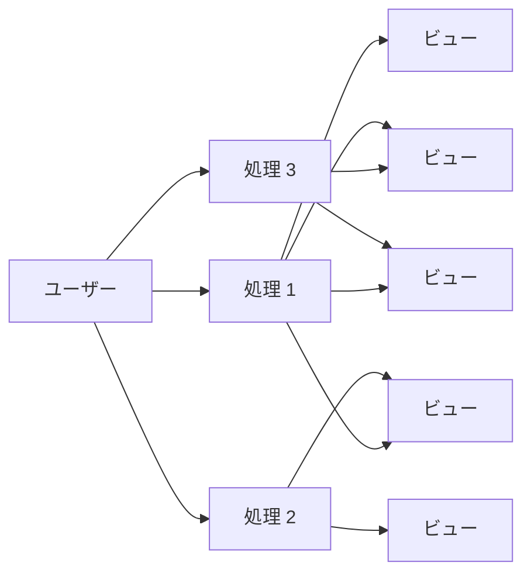
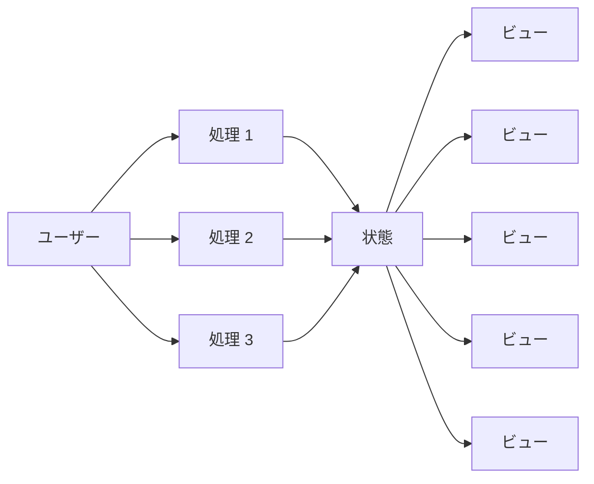

# 状態管理

React は状態を元に画面を構築します。画面を変更する場合はその状態を変更します。
このようにUIを実装する考え方を宣言的UIといいます。

それと対する概念として命令的UIがあります。命令的UIは画面の変更を命令する形で実装します。

# 宣言的UIと命令的UI

この説明はこれまでの命令的UIに対して馴染みのある人に向けての説明です。

これまでにフロントエンド開発をしてきたことのない人は読み飛ばしても構いません。

## 命令的UIの例

ここではわかりやすくするためにわざとDOM操作を中心に実装しています。

それぞれの操作そのものがデータを触るのではなく、DOMを直接操作していることに着目してください。

```jsx
<div>
  <h1>動物</h1>
  <ul id="#animals">
  </ul>
  <button id="appendDog">🐕️</button>
  <button id="appendCat">🐈️</button>
  <button id="appendRabbit">🐇️</button>
</div>
<script>
  const animals = document.getElementById("animals");
  const apppendDog = document.getElementById("appendDog");
  const appendCat = document.getElementById("appendCat");
  const appendRabbit = document.getElementById("appendRabbit");

  function appendAnimal (animal) {
    const li = document.createElement("li");
    li.textContent = animal;

    const button = document.createElement("button");
    button.textContent = "削除";
    button.addEventListener("click", () => {
      li.remove();
    });

    animals.appendChild(li);
  }

  appendDog.addEventListener("click", () => appendAnimal("🐕️"));
  appendCat.addEventListener("click", () => appendAnimal("🐈️"))
  appendRabbit.addEventListener("click", () => appendAnimal("🐇️"));
</script>
```




## 宣言的UIの例

次の実装は `animals` を元に画面が構築されています。

DOMを直接操作していないことに注目してください。

```jsx
import { useState } from "react";

function App() {
  const [animals, setAnimal] = useState([
    "🐕️"
  ]);

  const append = (animal) => {
    setAnimal([...animals, animal]);
  };

  const remove = (index) => {
    setAnimal(animals.filter((_, i) => i !== index));
  };

  return (
    <div>
      <h1>動物</h1>
      <ul>
        {animals.map((animal, index) => (
          <li key={index}>
            {animal}
            <button onClick={() => remove(index)}>削除</button>
          </li>
        ))}
      </ul>
      <button onClick={() => append("🐕️")}>🐕️</button>
      <button onClick={() => append("🐈️")}>🐈️</button>
      <button onClick={() => append("🐇️")}>🐇️</button>
    </div>
  );
}
```



## 比較

これだけでは十分な説明にはなっていないですが、どれだけ考え方が違うのかを確認してもらいたいです。

# カウンターの実装

数字を数えていくカウンターを実装してみましょう。

最終的に数字を増やしたり減らしたりできるカウンターを実装します。

## 数字の表示

先程の節で作成した `App` コンポーネントを修正します。

次のようにすることで 0 が表示されるようになります。

```jsx
function App () {
  return (
      <h1>0</h1>
  )
}

export default App

```

## 変数に入った数字の表示

次のようにすることで変数に入った数字を表示することができます。

```jsx
function App () {
  let count = 0
  return (
    <h1>{count}</h1>
  )
}
```

`count` の中にいれる数字を変えてみて、変数に入る内容が変わると表示が切り替わることを確かめてみましょう。

## ボタンの表示

次のようにすることでボタンを表示することができます。

```jsx
function App () {
  let count = 0
  return (
    <div>
      <h1>{count}</h1>
      <button>増やす</button>
    </div>
  )
}
```

表示されたボタンを押してみてください。

この状態ではボタンを押しても何も起こりません。

## ボタンがクリックされたら処理をする

ボタンがクリックされたらアラートを出すようにしましょう。

アラートはブラウザが用意している小さいポップアップです。

```jsx
function App () {
  let count = 0

  function handleClick () {
    alert("クリックされました")
  }

  return (
    <div>
      <h1>{count}</h1>
      <button onClick={handleClick}>増やす</button>
    </div>
  )
}

```

クリックされたらアラートを表示するという処理を追加しました。

ここでのクリックされたらは **クリックイベント** が起きたらという風に言い換えれます。

またアラートを表示する処理はクリックイベントが起きた時に動作する処理です。イベントを制御するという意味で、イベントハンドラーと呼ばれます。

`function handleClick` は クリックイベントのイベントハンドラーです。

## 数字を増やす試み

クリックされた時に数字を増やすようにしてみましょう。

```jsx
function App () {
  let count = 0

  function handleClick () {
    count = count + 1
  }

  return (
    <div>
      <h1>{count}</h1>
      <button onClick={handleClick}>増やす</button>
    </div>
  )
}

```

ボタンを押しても数字が増えません。

`count` が増えていることを確認するために alert を使って確認してみましょう。

```jsx
function App () {
  let count = 0

  function handleClick () {
    count = count + 1
    alert(count)
  }

  return (
    <div>
      <h1>{count}</h1>
      <button onClick={handleClick}>増やす</button>
    </div>
  )
}

```

アラートでは数字が増えていることが確認できます。

## React が変更を検知できない

React は最初に定義した内容を描画します。それ以降は描画が必要にならない限り描画を行いません。

今回は count が変更された際に再度描画してほしい状態です。そのためには React に変更を検知させる必要があります。

状態が変化されたら再描画するためには `useState` を使います。

次のように書いてみましょう。

```jsx
import { useState } from "react";

function App () {
  // let count = 0
  const [count, setCount] = useState(0)

  function handleClick () {
    // count = count + 1
    setCount(count + 1)
  }

  return (
    <div>
      <h1>{count}</h1>
      <button onClick={handleClick}>増やす</button>
    </div>
  )
}
```

```mermaid
graph LR


```

setCount を使うことで count の値を変更することと再描画を行うことができます。

# 理解の確認

ここまでの理解を確認するために次の実装をしてみましょう。

## 基本的な課題

- 数字を減らすボタンを追加する
- 数字が 0未満 にならないようにする

## 応用的な課題

- 数字が 11より大きくならないようにする
- 数字が0の時にdisabled属性を使って減らすボタンを押しても何も起こらないようにする
- 数字が10の時にdisabled属性を使って増やすボタンを押しても何も起こらないようにする

## 実装例

```jsx
import { useState } from "react";

function App () {
  const [count, setCount] = useState(0)

  function handlePlus () {
    if (count >= 10) return
    setCount(count + 1)
  }

  function handleMinus () {
    if (count <= 0) return
    setCount(count - 1)
  }

  return (
    <div>
      <h1>{count}</h1>
      <button onClick={handlePlus} disabled={count >= 10}>増やす</button>
      <button onClick={handleMinus} disabled={count <= 0}>減らす</button>
    </div>
  )
}

```

# まとめ

ここまでで状態管理とイベントハンドリングを学んできました。

状態管理ではコンポーネント内で扱う状態と再描画のタイミングを制御しました。

また、イベントハンドリングではイベントに対してハンドラーを指定してユーザーの操作に応じて処理を実行しました。

次はコンポーネントに注目してReactの理解を深めましょう

[コンポーネント](./03-component.md)
