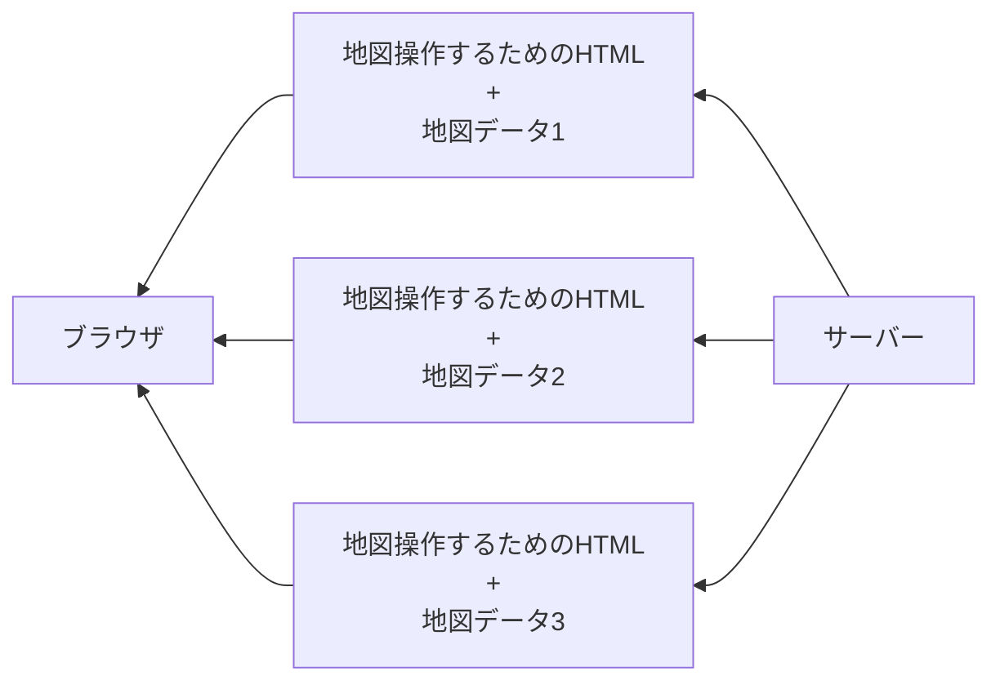
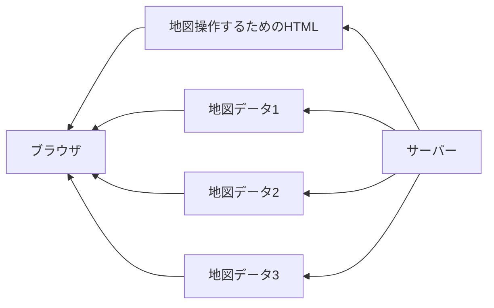

# 非同期処理

Webで非同期処理が出てきたのは、Ajaxが登場してからです。Ajax は Asynchronous JavaScript and XML の略で、非同期処理を行うための技術です。

Google Map は世界中の地図を様々な縮尺で表示することができます。ただし、その地図データをすべてダウンロードするとなると大きなデータになることが想像できます。


見たい場所に移動するたびに画面を再読込する実装を想像してみてください。駅の隣の周りのコンビニを探すために少し右に移動してみます。画面が再読込されます。

そうすると川があったのでこのあたりはコンビニがないなと思います。そしたら左に行こうとするので左に移動します、すると画面が再読込されて駅に戻ってきます。



この体験では地図で目的地を探すことが難しくなるでしょう。その再読み込みをなくしてくれたのがAjaxです。

今ではAjaxと呼ばれることはすくなくなりました。ブラウザが進歩して、Ajaxとは異なる方法で非同期処理を行うことができるようになりました。



長くなりましたが重要な概念なのでより想像しやすいように説明しました。

この節では React を使った非同期処理の方法を学びます。

# 郵便番号検索API

Google Map の例では地図データを非同期で返してくれるプログラムがWeb上にありました。

今回は郵便番号のデータを非同期で返してくれるプログラムである 郵便番号検索API を利用します。このようなWeb上にあるアクセスできるプログラムを Web API と呼びます。

[郵便番号検索API](https://zipcloud.ibsnet.co.jp/doc/api) にアクセスすると細かい仕様を見ることができます。

# ブラウザからアクセスする

現在、開発中のReactのページを開いてください。各ブラウザに開発者ツールがあります。

開発者ツールを使いながら非同期処理の動きを見てみましょう。

OSやブラウザによって起動方法が異なるので、自分の環境に合わせて開発者ツールを開いてください。

- [Chrome DevTools](https://developer.chrome.com/docs/devtools)
- [Edge DevTools](https://learn.microsoft.com/ja-jp/microsoft-edge/devtools-guide-chromium/landing/)
- [Safari](https://support.apple.com/ja-jp/guide/safari/sfri20948/mac)
- [Firefox DevTools](https://developer.mozilla.org/ja/docs/Tools)

開発者ツールを開くと、コンソールというタブがあります。コンソールに次のコードを入力してください。

## 非同期処理の実行

**開発者ツールのコンソールで次のコードを入力してください。**

```js
const response = await fetch('https://zipcloud.ibsnet.co.jp/api/search?zipcode=8997103')
const data = await response.json()
console.log(data.results[0])
```

次のような内容が表示されます。

```json
{
  "address1": "鹿児島県",
  "address2": "志布志市",
  "address3": "志布志町志布志",
  "kana1": "ｶｺﾞｼﾏｹﾝ",
  "kana2": "ｼﾌﾞｼｼ",
  "kana3": "ｼﾌﾞｼﾁｮｳｼﾌﾞｼ",
  "prefcode": "46",
  "zipcode": "8997103"
}
```

このコードは郵便番号 `8997103` に対応する住所を取得しています。

`await` というキーワードが出てきています。このキーワードがついた後の関数は非同期で実行される関数です。非同期処理が終了するまで待ってからその結果を返します。

```js
const response = await fetch('https://zipcloud.ibsnet.co.jp/api/search?zipcode=8997103')
```

非同期処理は結果を持ったPromiseオブジェクトを返します。`await` をつけることで非同期処理の完了を待ち、Promise オブジェクトから結果を取り出します。この箇所は難しいので、今は `await` が非同期処理を待つキーワードであると覚えてください。

## 非同期処理関数の作成

次に任意の郵便番号の情報を取得する関数を作ってみましょう。

次の関数は郵便番号を引数に取り、その郵便番号に対応する住所を返す関数です。

**開発者ツールのコンソールで次のコードを入力してください。**

```js
async function fetchAddressByZipcode (zipcode) {
  const response = await fetch(`https://zipcloud.ibsnet.co.jp/api/search?zipcode=${zipcode}`)
  const data = await response.json()
  return data.results[0]
}
```

`async` というキーワードが関数の前についています。このキーワードがついた関数は非同期で実行される関数です。`async` キーワードがついている関数の中では `await` キーワードを使うことができます。逆に `await` キーワードが使えるのは `async` キーワードがついている関数の中だけです。

この関数を使って郵便番号 `8997103` に対応する住所を取得してみましょう。

**開発者ツールのコンソールで次のコードを入力してください。**

```js
const address1 = await fetchAddressByZipcode('8997103')
const address2 = await fetchAddressByZipcode('8997212')
const address3 = await fetchAddressByZipcode('8997102')
console.log(address1)
console.log(address2)
console.log(address3)
```

# 住所検索アプリ

郵便番号から住所を検索するアプリを作ってみましょう。

## 画面の実装

`src/App.jsx` を次のように変更してください。

まずは表示する箇所を作ります。

```jsx
import { useState } from 'react'

function App () {
  const [address, setAddress] = useState({
    zipcode: '',
    address1: '',
    address2: '',
    address3: ''
  })

  function handleSubmit (event) {
    event.preventDefault()
    const data = new FormData(event.target)
    const zipCode = data.get('zipcode')

    setAddress({
      zipcode: zipCode,
      address1: '鹿児島県',
      address2: '志布志市',
      address3: '志布志町志布志'
    })
  }

  return (
    <div>
      <h1>住所を表示する</h1>
      <form onSubmit={handleSubmit}>
        <label>
          郵便番号
          <input name="zipcode" />
        </label>
        <button type="submit">検索</button>
      </form>
      <dl>
        <dt>郵便番号</dt>
        <dd>{address.zipcode}</dd>
        <dt>住所1</dt>
        <dd>{address.address1}</dd>
        <dt>住所2</dt>
        <dd>{address.address2}</dd>
        <dt>住所3</dt>
        <dd>{address.address3}</dd>
      </dl>
    </div>
  )
}

```

どんな郵便番号を入力しても同じ住所が表示されるようになっています。

## 非同期処理の追加

先ほど定義した `fetchAddressByZipcode` 関数を使って住所を取得するように変更します。

```jsx
import { useState } from 'react'

async function fetchAddressByZipcode (zipcode) {
  const response = await fetch(`https://zipcloud.ibsnet.co.jp/api/search?zipcode=${zipcode}`)
  const data = await response.json()
  return data.results[0]
}

function App () {
  const [address, setAddress] = useState({
    zipcode: '',
    address1: '',
    address2: '',
    address3: ''
  })

  async function handleSubmit (event) {
    event.preventDefault()
    const data = new FormData(event.target)
    const zipCode = data.get('zipcode')
    const address = await fetchAddressByZipcode(zipCode)
    setAddress(address)
  }

  return (
    <div>
      <h1>住所を表示する</h1>
      <form onSubmit={handleSubmit}>
        <label>
          郵便番号
          <input name="zipcode" />
        </label>
        <button type="submit">検索</button>
      </form>
      <dl>
        <dt>郵便番号</dt>
        <dd>{address.zipcode}</dd>
        <dt>住所1</dt>
        <dd>{address.address1}</dd>
        <dt>住所2</dt>
        <dd>{address.address2}</dd>
        <dt>住所3</dt>
        <dd>{address.address3}</dd>
      </dl>
    </div>
  )
}

export default App
```

入力した郵便番号に対応する住所が表示されるようになりました。

## 潜む問題を考える

この住所検索アプリはどのような問題が潜んでいるでしょうか。

自分の経験に照らし合わせて考えてみてください。また、あなたの身の回りの人にとってはどのようなアプリに映るでしょうか。

特に技術的な課題について考えてみます。

### 不正な郵便番号

郵便番号は7桁の数字で構成されています。このアプリでは7桁の数字以外を入力するとエラーが発生します。

### 存在しない郵便番号

存在しない郵便番号が入力されたことを伝えることできません。

### 状態が不明

ローディング中の状態であることをユーザーに伝えることができません。

ユーザーは何も反応がないので、何かが起こっているのか不安になります。

# 入力値のエラーの対応

まずは不正な郵便番号を入力した場合のエラーを対応します。

```jsx
import { useState } from 'react'

// fetchZipcodeByAddress は省略

function App () {
  const [address, setAddress] = useState({
    zipcode: '',
    address1: '',
    address2: '',
    address3: ''
  })
  const [error, setError] = useState('')

  async function handleSubmit (event) {
    event.preventDefault()
    const data = new FormData(event.target)
    const zipCode = data.get('zipcode')

    if (!/^[0-9]{7}$/.test(zipCode)) {
      setError('郵便番号は7桁の数字で入力してください')
      return
    }

    const address = await fetchAddressByZipcode(zipCode)
    setAddress(address)
  }

  return (
    <div>
      <h1>住所を表示する</h1>
      <form onSubmit={handleSubmit}>
        <label>
          郵便番号
          <input name="zipcode" />
        </label>
        <button type="submit">検索</button>
      </form>
      {error && <p>{error}</p>}
      <dl>
        <dt>郵便番号</dt>
        <dd>{address.zipcode}</dd>
        <dt>住所1</dt>
        <dd>{address.address1}</dd>
        <dt>住所2</dt>
        <dd>{address.address2}</dd>
        <dt>住所3</dt>
        <dd>{address.address3}</dd>
      </dl>
    </div>
  )
}

```

次の処理でエラーの判定をします。

正規表現という技術を使っています。理解が難しい場合は数字の7桁であるかどうかを判断していると見てください。

- `^` 始まりを表す
- `[0-9]` 数字を表す
- `{7}` 直前の文字が7回繰り返される
- `$` 終わりを表す

0から9の文字で始まり、7文字繰り返されて文字列が終わるという意味になります。

```js
if (!/^[0-9]{7}$/.test(zipCode)) {
  throw new Error('郵便番号は7桁の数字で入力してください')
}
```

この処理で郵便番号が7桁の数字でない場合にエラーメッセージを表示します。

#　存在しない郵便番号の対応

## データ取得の動作の確認

開発者ツールに戻って存在しない郵便番号にアクセスしてみましょう。

**開発者ツールのコンソールで次のコードを入力してください。**

```js
const response = await fetch('https://zipcloud.ibsnet.co.jp/api/search?zipcode=9999999')
const data = await response.json()
console.log(data)
```

次のようなデータが返ってきます。

```
{
  "message": null,
  "results": null,
  "status": 200
}
```

`data.results` が `null` となっていれば存在しないことがわかります。

##　住所取得時のエラー処理

`fetchAddressByZipcode` 関数を修正して存在しない郵便番号の場合にエラーを投げるようにします。

```jsx
async function fetchAddressByZipcode (zipcode) {
  const response = await fetch(`https://zipcloud.ibsnet.co.jp/api/search?zipcode=${zipcode}`)
  const data = await response.json()

  if (data.results === null) {
    throw new Error('存在しない郵便番号です')
  }

  return data.results[0]
}
```

`throw` はエラーを投げます。このエラーは呼び出し側が `try-catch` で囲っている場合 `catch` で受け取ることができます。`throw` が呼び出された後は関数の実行が中断されます。

`handleSubmit` を次のように修正します。

```jsx
async function handleSubmit (event) {
    try {
      event.preventDefault()
      const data = new FormData(event.target)
      const zipCode = data.get('zipcode')

      if (!/^[0-9]{7}$/.test(zipCode)) {
        throw new Error('郵便番号は7桁の数字で入力してください')
      }

      const address = await fetchAddressByZipcode(zipCode)
      setAddress(address)
    } catch (error) {
      setError(error.message)
    }
}

```

## error を投げない方法

error を投げる方法に馴染みのない人は次の書き方もできます

```jsx
async function fetchAddressByZipcode (zipcode) {
  const response = await fetch(`https://zipcloud.ibsnet.co.jp/api/search?zipcode=${zipcode}`)
  const data = await response.json()

  if (data.results === null) {
    return null
  }

  return data.results[0]
}
```

```jsx
async function handleSubmit (event) {
  event.preventDefault()
  const data = new FormData(event.target)
  const zipCode = data.get('zipcode')

  if (!/^[0-9]{7}$/.test(zipCode)) {
    setError('郵便番号は7桁の数字で入力してください')
    return
  }

  const address = await fetchAddressByZipcode(zipCode)
  if (address === null) {
    setError('存在しない郵便番号です')
    return
  }
  setAddress(address)
}
```

現段階ではどちらの方法でも問題ありません。

## `try-catch` を使う利点

`fetchAddressByZipcode` を `try-catch` で囲むことでエラーが発生した場合にエラーメッセージを表示することができます。

今回エラーが発生するのは自分で書いた `throw new Error('存在しない郵便番号です')` このときだけのように見えます。

しかし、実際にはネットワークエラーやサーバーエラーなど様々な理由でエラーが発生する可能性があります。例えば、サーバーがダウンしていたり急にWi-Fiが切れるなどです。

非同期処理はエラーが発生する可能性が高い処理です。そのため、非同期処理を行う関数は `try-catch` で囲むことが推奨されます。

# ローディングを表示する

ローディングを表示することでユーザーに何かが起こっていることを伝えることができます。

`loading` の値を追加してローディング中であることを示します。

```jsx
import { useState } from 'react'

// fetchZipcodeByAddress は省略

function App () {
  const [address, setAddress] = useState({
    zipcode: '',
    address1: '',
    address2: '',
    address3: ''
  })
  const [error, setError] = useState('')
  const [loading, setLoading] = useState(false)

  // handleSubmit は省略

  return (
    <div>
      <h1>住所を表示する</h1>
      <form onSubmit={handleSubmit}>
        <label>
          郵便番号
          <input name="zipcode" />
        </label>
        <button type="submit">検索</button>
      </form>
      {error && <p>{error}</p>}
      {loading && <p>ローディング中...</p>}
      <dl>
        <dt>郵便番号</dt>
        <dd>{address.zipcode}</dd>
        <dt>住所1</dt>
        <dd>{address.address1}</dd>
        <dt>住所2</dt>
        <dd>{address.address2}</dd>
        <dt>住所3</dt>
        <dd>{address.address3}</dd>
      </dl>
    </div>
  )
}

```

非同期処理の開始前に `setLoading(true)` を呼び出し、非同期処理の終了後に `setLoading(false)` を呼び出します。

```js

async function handleSubmit (event) {
  event.preventDefault()
  const data = new FormData(event.target)
  const zipCode = data.get('zipcode')

  if (!/^[0-9]{7}$/.test(zipCode)) {
    setError('郵便番号は7桁の数字で入力してください')
    return
  }

  setLoading(true)
  try {
    const address = await fetchAddressByZipcode(zipCode)
    setAddress(address)
  } catch (error) {
    setError(error.message)
  }
  setLoading(false)
}

```

これで非同期処理に応じて loading の内容が変更されます。

# 画面表示時に住所を取得する

郵便番号の情報を表示するWebアプリだと考えます。

http://localhost:3000?zipcode=8997103 にアクセスすると郵便番号 `8997103` に対応する住所が表示されるようにしたいです。

今まではフォームで送信された値を取得していましたが、今回はURLのクエリパラメータから取得します。


## フォーム実行時に画面遷移する

フォームを送信すると画面が再読込されてURLにパラメータが付いていることを確認してください。

```jsx
// fetchAddressByZipcode は省略

function App () {
  const [address, setAddress] = useState({
    zipcode: '',
    address1: '',
    address2: '',
    address3: ''
  })
  const [error, setError] = useState('')
  const [loading, setLoading] = useState(false)

  return (
    <div>
      <h1>住所を表示する</h1>
      {error && <p>{error}</p>}
      {loading && <p>ローディング中...</p>}
      <form action="." method="get">
        <label>
          郵便番号
          <input name="zipcode" />
        </label>
        <button type="submit">検索</button>
      </form>
      <dl>
        <dt>郵便番号</dt>
        <dd>{address.zipcode}</dd>
        <dt>住所1</dt>
        <dd>{address.address1}</dd>
        <dt>住所2</dt>
        <dd>{address.address2}</dd>
        <dt>住所3</dt>
        <dd>{address.address3}</dd>
      </dl>
    </div>
  )
}

```

## パラメータを取得する

ついているパラメータを取得して入力欄の初期値としましょう。


```jsx
import { useState, useEffect } from 'react'

// fetchAddressByZipcode は省略

function App () {
  const [address, setAddress] = useState({
    zipcode: '',
    address1: '',
    address2: '',
    address3: ''
  })
  const [error, setError] = useState('')
  const [loading, setLoading] = useState(false)

  const zipcode = new URL(window.location.href).searchParams.get('zipcode') || ''
  return (
    <div>
      <h1>住所を表示する</h1>
      {error && <p>{error}</p>}
      {loading && <p>ローディング中...</p>}
      <form action="." method="get">
        <label>
          郵便番号
          <input name="zipcode" defaultValue={zipcode} />
        </label>
        <button type="submit">検索</button>
      </form>
      <dl>
        <dt>郵便番号</dt>
        <dd>{address.zipcode}</dd>
        <dt>住所1</dt>
        <dd>{address.address1}</dd>
        <dt>住所2</dt>
        <dd>{address.address2}</dd>
        <dt>住所3</dt>
        <dd>{address.address3}</dd>
      </dl>
    </div>
  )
}

```

## パラメータがある場合に住所を取得する

`useEffect()` が登場しています。

`useEffect` は React の学習を進める中でとても難しい概念です。ここでは `useEffect` がパラメータが変更されたときに実行されるということだけ覚えてください。

```jsx
import { useState, useEffect } from 'react'

// fetchAddressByZipcode は省略

function App () {
  const [address, setAddress] = useState({
    zipcode: '',
    address1: '',
    address2: '',
    address3: ''
  })
  const [error, setError] = useState('')
  const [loading, setLoading] = useState(false)

  async function fetchAddress (zipCode) {
    setLoading(true)
    try {
      const address = await fetchAddressByZipcode(zipCode)
      setAddress(address)
    } catch (error) {
      setError(error.message)
    }
    setLoading(false)
  }

  useEffect(() => {
    const url = new URL(window.location.href)
    const zipCode = url.searchParams.get('zipcode')
    if (!zipCode) return
    fetchAddress(zipCode)
  }, [])

  const zipcode = new URL(window.location.href).searchParams.get('zipcode') ?? ''
  return (
    <div>
      <h1>住所を表示する</h1>
      {error && <p>{error}</p>}
      {loading && <p>ローディング中...</p>}
      <form action="." method="get">
        <label>
          郵便番号
          <input name="zipcode" defaultValue={zipcode} />
        </label>
        <button type="submit">検索</button>
      </form>
      <dl>
        <dt>郵便番号</dt>
        <dd>{address.zipcode}</dd>
        <dt>住所1</dt>
        <dd>{address.address1}</dd>
        <dt>住所2</dt>
        <dd>{address.address2}</dd>
        <dt>住所3</dt>
        <dd>{address.address3}</dd>
      </dl>
    </div>
  )
}

```

useEffectはコンポーネントのライフサイクルに応じて処理を行うためのフックです。

第一引数には関数を渡します。この関数はコンポーネントがマウントされたとき、アンマウントされたとき、更新されたときに実行されます。


# 理解を深める

1. `address` が取得されていないときは `<dl>` の中を表示しないようにしましょう
2. ローディング中に input と button を disabled にしましょう

# まとめ

この節では非同期処理を行う方法を学びました。

非同期処理は処理の順番を追うことが難しくなります。ここでこそ宣言的UIが本領を発揮します。

`return` 内のDOM描画の処理は非同期処理に対しては関心を持っていません。stateにある状態の内容に基づいて表示を行うだけです。また、非同期処理も DOM描画の処理に対しては関心を持っていません。非同期処理が終了したら状態を更新するだけです。


これで非同期処理を実行できるようになりました。

フォームを送信したときと画面を表示した時それぞれで非同期処理をする方法を学びました。

次の節では画面遷移を学んでいきます。

- [画面遷移](./06-routing.md)
