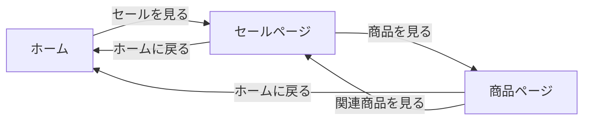

# ルーティング

あなたは勉強会の間で退屈になってAmazonのページを開いているとします。

**トップページ** を表示したら、セールをしていることに気づきます。**セールのページ** を開いてみます。
気になる商品が安くなっていたので **商品ページ** を開きました。
関連商品を見ようとしたところで講師が近づいてきたのでエディタを開いてなかったことにします。

この流れの中で Amazonのサイトで見たURLは次のようになっています。

- トップページ: `https://www.amazon.co.jp/`
- セールページ: `https://www.amazon.co.jp/events/monthlydealevent/`
- 商品ページ: `https://www.amazon.co.jp/dp/B09M2XFRCF`

各ページに対してURLが異なることで、異なるページを表示することができます。これがルーティングの基本です。

`https://www.amazon.co.jp` の箇所は同じなので重要なのは次の箇所です。

- トップページ: `/`
- セールページ: `/events/monthlydealevent/`
- 商品ページ: `/dp/B09M2XFRCF`

この箇所をパスと呼びます。今まで作ってきたアプリは画面遷移はないので全て `/` を表示していました。今回はルーティングを使って画面遷移を実装していきます。

# Single Page Application

これから作る方法はSingle Page Application (SPA) と呼ばれる方法です。SPAは1つのHTMLファイルを読み込んで、JavaScriptで画面遷移を行います。画面遷移を行う際にはURLを変更しますが、ページ全体をリロードすることはありません。

Ruby on RailsやDjango などのフレームワークで作られる方法をSPAと対比してMPA (Multi Page Application) と呼んだりもします。

# React Router DOM

ここでは React Router DOM を使ってルーティングを設定してみましょう。

## ライブラリのインストール

```bash
npm install react-router-dom
```

# 画面遷移

```jsx
import {
  BrowserRouter,
  Route,
  Routes
} from 'react-router-dom'

function Top () {
  return <h1>トップページ</h1>
}

function Sale () {
  return <h1>セールページ</h1>
}

function Product () {
  return <h1>商品ページ</h1>
}

function App () {
  return (
    <BrowserRouter>
      <Routes>
        <Route path="/events/monthlydealevent" element={<Sale />} />
        <Route path="/dp/B09M2XFRCF" element={<Product />} />
        <Route path="/" element={<Top />} />
      </Routes>
    </BrowserRouter>
  )
}

export default App

```

## 動作確認

`npm start` でアプリを起動して、ブラウザで `http://localhost:3000/` を開いてください。

`http://localhost:3000/` にアクセスすると `トップページ` と表示されます。

`http://localhost:3000/events/monthlydealevent/` にアクセスすると `セールページ` と表示されます。

`http://localhost:3000/dp/B09M2XFRCF` にアクセスすると `商品ページ` と表示されます。

## リンクの追加

次のように画面遷移できるようにします。



`Link` のインポートを追加します。

```jsx
import {
  BrowserRouter,
  Route,
  Routes,
  Link
} from 'react-router-dom'
```

各画面を移動できるようにしましょう。

### トップページ

```jsx
function Top () {
  return (
    <div>
      <h1>トップページ</h1>
      <hr />
      <Link to="/events/monthlydealevent">セールページ</Link>
    </div>
  )
}
```

### セールページ

```jsx
function Sale () {
  return (
    <div>
      <h1>セールページ</h1>
      <hr />
      <Link to="/dp/B09M2XFRCF">商品ページ</Link>
      <br />
      <Link to="/">ホームに戻る</Link>
    </div>
  )
}
```

### 商品ページ

```jsx
function Product () {
  return (
    <div>
      <h1>商品ページ</h1>
      <hr />
      <Link to="/events/monthlydealevent">セールページ</Link>
      <br />
      <Link to="/">ホームに戻る</Link>
    </div>
  )
}
```

## 動作確認

画面遷移できることを確認してみましょう。

# ファイルの整理

一つのファイルで複数の画面を実装するのは見通しが悪いのでファイルごとに分けましょう。

次のディレクトリ構成にします。

```
./src
├── App.jsx
├── main.jsx
└── routes
    ├── Product.jsx
    ├── Sale.jsx
    └── Top.jsx
```

次に各ファイルの内容を確認します。

インポートするコンポーネントに気をつけながらファイルを整理してください。

## `routes/Product.jsx`

```jsx
import { Link } from "react-router-dom"

function Product () {
  return (
    <div>
      <h1>商品ページ</h1>
      <hr />
      <Link to="/events/monthlydealevent">セールページ</Link>
      <br />
      <Link to="/">ホームに戻る</Link>
    </div>
  )
}

export default Product
```

## `routes/Sale.jsx`

```jsx
import { Link } from 'react-router-dom'

function Sale () {
  return (
    <div>
      <h1>セールページ</h1>
      <hr />
      <Link to="/dp/B09M2XFRCF">商品ページ</Link>
      <br />
      <Link to="/">ホームに戻る</Link>
    </div>
  )
}

export default Sale
```

## `routes/Top.jsx`

```jsx
import { Link } from 'react-router-dom'

function Top () {
  return (
    <div>
      <h1>トップページ</h1>
      <hr />
      <Link to="/events/monthlydealevent">セールページ</Link>
    </div>
  )
}

export default Top

```

## `App.jsx`

```jsx
import {
  BrowserRouter,
  Route,
  Routes
} from 'react-router-dom'

import Top from './routes/Top'
import Sale from './routes/Sale'
import Product from './routes/Product'

function App () {
  return (
    <BrowserRouter>
      <Routes>
        <Route path="/" element={<Top />} />
        <Route path="/events/monthlydealevent" element={<Sale />} />
        <Route path="/dp/B09M2XFRCF" element={<Product />} />
      </Routes>
    </BrowserRouter>
  )
}

export default App
```

# 商品ページを作る

商品ページに内容を表示してみましょう。

`src/routes/Product.jsx` を次のように変更します。

```jsx
import { Link } from "react-router-dom"

function Product () {
  return (
    <div>
      <h1>商品ページ</h1>

      <h2>商品名:ポップコーン</h2>
      <p>価格: 1000円</p>
      <p>商品説明: おいしいポップコーンです。</p>
      <button>購入する</button>

      <hr />
      <Link to="/events/monthlydealevent">セールページ</Link>
      <br />
      <Link to="/">ホームに戻る</Link>
    </div>
  )
}

export default Product

```

## もう一つ商品を追加する

`src/routes/Product2.jsx` を作って次のようにします。

```jsx
import { Link } from "react-router-dom"

function Product2 () {
  return (
    <div>
      <h1>商品ページ</h1>
      <h2>商品名:コーラ</h2>
      <p>価格: 300円</p>
      <p>商品説明: 普通のコーラ</p>
      <button>購入する</button>
      <hr />
      <Link to="/events/monthlydealevent">セールページ</Link>
      <br />
      <Link to="/">ホームに戻る</Link>
    </div>
  )
}

export default Product2

```

### 画面遷移の調整


#### ルーティング

`src/App.jsx` を次のように変更します。

`<Route path="/dp/X00X0XXXXX" element={<Product2 />} />` を追加します。

`/dp/X00X0XXXXX` にアクセスすると追加したページを見ることができます

```jsx
import {
  BrowserRouter,
  Route,
  Routes
} from 'react-router-dom'

import Top from './routes/Top'
import Sale from './routes/Sale'
import Product from './routes/Product'
import Product2 from './routes/Product2'

function App () {
  return (
    <BrowserRouter>
      <Routes>
        <Route path="/" element={<Top />} />
        <Route path="/events/monthlydealevent" element={<Sale />} />
        <Route path="/dp/B09M2XFRCF" element={<Product />} />
        <Route path="/dp/X00X0XXXXX" element={<Product2 />} />
      </Routes>
    </BrowserRouter>
  )
}

export default App
```


#### セールのページ

セールのページから各商品ページにアクセスできるようにしましょう。

```jsx
import { Link } from 'react-router-dom'

function Sale () {
  return (
    <div>
      <h1>セールページ</h1>
      <hr />
      <Link to="/dp/B09M2XFRCF">ポップコーン</Link>
      <Link to="/dp/X00X0XXXXX">コーラ</Link>
      <br />
      <Link to="/">ホームに戻る</Link>
    </div>
  )
}

export default Sale
```

# もう一つ商品を...

もう一つ商品を追加したいです。

このまま商品を追加する方法を想像してください。ファイルを作成してルートを追加してと繰り返すことになります。
商品が増えるたびにファイルを増やしていくのを想像してください。

それらを追加した後に、商品の画像を追加したり商品説明に表を追加して賞味期限を出すのを想像してください。
また、各ファイルの選考をする必要があります。

これではあまりにも手間がかかります。そこでパスパラーメータを使って商品の情報を取得する方法を紹介します。

## パスパラメータは

この２つのパスはどちらも商品ページを表示します。

- `/dp/B09M2XFRCF`
- `/dp/X00X0XXXXX`

これらを一般化すると `/dp/{商品ID}` となります。

`{}` で囲まれた部分をパスパラメータと呼びます。このパスパラメータを使って表示を切り替えます。

## 商品の内容を変数にする

`const product` に商品の情報の値を入れます。

その値を使って商品を表示します。次のように変更して変わらず表示されることを確認してください。

### `Produxt.jsx`

```jsx
import { Link } from "react-router-dom"

function Product () {
  const product = {
    name: "ポップコーン",
    price: 1000,
    description: "おいしいポップコーンです。"
  }

  return (
    <div>
      <h1>商品ページ</h1>

      <h2>商品名: {product.name}</h2>
      <p>価格: {product.price}円</p>
      <p>商品説明: {product.description}</p>
      <button>購入する</button>

      <hr />
      <Link to="/events/monthlydealevent">セールページ</Link>
      <br />
      <Link to="/">ホームに戻る</Link>
    </div>
  )
}

export default Product
```


### `Product2.jsx`

```jsx
import { Link } from "react-router-dom"

function Product2 () {
  const product = {
    name: "コーラ",
    price: 300,
    description: "普通のコーラです。"
  }

  return (
    <div>
      <h1>商品ページ</h1>

      <h2>商品名: {product.name}</h2>
      <p>価格: {product.price}円</p>
      <p>商品説明: {product.description}</p>
      <button>購入する</button>

      <hr />
      <Link to="/events/monthlydealevent">セールページ</Link>
      <br />
      <Link to="/">ホームに戻る</Link>
    </div>
  )
}

export default Product2

```

## パスパラメータを設定する

`/dp/{商品ID}` の商品IDを取得するためにパスパラメータを設定します。

`App.jsx` を次のように変更します。

- `Product2` へのルートの設定は削除します
- `Product2.jsx` のファイルは削除します
- `Product` にパスパラメータを追加します
  - `/dp/:productId` のように設定します

```jsx
import {
  BrowserRouter,
  Route,
  Routes
} from 'react-router-dom'

import Top from './routes/Top'
import Sale from './routes/Sale'
import Product from './routes/Product'

function App () {
  return (
    <BrowserRouter>
      <Routes>
        <Route path="/" element={<Top />} />
        <Route path="/events/monthlydealevent" element={<Sale />} />
        <Route path="/dp/:productId" element={<Product />} />
      </Routes>
    </BrowserRouter>
  )
}

export default App
```

## パスパラメータを受け取る

`Product.jsx` を次のように変更します。

`useParams` を使ってパスパラメータを取得します。

```jsx
import { Link, useParams } from "react-router-dom"

function Product () {
  const { productId } = useParams()

  let product = null;

  if (productId === 'B09M2XFRCF') {
    product = {
        name: "ポップコーン",
        price: 1000,
        description: "おいしいポップコーンです。"
    }
  } else {
    product = {
      name: "コーラ",
      price: 300,
      description: "普通のコーラです。"
    }
  }

  return (
    <div>
      <h1>商品ページ</h1>

      <h2>商品名: {product.name}</h2>
      <p>価格: {product.price}円</p>
      <p>商品説明: {product.description}</p>
      <button>購入する</button>

      <hr />
      <Link to="/events/monthlydealevent">セールページ</Link>
      <br />
      <Link to="/">ホームに戻る</Link>
    </div>
  )
}

export default Product

```

セール画面から各商品ページにアクセスできることを確認してください。


# 理解の確認

セールも商品と同様にパスパラメータによって表示を切り替えられるようにしましょう。

セールごとに商品を切り替えましょう。

```js
const productsBySaleName = {
  'monthlydealevent': [{
    id: 'B09M2XFRCF',
    name: 'ポップコーン',
    price: 1000,
    description: 'おいしいポップコーンです。'
  }, {
    id: 'X00X0XXXXX',
    name: 'コーラ',
    price: 300,
    description: '普通のコーラです。'
  }],
  'specialevent': [{
    id: 'Y00Y0YYYYY',
    name: 'ポテトチップス',
    price: 200,
    description: 'おいしいポテトチップスです。'
  }, {
    id: 'Z00Z0ZZZZZ',
    name: 'オレンジジュース',
    price: 400,
    description: 'おいしいオレンジジュースです。'
  }]
}

```

# まとめ

ここではパスによって画面を切り替える方法を react-router-dom を使って実装しました。

パスによって表示を切り替えるだけではなくパスのパラメータを使いながら表示を切り替える方法も紹介しました。

次はブラウザごとにデータを永続化するための LocalStorage に付いて学びます。

[ローカルストレージ](07-local-storage.md)
