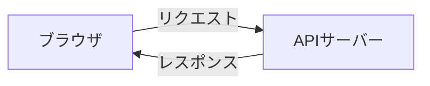
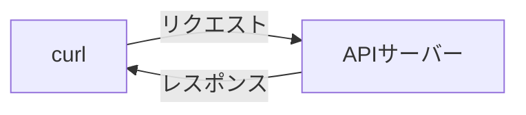

# Express プロジェクトの作成

このセクションでは、Express を使って簡単な API を作成し、JSON 形式で `Hello World` を返す API を実装します。

---

## 1. Express プロジェクトを作成する

まず、Express プロジェクトを作成し、必要なパッケージをインストールします。

### 手順
1. 新しいディレクトリを作成し、プロジェクトを初期化します。

   ```sh
   mkdir my-express-api
   cd my-express-api
   npm init -y
   ```

2. `express` をインストールします。

   ```sh
   npm install express
   ```

3. `package.json` を開き、以下のように `type: "module"` を追加します。

   ```json
   {
     "name": "my-express-api",
     "type": "module",
     ...
   }
   ```

### CommonJS と ESM (ECMAScript Modules)　の違い

Node.js では、CommonJS と ESM の 2 つのモジュールシステムがあります。

CommonJS は `require` と `module.exports` を使った古いモジュールシステムです。ESM は、`import` と `export` を使った新しいモジュールシステムです。

記法の違いもありますが、インポートするパッケージがいずれかの形式にしか対応していないことがあります。

### CommonJS の例

```js
const express = require("express");
```

### ESM の例

```js
import express from "express";
```

### package.json の `type: "module"` について

`type: "module"` を設定することで、Node.js が ESM をサポートするようになります。これにより、`import` と `export` を使ってモジュールを読み込むことができます。

---

## 2. サーバーの作成

次に、`server.js` を作成し、簡単なサーバーを実装します。

### `server.js`

```js
import express from "express";

const app = express();
const PORT = 3000;

app.get("/", (req, res) => {
  res.json({ message: "Hello World" });
});

app.listen(PORT, () => {
  console.log(`Server is running on http://localhost:${PORT}`);
});
```

### 動作確認

Node.js を使って `server.js` を実行し、API が正しく動作するか確認します。

```
node ./server.js
```

ブラウザで `http://localhost:3000` にアクセスし、JSON レスポンスが表示されれば成功です。

### 動作の解説

動作確認で見た動きについて説明します。

ブラウザが `http://localhost:3000` にアクセスしました。これはAPIサーバーにリクエスト（要求）したといいます。そのリクエストに対してAPIサーバーがレスポンス（返答）を返しました。

その他の用語でも一般的にはリクエストとレスポンスが使われます。時々、要求と返答という組み合わせで使うこともあります。



より厳密に言うと http://localhost:3000 に GET リクエストを送信したといえます。

GETというのはリクエストのメソッドと言われます。メソッドが何なのかについてはここでは説明しませんが、単にアクセスしたのではなくその他の情報も含めてAPIサーバーにリクエストを送信したということです。

APIサーバーはそれに対して返答しています。その返答が JSON 形式で、`{ message: "Hello World" }` というデータです。


---

## 3. package.json にスクリプトを追加

開発時に簡単にサーバーを起動できるように、`package.json` の `scripts` に以下を追加します。

```json
"scripts": {
  "start": "node server.js"
}
```

---

## 4. サーバーの起動と動作確認

### サーバーの起動

以下のコマンドを実行し、サーバーを起動します。

```sh
npm start
```

ブラウザで `http://localhost:3000` にアクセスし、JSON レスポンスが表示されることを確認してください。

### API の確認

ブラウザに直接アクセスする代わりに、`curl` コマンドを使用して API の動作を確認します。

#### 1. `curl` コマンドを使用（推奨）

curl コマンドは、コマンドラインから HTTP リクエストを送信するためのツールです。

ブラウザまたは `curl` コマンドで `http://localhost:3000` にアクセスし、JSON レスポンスを確認します。

```sh
curl http://localhost:3000
```

レスポンス:
```json
{ "message": "Hello World" }
```

#### 2. Windows で `curl` が使えない場合

Windows で `curl` が使えない場合は、**Scoop** を使用して `curl` をインストールできます。

1. **Scoop のインストール**
   - PowerShell を管理者権限で開き、以下のコマンドを実行します。

   ```powershell
   Set-ExecutionPolicy RemoteSigned -Scope CurrentUser
   iwr -useb get.scoop.sh | iex
   ```

2. **`curl` をインストール**
   - Scoop をインストールしたら、以下のコマンドを実行して `curl` をインストールします。

   ```sh
   scoop install curl
   ```

3. **インストール確認**
   - 以下のコマンドを実行し、バージョンが表示されれば成功です。

   ```sh
   curl --version
   ```

4. **再度 API の確認**
   - `curl http://localhost:3000` を実行し、JSON レスポンスが表示されることを確認してください。

### 動作の解説

先程は、ブラウザがAPIにリクエストをしていましたが今回はcurlがAPIにリクエストをしています。

このようにAPIサーバーは何からリクエストしたかに関わらず正しい形のリクエストであればレスポンスを返すことができます。



---

# 5. 理解の確認

理解の確認として次の機能を実装してみましょう。

- `/now/day` にアクセスすると、今日の日付を返す API を作成してください。
- `/now/time` にアクセスすると、現在の時刻を返す API を作成してください。
- それぞれの動作について、ブラウザまたは `curl` コマンドで確認してください。

現在の日付や時刻を取得するには、JavaScript の `Date` オブジェクトを使用します。

以下のコードを参考にして、API を実装してみてください。

```js
const date = new Date();
const day = date.toLocaleDateString(); // -> "2021/8/1"
const time = date.toLocaleTimeString(); // -> "12:34:56"
```

レスポンスの形式の例
```
{
   "day": "2021/8/1",
}
```

```
{
   "time": "12:34:56",
}
```


## まとめ

このセクションでは、以下の内容を学びました：
- Express プロジェクトを作成する
- `Hello World` を返す API を実装する
- サーバーを起動し、動作を確認する
- Windows で `curl` が使えない場合のセットアップ方法（Scoop を使用）

次のステップでは、クライアント (React) から API を呼び出し、画面にデータを表示します。
