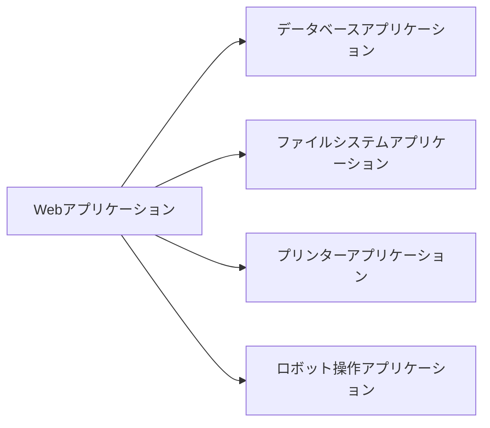
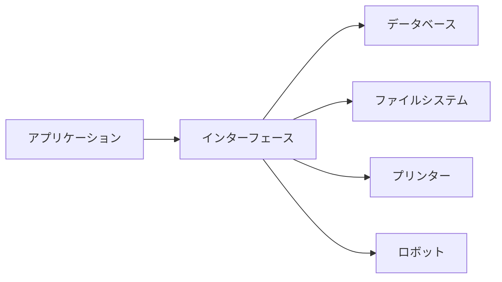
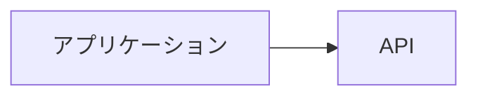
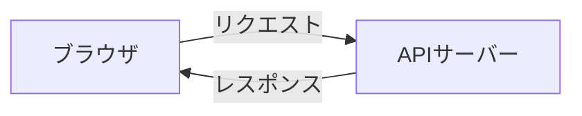
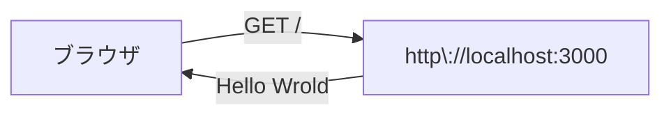
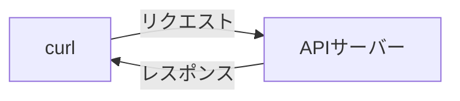

# Express プロジェクトの作成

このセクションでは、Express を使って簡単な API を作成し、JSON 形式で `Hello World` を返す API を実装します。

## API とは

APIは Application Programming Interface の略で、アプリケーション間でデータをやり取りするためのインターフェースです。

下の図の一つ一つがアプリケーションだと考えます。それぞれが関係をもって一つ一つを連携しながら目的を達成します。

しかしこれだと、Webアプリケーションの開発者がそれぞれのアプリケーションの仕様を細かく理解する必要があります。また、権限管理を各アプリケーション上で考える必要も出てきます。



そこでそれぞれのアプリケーションの間にプログラミングできるインターフェースを作ります。それがAPIです。



こうすることで、下の図のアプリケーションは背後に何があるかを考えずにAPIの仕様だけを考えて進めることができます。また、APIが間に入ることでこの箇所のマシンパワーを大きくするなどの柔軟な対応も可能になります。



---

## 1. Express プロジェクトを作成する

それではAPIを作っていきましょう。

まず、Express プロジェクトを作成し、必要なパッケージをインストールします。

### 手順
1. 新しいディレクトリを作成し、プロジェクトを初期化します。

   ```sh
   mkdir my-express-api
   cd my-express-api
   npm init -y
   ```

2. `express` をインストールします。

   ```sh
   npm install express
   ```

3. `package.json` を開き、以下のように `type: "module"` を追加します。

   ```json
   {
     "name": "my-express-api",
     "type": "module",
     ...
   }
   ```

### CommonJS と ESM (ECMAScript Modules)　の違い

Node.js では、CommonJS と ESM の 2 つのモジュールシステムがあります。

CommonJS は `require` と `module.exports` を使った古いモジュールシステムです。ESM は、`import` と `export` を使った新しいモジュールシステムです。

記法の違いもありますが、インポートするパッケージがいずれかの形式にしか対応していないことがあります。

### CommonJS の例

```js
const express = require("express");
```

### ESM の例

```js
import express from "express";
```

### package.json の `type: "module"` について

`type: "module"` を設定することで、Node.js が ESM をサポートするようになります。これにより、`import` と `export` を使ってモジュールを読み込むことができます。

### `.mjs` ファイルの拡張子

`type: "module"` を設定しない場合、`.js` ファイルは CommonJS として扱われます。そのため、ESM を使う場合は `.mjs` ファイルの拡張子を使うことがあります。

---

## 2. サーバーの作成

次に、`server.js` を作成し、簡単なサーバーを実装します。

### `server.js`

```js
import express from "express";

const app = express();

app.get("/", (req, res) => {
  res.send("Hello World");
});

app.listen(3000, () => {
  console.log(`Server is running on http://localhost:3000`);
});
```

### 動作確認

Node.js を使って `server.js` を実行し、API が正しく動作するか確認します。

```
node ./server.js
```

ブラウザで `http://localhost:3000` にアクセスし `Hello World` が表示されることを確認してください。

```
Hello World
```

### 動作の解説

動作確認で見た動きについて説明します。

ブラウザが `http://localhost:3000` にアクセスしました。これはAPIサーバーにリクエスト（要求）したといいます。そのリクエストに対してAPIサーバーがレスポンス（返答）を返しました。

その他の用語でも一般的にはリクエストとレスポンスが使われます。時々、要求と返答という組み合わせで使うこともあります。



より厳密に言うと http://localhost:3000 に GET リクエストを送信したといえます。



ブラウザからのリクエストの内容は `GET /` で、APIサーバーはそれに対して返答しています。その返答が `"Hello World"` というデータです。

#### メソッドとパス

`GET` はメソッドです。リクエストの種類を示しています。`GET` はデータを取得するためのメソッドです。

メソッドには他にも `POST`（データを送信する）、`PUT`（データを更新する）、`DELETE`（データを削除する）などがあります。

`/` はパスです。リクエストの対象を示しています。この場合はルートパスです。

パスはフォルダ構造と同じような考え方で、`/` で区切られた文字列です。`/users` などのように、階層を持つこともあります。


## 3. 構造的なデータを返す

`Hello World` 自体は文字列です。JavaScriptでいう `const message = "Hello World"` と同じです。

次のような構造を持つデータを返そうとなると難しいです。

```
{
  name: "John",
  age: 20,
  email: "john@example.com"
}
```

このような場合には、JSON形式でデータを返すことが一般的です。

```json
{
  "name": "John",
  "age": 20,
  "email": "john@example.com"
}
```

JSON とは JavaScript Object Notation の略で、JavaScript のオブジェクトを表現するためのデータ形式です。

JSON自体は文字列なのですが、規格に沿っている形式の文字列であれば JavaScript のオブジェクトに変換することができます。他の言語でも扱うことができます。

JSON を返す場合は次のように変更します。

`GET /user` のリクエストがあった場合に次のJSONを返すように実装します。

```
{
  "name": "John Due"
}
```

```js
import express from "express";

const app = express();

app.get("/", (req, res) => {
  res.send("Hello World");
});

app.get("/user", (req, res) => {
  res.json({
    name: "John Due"
  });
});

app.listen(3000, () => {
  console.log(`Server is running on http://localhost:3000`);
});
```

サーバーの動作を止めて、再度 `node ./server.js` を実行し、ブラウザで `http://localhost:3000/user` にアクセスして JSON レスポンスが表示されることを確認してください。

```json
{
  "name": "John Due"
}
```

---

## 3. 動作確認の方法

### API の確認

ブラウザに直接アクセスする代わりに、`curl` コマンドを使用して API の動作を確認します。

#### 1. `curl` コマンドを使用（推奨）

curl コマンドは、コマンドラインから HTTP リクエストを送信するためのツールです。

ブラウザまたは `curl` コマンドで `http://localhost:3000` にアクセスし、JSON レスポンスを確認します。

```sh
curl http://localhost:3000
```

レスポンス
```
Hello World
```

#### 2. Windows で `curl` が使えない場合

Windows で `curl` が使えない場合は、**Scoop** を使用して `curl` をインストールできます。

1. **Scoop のインストール**
   - PowerShell を管理者権限で開き、以下のコマンドを実行します。

   ```powershell
   Set-ExecutionPolicy RemoteSigned -Scope CurrentUser
   iwr -useb get.scoop.sh | iex
   ```

2. **`curl` をインストール**
   - Scoop をインストールしたら、以下のコマンドを実行して `curl` をインストールします。

   ```sh
   scoop install curl
   ```

3. **インストール確認**
   - 以下のコマンドを実行し、バージョンが表示されれば成功です。

   ```sh
   curl --version
   ```

4. **再度 API の確認**
   - `curl http://localhost:3000` を実行し、レスポンスが表示されることを確認してください。

### 動作の解説

先程は、ブラウザがAPIにリクエストをしていましたが今回はcurlがAPIにリクエストをしています。

このようにAPIサーバーは何からリクエストしたかに関わらず正しい形のリクエストであればレスポンスを返すことができます。



---

# 4. 理解の確認

理解の確認として次の機能を実装してみましょう。

1. 現在の日付を返す
1. 現在の時間を返す
1. 自分のプロフィールを返す
1. 干支の一覧を返す

## 1. 現在の日付

- パスは自分で考えてください。
- 現在の日付は　Date オブジェクトを使って取得してください。

```js
const now = new Date();
const date = now.toLocaleDateString(); // -> "2021/8/1"
```

## 2. 現在の時間

- パスは自分で考えてください。
- 現在の時間は　Date オブジェクトを使って取得してください。

```js
const now = new Date();
const time = date.toLocaleTimeString(); // -> "12:34:56"
```

## 3. 自分のプロフィール

- パスは自分で考えてください。
- 自分のプロフィールをJSONで返してください。
- プロフィールの項目
  - 名前
  - 年齢
  - メールアドレス

```json
{
  "name": "John Due",
  "age": 20,
  "email": "
}
```

## 4. 干支の一覧

- パスは自分で考えてください。
- すべての干支の一覧をJSONで返してください。

干支のデータ構造は次のとおりです。

```json
{
  "name": "子",
  "nameKana": "ね",
  "animal": "ネズミ",
}
```

## 実装例

### 1. 現在の日付

```js
app.get("/date", (req, res) => {
  const now = new Date();
  const date = now.toLocaleDateString();
  res.send(date);
});
```

### 2. 現在の時刻


```js
app.get("/time", (req, res) => {
  const now = new Date();
  const time = date.toLocaleTimeString();
  res.send(time);
});
```

### 3. 自分のプロフィール

```js
app.get("/me", (req, res) => {
  res.json({
    name: "John Due",
    age: 20,
    email: "john@due.example.com""
  })
});
```

### 4. 干支の一覧

```js

function createEto (name, nameKane, animal) {
  return {
    name, nameKana, animal
  }
}

app.get("/eto", (req, res) => {
  res.json([
    createEto("子", "ね", "ネズミ"),
    createEto("丑", "うし", "ウシ"),
    createEto("寅", "とら", "トラ"),
    createEto("卯", "う", "ウサギ"),
    createEto("辰", "たつ", "タツ"),
    createEto("巳", "み", "ヘビ"),
    createEto("午", "うま", "ウマ"),
    createEto("未", "ひつじ", "ヒツジ"),
    createEto("申", "さる", "サル"),
    createEto("酉", "とり", "ニワトリ"),
    createEto("戌", "いぬ", "イヌ"),
    createEto("亥", "い", "イノシシ")
  ])
});

```

# まとめ

このセクションでは、以下の内容を学びました：
- Express プロジェクトを作成する
- `Hello World` を返す API を実装する
- サーバーを起動し、動作を確認する
- Windows で `curl` が使えない場合のセットアップ方法（Scoop を使用）

次のステップでは、クライアント (React) から API を呼び出し、画面にデータを表示します。
