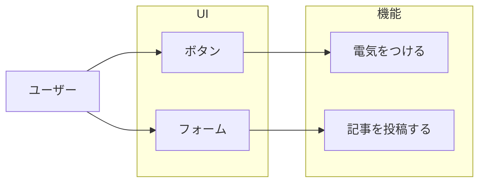
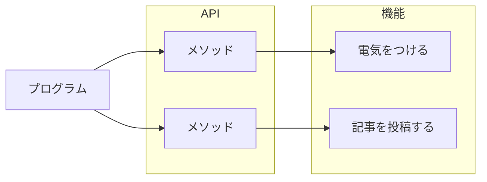
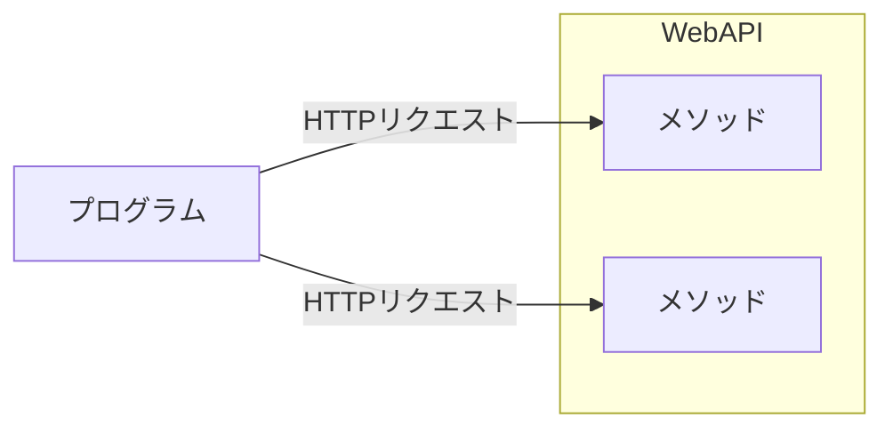
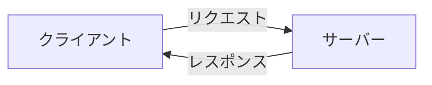
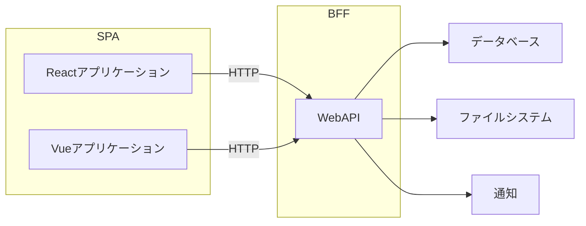

# WebAPI

この節では WebAPI について確認します。

Hono は簡単に WebAPI を作成することができます。それでは Web API とは何でしょうか。

# API

APIとは Application Programming Interface の略で、アプリケーション同士が相互にやり取りをするためのインターフェースのことです。

対象の機能に対してプログラムから呼び出すことができるようにしたものです。

ボタンやフォームなどのUIと比較して考えてみましょう。

ユーザーが機能にアクセスするために使うボタンやフォームはUI=User Interface です。

プログラムが機能にアクセスするために使うのがAPI=Application Programming Interface です。

# Web API

Web APIはプログラムがWeb(HTTP)を介して機能にアクセスするためのAPIです。

## HTTP リクエスト

HTTP リクエストは、Webにおけるクライアントとサーバー間の通信のことです。

Webサイトを閲覧するときに利用している通信方法です。

HTTP には様々な取り決めがあります。

よく見る取り決めの中にステータスコードというものがあります。

## 404 Not Found

Webページにアクセスすると 404 や NotFound というエラーが表示されることがあります。

これは要求されたリソース（ページ）が見つからないときは 404 という数字を返すことにしましょうという決まりになっています。

## 500 Internal Server Error

チケットの購入やセールなどでWebページにアクセスしたときに「サーバーが落ちている」などして目的の操作ができないときがあります。

このときにサーバーは「500」という数字を返すことにしましょうという決まりになっています。

#　BFF

BFFはBackend For Frontendの略で、フロントエンドのためのバックエンドという意味です。

React や Vue.js の普及に伴いBFFという考え方が広まっています。

React や Vue.js などのフロントエンドのアプリケーションは、Web APIを利用してデータを取得したり、データを送信したりします。

# まとめ

WebAPIとフロントエンドの関係を確認したうえで、Honoを使って作るWebAPIの役割を確認しました。

次からは実際に WebAPI を実装してみましょう。

- [簡単なWebAPIの実装](./03-basic.md)
