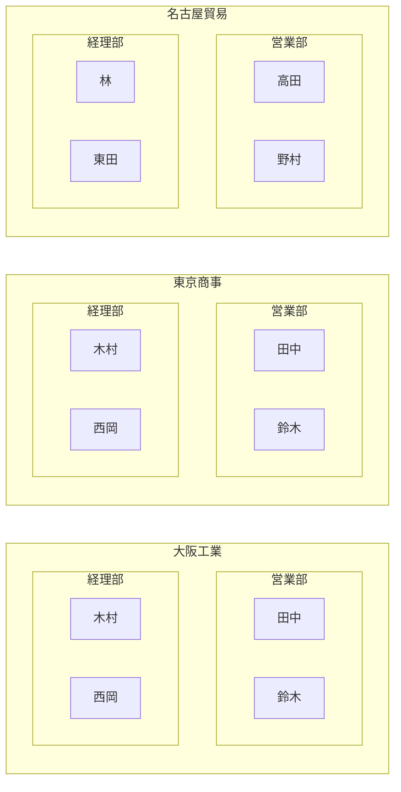
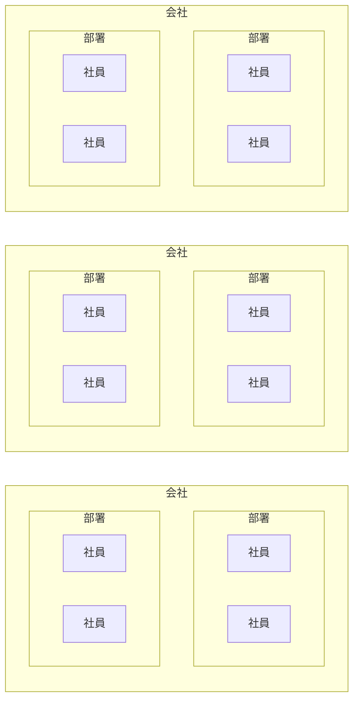
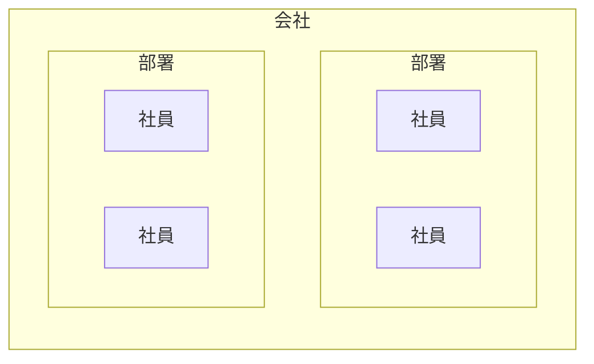
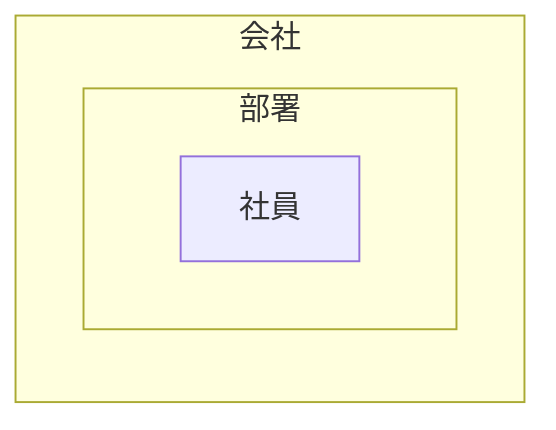
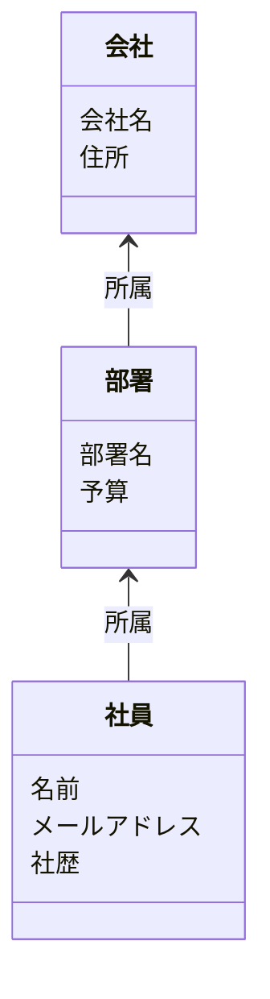
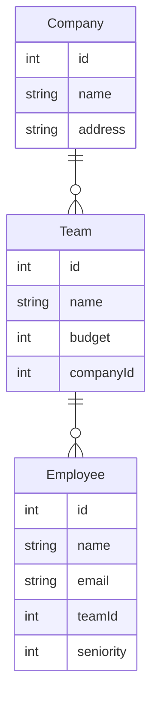
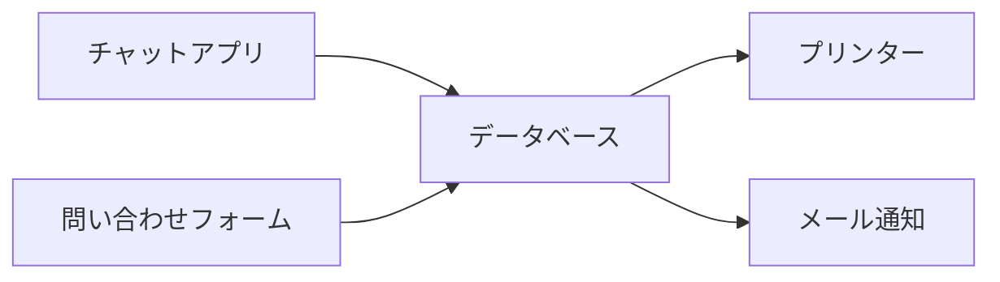
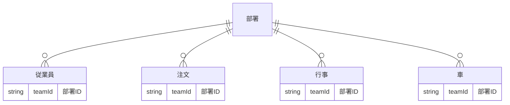
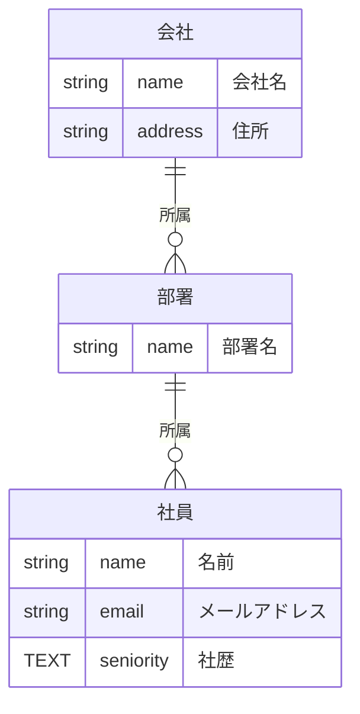

# データベースの用意

このセクションでは、SQLite をセットアップし、データベースを作成してデータを操作する方法を学びます。

# データについて

次のような状態を管理するシステムを作ろうと考えているとします。



具体的な名称を取り除いて一般的な名称にしてみましょう。



一つの会社に着目してみましょう。



会社の中で重複するものを取り除きましょう。




こういうように書くこともできます。


こうすることで書くデータが何を持っているのかも表現することができます。



このように取り扱おうとしているデータがどのような形をしているのかを考えることをデータモデリングといいます。

会社や部署、社員のような一つ一つをモデルと呼ぶことがあります。

このモデルを保存できるようにするためにデータベースを設計する必要があります。

以下の内容の細かい説明はしませんが先程のモデルを保存する形にしました。

同じ形のデータを保存しておく塊をテーブルと呼びます。そのテーブルの形をテーブル定義と呼びます。



データベースがどのような形になるかを考える流れを追ってきました。最後にデータベースがどのように使われるのかを見ていきます。



データベースだけでなにか機能の目的を達成することはほとんどありません。何かしらの他のアプリケーションがデータを利用するためにデータベースが使われます。

逆に言うとデータの読み書きを扱うアプリケーションはすべてデータベースを必要とします。データベースの話は具体的な機能から遠くなり何をしているのかわかりにくくなります。

これがアプリケーションの中心にあるデータを扱っているのだと考えながら学習を進めて欲しいです。

---

# 1. SQLite のセットアップ

SQLite は軽量なデータベースで、シンプルな構成でアプリケーションに組み込むことができます。

Windows では [**Scoop** ](https://scoop.sh/) を使用してインストールできます。

その他にも [公式サイト](https://www.sqlite.org/) からのインストールの方法もあります。

Scoop はこの後も使うので、まずは Scoop のインストールから始めましょう。

## Scoop とは

Scoop は Windows 用のパッケージマネージャで、コマンドラインからアプリケーションをインストール・アップデート・アンインストールできます。

Linux の `apt` や macOS の `brew` に似た使い勝手を提供します。

## 1-1. Scoop のインストール

1. PowerShell を管理者権限で開き、以下のコマンドを実行します。

   ```powershell
   Set-ExecutionPolicy -ExecutionPolicy RemoteSigned -Scope CurrentEmployee
   Invoke-RestMethod -Uri https://get.scoop.sh | Invoke-Expression
   ```

2. Scoop の `main` バケットが追加されていることを確認します。

   ```sh
   > scoop bucket list
   Name Source               Updated             Manifests
   ---- ------               -------             ---------
   main ~\scoop\buckets\main 2025/02/07 13:44:59      1357
   ```

   `main` バケットがない場合は、追加してください。

   ```sh
   scoop bucket add main
   ```

## 1-2. SQLite のインストール

Scoop を使って SQLite をインストールします。

```powershell
> scoop install sqlite
```

## 1-3. SQLiteBrowser のインストール

データベースを GUI で管理できる **DB Browser for SQLite** もインストールします。

```powershell
> scoop install sqlitebrowser
```

インストールのために他のプログラムのインストールが必要になる可能性があります。

エラーが出た場合は、エラーメッセージに従って必要なプログラムをインストールしてください。

インストールが完了したら、`sqlite3` コマンドと `sqlitebrowser` コマンドが使えることを確認します。

```sh
sqlite3 --version
sqlitebrowser
```

scoop でインストールできない場合は公式サイトからもダウンロードできます。

[https://sqlitebrowser.org/dl/](https://sqlitebrowser.org/dl/)

---

# 2. データベースの作成

1. SQLite のデータベースファイルを作成するために、ターミナルで以下のコマンドを実行します。

   ```sh
   sqlite3 database.sqlite
   ```

   これにより、`database.sqlite` というファイルが作成され、SQLite のコマンドラインが開きます。

2. `.tables` コマンドでテーブルがないことを確認します。

   ```sql
   .tables
   ```

   **出力:**
   ```
   (何も表示されない)
   ```

---

## 2-1. employee テーブルの作成

次に、`employee` テーブルを作成します。

```sql
CREATE TABLE employee (
  id INTEGER PRIMARY KEY AUTOINCREMENT,
  name TEXT NOT NULL,
  email TEXT UNIQUE NOT NULL,
  seniority INTEGER DEFAULT 0
);
```

作成したテーブルを確認するには、以下のコマンドを実行します。

```sql
.tables
```

**出力:**
```
employee
```

カラム情報を確認するには、以下のコマンドを実行します。

```sql
PRAGMA table_info(employee);
0|id|INTEGER|0||1
1|name|TEXT|1||0
2|email|TEXT|1||0
3|seniority|INTEGER|0|0|0
```

## 2-2. テーブルに対しての制約

テーブルを作るときにテーブルに対して制約を与えることができます。

例えば、SNSを使っていて同じアカウントIDを持っている人が2人いると困ることがあります。

このようなことが起こらないようにテーブルに対して制約を与えることができます。

### `PRIMARY KEY`

テーブルの中にあるデータそれぞれが一意であることを保証するために使います。

### `NOT NULL`

そのカラムが必ず値を持つことを保証するために使います。

### `DEFAULT`

そのカラムが値を持たない場合にデフォルトの値を持つようにします。

---

# 3. データの追加と SELECT 文の実行

## 3-1. データの追加

以下の SQL でデータを追加します。

```sql
INSERT INTO employee (name, email, seniority) VALUES ('田中太郎', 'taro@tanaka.jp', 5);
INSERT INTO employee (name, email, seniority) VALUES ('山田花子', 'hanako@yamada.jp', 11);
INSERT INTO employee (name, email, seniority) VALUES ('鈴木慶一', 'keichi@suzuki.jp', 15);
INSERT INTO employee (name, email, seniority) VALUES ('中村恵', 'megumi@nakamura.jp', 2);
INSERT INTO employee (name, email, seniority) VALUES ('木下祐介', 'yusuke@kinoshita.jp', 10);
INSERT INTO employee (name, email, seniority) VALUES ('ジョーンフガート', 'doe@fugate.com', 8);
INSERT INTO employee (name, email, seniority) VALUES ('左雨泽', 'yuze@zuo.ch', 9);
```

## 4-2. データの取得

追加したデータを取得します。

```sql
SELECT * FROM employee;
1|田中太郎|taro@tanaka.jp|5
2|山田花子|hanako@yamada.jp|11
3|鈴木慶一|keichi@suzuki.jp|15
4|中村恵|megumi@nakamura.jp|2
5|木下祐介|yusuke@kinoshita.jp|10
6|ジョーンフガート|doe@fugate.com|8
7|左雨泽|yuze@zuo.ch|9

```

`*` は全てのカラムを取得するという意味です。

また次のようにも書くことができます。

```sql
SELECT id, name, email, seniority FROM employee;
1|田中太郎|taro@tanaka.jp|5
2|山田花子|hanako@yamada.jp|11
3|鈴木慶一|keichi@suzuki.jp|15
4|中村恵|megumi@nakamura.jp|2
5|木下祐介|yusuke@kinoshita.jp|10
6|ジョーンフガート|doe@fugate.com|8
7|左雨泽|yuze@zuo.ch|9
```

### SELECT文

文の構造としては次のようになっています。

```sql
SELECT 何を FROM どこから;
```

```sql
SELECT すべてを FROM ユーザーテーブルから;
```

```sql
SELECT * FROM employee;
```

### 条件を指定する

社歴が10年以上の社員の一覧を取得します。

```sql
SELECT * FROM employee WHERE seniority >= 10;
2|山田花子|hanako@yamada.jp|11
3|鈴木慶一|keichi@suzuki.jp|15
5|木下祐介|yusuke@kinoshita.jp|10
```

文の構造としては次のようになっています。

```sql
SELECT 何を FROM どこから WHERE 条件;
```

ここでは条件が次のようになっていました。

```
seniority >= 10
```

これはテーブルのカラムに対しての条件式です。

条件式の書き方には様々なものがあります。ここではWHEREを使うことで取得する内容を絞り込めることを確認してください。

## テーブルをまたいだデータの参照

従業員に対して部署を設定します。

従業員テーブルに対して部署名を追加することもできます。

ただし、注文や行事、車など他にも部署を登録したいときに部署に関する情報をすべて各テーブルに追加する場合次のような問題が起きます。

- データ量が増える
- データの変更の手間が増える
- データの整合性が取れなくなる

データの整合性が取れなくなるというのは、部署に名前以外の他に住所や連絡先があるとします。
部署の情報が変更になった場合にすべてのデータを変更する必要があります。

各テーブルが部署のIDを持つことで先のような問題を解決します。



### team テーブルの作成

`team` テーブルを作成します。

```sql
CREATE TABLE team (
  id INTEGER PRIMARY KEY AUTOINCREMENT,
  name TEXT NOT NULL
);
```

`team` テーブルにデータを追加します。

```sql
INSERT INTO team (name) VALUES ('営業');
INSERT INTO team (name) VALUES ('製造');
INSERT INTO team (name) VALUES ('販売');
```

データを確認します。

```sql
SELECT * FROM team;
1|営業
2|製造
3|販売
```

### employee テーブルの構造を変更

employee テーブルの構造を確認します。

```sql
PRAGMA table_info(employee);
0|id|INTEGER|0||1
1|name|TEXT|1||0
2|email|TEXT|1||0
3|seniority|INTEGER|0|0|0
```

この内容は次のような意味を持ちます。
ここでは PRIMARY KEY 制約が id に設定されていることがわかりますが一旦無視します。

| カラム名 | データ型 | NOT NULL 制約 | PRIMARY KEY 制約 | AUTOINCREMENT 制約 |
| --- | --- | --- | --- | --- |
| id | INTEGER | なし |  | あり |
| name | TEXT | あり |  | なし |
| email | TEXT | あり |  | なし |
| seniority | INTEGER | なし |  | なし |

カラム名とデータ型に注目してください。

次にテーブルの構造を変更します。

employee テーブルに team の id を持てるようにします。

```sql
ALTER TABLE employee ADD COLUMN team_id INTEGER;
```

テーブルの構造を確認しましょう。

```sql
PRAGMA table_info(employee);
0|id|INTEGER|0||1
1|name|TEXT|1||0
2|email|TEXT|1||0
3|seniority|INTEGER|0|0|0
4|team_id|INTEGER|0||0
```

| カラム名 | データ型 | NOT NULL 制約 | PRIMARY KEY 制約 | AUTOINCREMENT 制約 |
| --- | --- | --- | --- | --- |
| id | INTEGER | なし |  | あり |
| name | TEXT | あり |  | なし |
| email | TEXT | あり |  | なし |
| seniority | INTEGER | なし |  | なし |
| team_id | INTEGER | なし |  | なし |

team_id が追加されたことがわかります。

ユーザーの情報を確認しましょう。

```sql
SELECT * FROM employee;
1|田中太郎|taro@tanaka.jp|5|
2|山田花子|hanako@yamada.jp|11|
3|鈴木慶一|keichi@suzuki.jp|15|
4|中村恵|megumi@nakamura.jp|2|
5|木下祐介|yusuke@kinoshita.jp|10|
6|ジョーンフガート|doe@fugate.com|8|
7|左雨泽|yuze@zuo.ch|9|
```

| id | name          | email              | seniority | team_id |
|----|--------------|--------------------|-----------|---------|
| 1  | 田中太郎     | taro@tanaka.jp     | 5         | (NULL)  |
| 2  | 山田花子     | hanako@yamada.jp   | 11        | (NULL)  |
| 3  | 鈴木慶一     | keichi@suzuki.jp   | 15        | (NULL)  |
| 4  | 中村恵       | megumi@nakamura.jp | 2         | (NULL)  |
| 5  | 木下祐介     | yusuke@kinoshita.jp | 0        | (NULL)  |
| 6  | ジョーンフガート | doe@fugate.com  | 0         | (NULL)  |
| 7  | 左雨泽       | yuze@zuo.ch        | 0         | (NULL)  |


team_id はどの行にも指定されていません。

ユーザーの情報を更新します。

```sql
UPDATE employee SET team_id = 1 WHERE id = 1;
UPDATE employee SET team_id = 1 WHERE id = 2;
```
ユーザーテーブルの内容を確認しましょう。

```sql
SELECT * FROM employee;
1|田中太郎|taro@tanaka.jp|5|1
2|山田花子|hanako@yamada.jp|11|1
3|鈴木慶一|keichi@suzuki.jp|15|
4|中村恵|megumi@nakamura.jp|2|
5|木下祐介|yusuke@kinoshita.jp|10|
6|ジョーンフガート|doe@fugate.com|8|
7|左雨泽|yuze@zuo.ch|9|
```

これは次のような意味を持ちます

| id | name          | email              | seniority | team_id |
|----|--------------|--------------------|-----------|---------|
| 1  | 田中太郎     | taro@tanaka.jp     | 5         | 1       |
| 2  | 山田花子     | hanako@yamada.jp   | 11        | 1       |
| 3  | 鈴木慶一     | keichi@suzuki.jp   | 15        | (NULL)  |
| 4  | 中村恵       | megumi@nakamura.jp | 2         | (NULL)  |
| 5  | 木下祐介     | yusuke@kinoshita.jp | 0        | (NULL)  |
| 6  | ジョーンフガート | doe@fugate.com  | 0         | (NULL)  |
| 7  | 左雨泽       | yuze@zuo.ch        | 0         | (NULL)  |

営業 チームに属しているユーザーの一覧を取得しましょう。

```sql
SELECT * FROM employee WHERE team_id = 1;
```

```sql
SELECT * FROM employee WHERE team_id = 1;
1|田中太郎|taro@tanaka.jp|5|1
2|山田花子|hanako@yamada.jp|11|1
```

| id | name      | email            | seniority | team_id |
|----|----------|-----------------|-----------|---------|
| 1  | 田中太郎 | taro@tanaka.jp   | 5         | 1       |
| 2  | 山田花子 | hanako@yamada.jp | 11        | 1       |

これに対して部署の名前を表示できるようにしましょう。

```sql
SELECT employee.id, employee.name, team.name
   FROM employee
   JOIN team ON employee.team_id = team.id;
1|田中太郎|営業
2|山田花子|営業
```

| id | name      | team_name |
|----|----------|----------|
| 1  | 田中太郎 | 営業     |
| 2  | 山田花子 | 営業     |

部署名が表示できました。

### SQLの構造

```sql
SELECT なにを FROM どこから
```

に対して `JOIN テーブル名 ON 結合条件` を追加することで複数のテーブルからデータを取得することができます。

```sql
SELECT なにを
   FROM どこから
   JOIN つなげるテーブル ON つなげ方
```

```sql
SELECT *
   FROM employee
   JOIN team ON employee.team_id = team.id;
```

---

# 4. データの削除

## 行の削除

データを削除するには `DELETE` 文を使います。


削除前の状態
```sql
SELECT * FROM employee;
1|田中太郎|taro@tanaka.jp|5|1
2|山田花子|hanako@yamada.jp|11|1
3|鈴木慶一|keichi@suzuki.jp|15|
4|中村恵|megumi@nakamura.jp|2|
5|木下祐介|yusuke@kinoshita.jp|0|
6|ジョーンフガート|doe@fugate.com|0|
7|左雨泽|yuze@zuo.ch|0|
```

削除前の実行
```sql
DELETE FROM employee WHERE id = 1;
```

削除後の状態
```sql
SELECT * FROM employee;
2|山田花子|hanako@yamada.jp|11|1
3|鈴木慶一|keichi@suzuki.jp|15|
4|中村恵|megumi@nakamura.jp|2|
5|木下祐介|yusuke@kinoshita.jp|0|
6|ジョーンフガート|doe@fugate.com|0|
7|左雨泽|yuze@zuo.ch|0|
```

## 表の削除

テーブルを削除するには `DROP` 文を使います。

削除前の状態
```sql
.tables
employee  team
```

削除の実行
```sql
DROP TABLE employee;
```

削除後の状態
```sql
.tables
team
```

# 理解の確認

## 社員の管理

複数の会社の社員の状態を管理するデータベースを作ります。

社員のデータは次のとおりです。

```csv
会社名,住所,部署名,名前,メールアドレス,社歴
東京貿易,東京都港区,営業,田中太郎,taro@tanaka.jp,5年
東京貿易,東京都港区,営業,山田花子,hanako@yamada.jp,11年
東京貿易,東京都港区,開発,鈴木慶一,keichi@suzuki.jp,15年
大阪商事,大阪府大阪市,開発,中村恵,megumi@nakamura.jp,2年
大阪商事,大阪府大阪市,人事,木下祐介,yusuke@kinoshita.jp,1年
福岡カンパニー,福岡県福岡市,人事,ジョーンフガート,doe@fugate.com,1年
福岡カンパニー,福岡県福岡市,営業,左雨泽,yuze@zuo.ch,11年
東京貿易,東京都港区,開発,佐藤健,sato@tokyo.co.jp,3年
東京貿易,東京都港区,営業,高橋愛,ai@tokyo.co.jp,7年
東京貿易,東京都港区,人事,伊藤和也,kazuya@tokyo.co.jp,10年
大阪商事,大阪府大阪市,営業,藤井誠,fujii@osaka.co.jp,6年
大阪商事,大阪府大阪市,開発,三浦亮,miura@osaka.co.jp,9年
大阪商事,大阪府大阪市,人事,大塚佳奈,kana@osaka.co.jp,4年
福岡カンパニー,福岡県福岡市,営業,村上翔,murakami@fukuoka.co.jp,2年
福岡カンパニー,福岡県福岡市,開発,橋本悠,hashimoto@fukuoka.co.jp,8年
福岡カンパニー,福岡県福岡市,人事,松井玲奈,rena@fukuoka.co.jp,5年
東京貿易,東京都港区,営業,加藤直樹,kato@tokyo.co.jp,12年
大阪商事,大阪府大阪市,開発,石田健一,ishida@osaka.co.jp,14年
福岡カンパニー,福岡県福岡市,営業,小林優,kobayashi@fukuoka.co.jp,3年
福岡カンパニー,福岡県福岡市,開発,清水健,shimizu@fukuoka.co.jp,7年
```
| 会社名         | 住所             | 部署名 | 名前       | メールアドレス             | 社歴  |
|--------------|----------------|------|-----------|----------------------|------|
| 東京貿易       | 東京都港区         | 営業  | 田中太郎   | taro@tanaka.jp     | 5年  |
| 東京貿易       | 東京都港区         | 営業  | 山田花子   | hanako@yamada.jp   | 11年  |
| 東京貿易       | 東京都港区         | 開発  | 鈴木慶一   | keichi@suzuki.jp   | 15年  |
| 大阪商事       | 大阪府大阪市       | 開発  | 中村恵     | megumi@nakamura.jp | 2年  |
| 大阪商事       | 大阪府大阪市       | 人事  | 木下祐介   | yusuke@kinoshita.jp | 1年  |
| 福岡カンパニー   | 福岡県福岡市       | 人事  | ジョーンフガート | doe@fugate.com     | 1年  |
| 福岡カンパニー   | 福岡県福岡市       | 営業  | 左雨泽     | yuze@zuo.ch        | 11年  |
| 東京貿易       | 東京都港区         | 開発  | 佐藤健     | sato@tokyo.co.jp   | 3年  |
| 東京貿易       | 東京都港区         | 営業  | 高橋愛     | ai@tokyo.co.jp     | 7年  |
| 東京貿易       | 東京都港区         | 人事  | 伊藤和也   | kazuya@tokyo.co.jp | 10年  |
| 大阪商事       | 大阪府大阪市       | 営業  | 藤井誠     | fujii@osaka.co.jp  | 6年  |
| 大阪商事       | 大阪府大阪市       | 開発  | 三浦亮     | miura@osaka.co.jp  | 9年  |
| 大阪商事       | 大阪府大阪市       | 人事  | 大塚佳奈   | kana@osaka.co.jp   | 4年  |
| 福岡カンパニー   | 福岡県福岡市       | 営業  | 村上翔     | murakami@fukuoka.co.jp | 2年  |
| 福岡カンパニー   | 福岡県福岡市       | 開発  | 橋本悠     | hashimoto@fukuoka.co.jp | 8年  |
| 福岡カンパニー   | 福岡県福岡市       | 人事  | 松井玲奈   | rena@fukuoka.co.jp | 5年  |
| 東京貿易       | 東京都港区         | 営業  | 加藤直樹   | kato@tokyo.co.jp   | 12年  |
| 大阪商事       | 大阪府大阪市       | 開発  | 石田健一   | ishida@osaka.co.jp | 14年  |
| 福岡カンパニー   | 福岡県福岡市       | 営業  | 小林優     | kobayashi@fukuoka.co.jp | 3年  |
| 福岡カンパニー   | 福岡県福岡市       | 開発  | 清水健     | shimizu@fukuoka.co.jp | 7年  |

要件は次のとおりです。

- 会社には複数の部署がある
- 部署には複数の社員がいる
- 会社には名前と住所がある
- 部署には名前がある
- 社員には名前とメールアドレスと社歴がある



## 基本的な課題

- 必要なテーブルを一覧してください
- 各テーブルに必要なカラムを決めてください
- データベースを新たに作ってテーブルを作成してください
- データを追加してください

### 例

会社テーブルの作成
```sql
CREATE TABLE company (
  id INTEGER PRIMARY KEY AUTOINCREMENT,
  name TEXT NOT NULL,
  address TEXT NOT NULL
);
```

部署テーブルの作成
```sql
CREATE TABLE team (
  id INTEGER PRIMARY KEY AUTOINCREMENT,
  name TEXT NOT NULL,
  company_id INTEGER NOT NULL
);
```

従業員テーブルの作成
```sql
CREATE TABLE employee (
  id INTEGER PRIMARY KEY AUTOINCREMENT,
  name TEXT NOT NULL,
  email TEXT NOT NULL,
  seniority INTEGER NOT NULL,
  team_id INTEGER NOT NULL
);
```

会社テーブルのデータの挿入
```sql
INSERT INTO company (name, address) VALUES
  ('大阪商事','大阪府大阪市'),
  ('東京貿易','東京都港区'),
  ('福岡カンパニー','福岡県福岡市');
```

部署テーブルのデータの挿入
```sql
INSERT INTO team (name, company_id) VALUES
  ('営業', (SELECT id FROM company WHERE name = '大阪商事' LIMIT 1)),
  ('開発', (SELECT id FROM company WHERE name = '大阪商事' LIMIT 1)),
  ('人事', (SELECT id FROM company WHERE name = '大阪商事' LIMIT 1)),
  ('営業', (SELECT id FROM company WHERE name = '東京貿易' LIMIT 1)),
  ('開発', (SELECT id FROM company WHERE name = '東京貿易' LIMIT 1)),
  ('人事', (SELECT id FROM company WHERE name = '東京貿易' LIMIT 1)),
  ('営業', (SELECT id FROM company WHERE name = '福岡カンパニー' LIMIT 1)),
  ('開発', (SELECT id FROM company WHERE name = '福岡カンパニー' LIMIT 1)),
  ('人事', (SELECT id FROM company WHERE name = '福岡カンパニー' LIMIT 1));
```

従業員テーブルのデータの挿入
```sql
INSERT INTO employee (name, email, seniority, team_id) VALUES
  ('田中太郎', 'taro@tanaka.jp', 5, (SELECT team.id FROM team JOIN company ON team.company_id = company.id WHERE company.name = '東京貿易' AND team.name = '営業' LIMIT 1)),
  ('山田花子', 'hanako@yamada.jp', 11, (SELECT team.id FROM team JOIN company ON team.company_id = company.id WHERE company.name = '東京貿易' AND team.name = '営業' LIMIT 1)),
  ('鈴木慶一', 'keichi@suzuki.jp', 15, (SELECT team.id FROM team JOIN company ON team.company_id = company.id WHERE company.name = '東京貿易' AND team.name = '開発' LIMIT 1)),
  ('中村恵', 'megumi@nakamura.jp', 2, (SELECT team.id FROM team JOIN company ON team.company_id = company.id WHERE company.name = '大阪商事' AND team.name = '開発' LIMIT 1)),
  ('木下祐介', 'yusuke@kinoshita.jp', 1, (SELECT team.id FROM team JOIN company ON team.company_id = company.id WHERE company.name = '大阪商事' AND team.name = '人事' LIMIT 1)),
  ('ジョーンフガート', 'doe@fugate.com', 1, (SELECT team.id FROM team JOIN company ON team.company_id = company.id WHERE company.name = '福岡カンパニー' AND team.name = '人事' LIMIT 1)),
  ('左雨泽', 'yuze@zuo.ch', 11, (SELECT team.id FROM team JOIN company ON team.company_id = company.id WHERE company.name = '福岡カンパニー' AND team.name = '営業' LIMIT 1)),
  ('佐藤健', 'sato@tokyo.co.jp', 3, (SELECT team.id FROM team JOIN company ON team.company_id = company.id WHERE company.name = '東京貿易' AND team.name = '開発' LIMIT 1)),
  ('高橋愛', 'ai@tokyo.co.jp', 7, (SELECT team.id FROM team JOIN company ON team.company_id = company.id WHERE company.name = '東京貿易' AND team.name = '営業' LIMIT 1)),
  ('伊藤和也', 'kazuya@tokyo.co.jp', 10, (SELECT team.id FROM team JOIN company ON team.company_id = company.id WHERE company.name = '東京貿易' AND team.name = '人事' LIMIT 1));
INSERT INTO employee (name, email, seniority, team_id) VALUES
  ('藤井誠', 'fujii@osaka.co.jp', 6, (SELECT team.id FROM team JOIN company ON team.company_id = company.id WHERE company.name = '大阪商事' AND team.name = '営業' LIMIT 1)),
  ('三浦亮', 'miura@osaka.co.jp', 9, (SELECT team.id FROM team JOIN company ON team.company_id = company.id WHERE company.name = '大阪商事' AND team.name = '開発' LIMIT 1)),
  ('大塚佳奈', 'kana@osaka.co.jp', 4, (SELECT team.id FROM team JOIN company ON team.company_id = company.id WHERE company.name = '大阪商事' AND team.name = '人事' LIMIT 1)),
  ('村上翔', 'murakami@fukuoka.co.jp', 2, (SELECT team.id FROM team JOIN company ON team.company_id = company.id WHERE company.name = '福岡カンパニー' AND team.name = '営業' LIMIT 1)),
  ('橋本悠', 'hashimoto@fukuoka.co.jp', 8, (SELECT team.id FROM team JOIN company ON team.company_id = company.id WHERE company.name = '福岡カンパニー' AND team.name = '開発' LIMIT 1)),
  ('松井玲奈', 'rena@fukuoka.co.jp', 5, (SELECT team.id FROM team JOIN company ON team.company_id = company.id WHERE company.name = '福岡カンパニー' AND team.name = '人事' LIMIT 1)),
  ('加藤直樹', 'kato@tokyo.co.jp', 12, (SELECT team.id FROM team JOIN company ON team.company_id = company.id WHERE company.name = '東京貿易' AND team.name = '営業' LIMIT 1)),
  ('石田健一', 'ishida@osaka.co.jp', 14, (SELECT team.id FROM team JOIN company ON team.company_id = company.id WHERE company.name = '大阪商事' AND team.name = '開発' LIMIT 1)),
  ('小林優', 'kobayashi@fukuoka.co.jp', 3, (SELECT team.id FROM team JOIN company ON team.company_id = company.id WHERE company.name = '福岡カンパニー' AND team.name = '営業' LIMIT 1)),
  ('清水健', 'shimizu@fukuoka.co.jp', 7, (SELECT team.id FROM team JOIN company ON team.company_id = company.id WHERE company.name = '福岡カンパニー' AND team.name = '開発' LIMIT 1));
```

## 応用的な課題

- 3年以下の社歴の社員の名前とメールアドレスを取得してください
- 10年以上の社員がいる会社名と住所と部署の名前を取得してください

### 例

```
SELECT name, email FROM employee WHERE seniority <= 3;
中村恵|megumi@nakamura.jp
木下祐介|yusuke@kinoshita.jp
ジョーンフガート|doe@fugate.com
佐藤健|sato@tokyo.co.jp
村上翔|murakami@fukuoka.co.jp
小林優|kobayashi@fukuoka.co.jp
```

```
SELECT company.name, company.address, team.name
   FROM team
      JOIN employee
         ON team.id = employee.team_id
      JOIN company
         ON team.company_id = company.id
   WHERE
      employee.seniority >= 10;
東京貿易|東京都港区|営業
東京貿易|東京都港区|開発
福岡カンパニー|福岡県福岡市|営業
東京貿易|東京都港区|人事
東京貿易|東京都港区|営業
大阪商事|大阪府大阪市|開発
```

# まとめ

ここまでデータベースの構築とデータの操作を確認してきました。

実際に存在する情報をデータベースの形に変えるためにいくつかの図を見ました。

また、データの取得や追加変更の方法を見ました。データの取得のときには複数のテーブルを参照した取得方法も見ました。

データベースの技術自体はデータの表現だけではなくパフォーマンスの改善やデータの整合性の確保など様々な分野がありここで触れたのはほんの僅かな知識です。

この分野にもっと関心がある場合はさらに学習を深めて欲しいです。

次の章ではこのデータベースを使ったWebAPIの実装を進めていきます。
