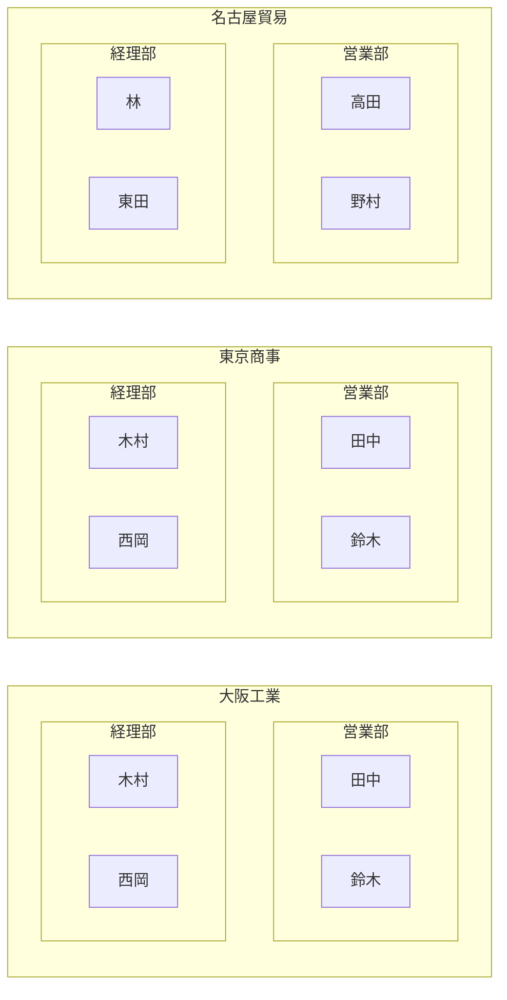
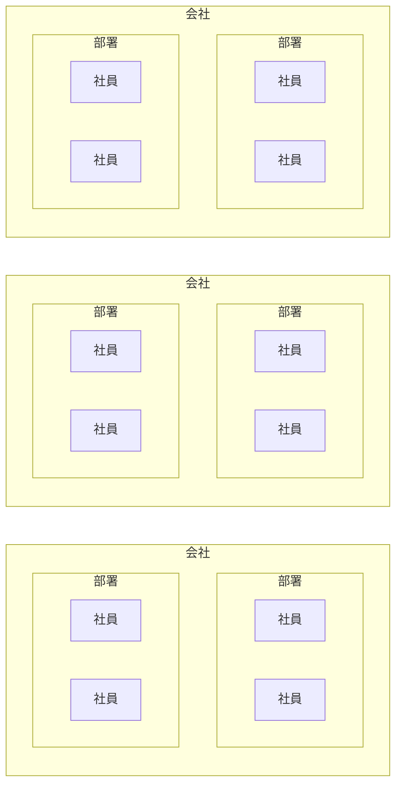
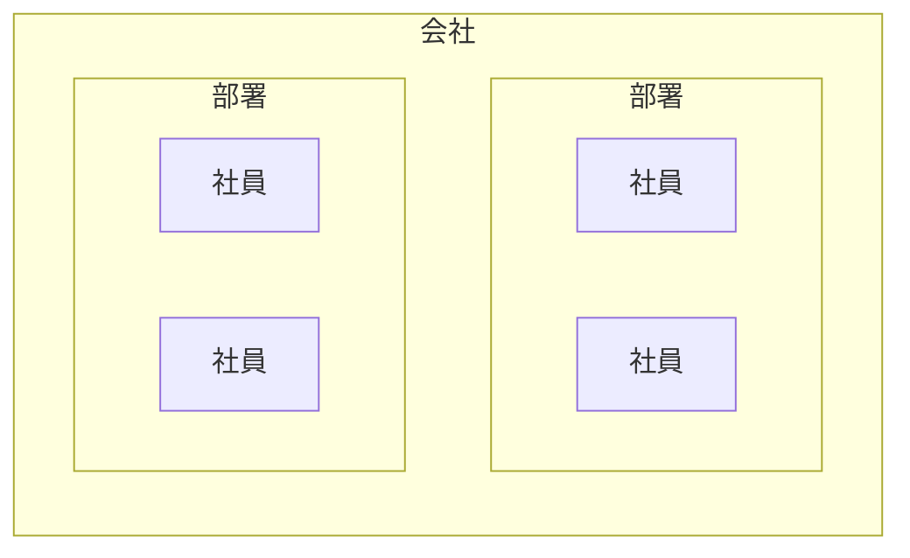
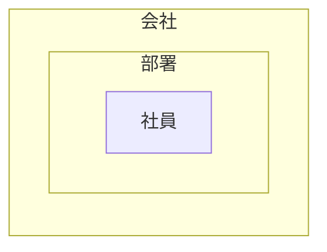
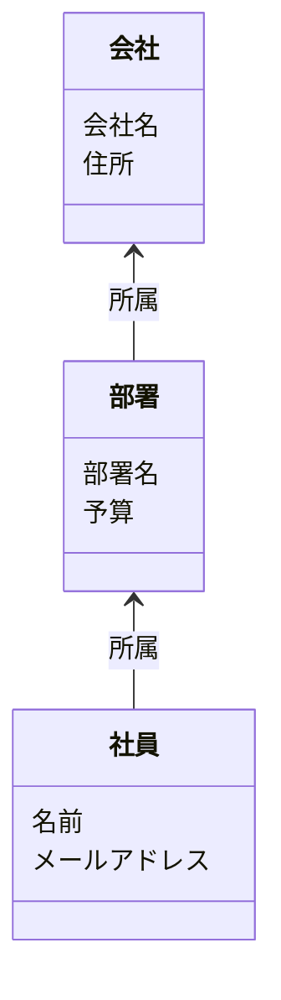
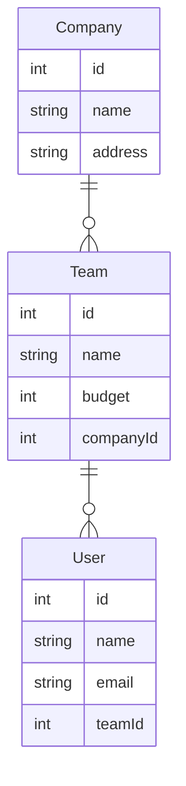
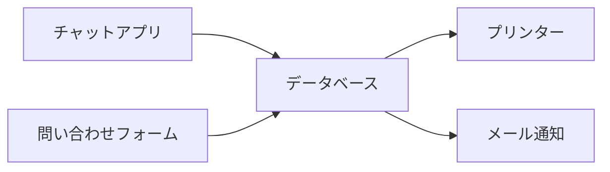

# データベースの用意

このセクションでは、SQLite をセットアップし、データベースを作成してデータを操作する方法を学びます。

## データについて

次のような状態を管理するシステムを作ろうと考えているとします。



具体的な名称を取り除いて一般的な名称にしてみましょう。



一つの会社に着目してみましょう。



会社の中で重複するものを取り除きましょう。




こういうように書くこともできます。


こうすることで書くデータが何を持っているのかも表現することができます。



このように取り扱おうとしているデータがどのような形をしているのかを考えることをデータモデリングといいます。

会社や部署、社員のような一つ一つをモデルと呼ぶことがあります。

このモデルを保存できるようにするためにデータベースを設計する必要があります。

以下の内容の細かい説明はしませんが先程のモデルを保存する形にしました。

同じ形のデータを保存しておく塊をテーブルと呼びます。そのテーブルの形をテーブル定義と呼びます。



データベースがどのような形になるかを考える流れを追ってきました。最後にデータベースがどのように使われるのかを見ていきます。



データベースだけでなにか機能の目的を達成することはほとんどありません。何かしらの他のアプリケーションがデータを利用するためにデータベースが使われます。

逆に言うとデータの読み書きを扱うアプリケーションはすべてデータベースを必要とします。データベースの話は具体的な機能から遠くなり何をしているのかわかりにくくなります。

これがアプリケーションの中心にあるデータを扱っているのだと考えながら学習を進めて欲しいです。

---

## 1. SQLite のセットアップ

SQLite は軽量なデータベースで、シンプルな構成でアプリケーションに組み込むことができます。

Windows では [**Scoop** ](https://scoop.sh/) を使用してインストールできます。

その他にも [公式サイト](https://www.sqlite.org/) からのインストールの方法もあります。

Scoop はこの後も使うので、まずは Scoop のインストールから始めましょう。

### Scoop とは

Scoop は Windows 用のパッケージマネージャで、コマンドラインからアプリケーションをインストール・アップデート・アンインストールできます。

Linux の `apt` や macOS の `brew` に似た使い勝手を提供します。

### 1-1. Scoop のインストール

1. PowerShell を管理者権限で開き、以下のコマンドを実行します。

   ```powershell
   Set-ExecutionPolicy -ExecutionPolicy RemoteSigned -Scope CurrentUser
   Invoke-RestMethod -Uri https://get.scoop.sh | Invoke-Expression
   ```

2. Scoop の `main` バケットが追加されていることを確認します。

   ```sh
   > scoop bucket list
   Name Source               Updated             Manifests
   ---- ------               -------             ---------
   main ~\scoop\buckets\main 2025/02/07 13:44:59      1357
   ```

   `main` バケットがない場合は、追加してください。

   ```sh
   scoop bucket add main
   ```

### 1-2. SQLite のインストール
Scoop を使って SQLite をインストールします。

```powershell
> scoop install sqlite
```

### 1-3. SQLiteBrowser のインストール

データベースを GUI で管理できる **DB Browser for SQLite** もインストールします。

```powershell
> scoop install sqlitebrowser
```

インストールのために他のプログラムのインストールが必要になる可能性があります。

エラーが出た場合は、エラーメッセージに従って必要なプログラムをインストールしてください。

インストールが完了したら、`sqlite3` コマンドと `sqlitebrowser` コマンドが使えることを確認します。

```sh
sqlite3 --version
sqlitebrowser
```

scoop でインストールできない場合は公式サイトからもダウンロードできます。

[https://sqlitebrowser.org/dl/](https://sqlitebrowser.org/dl/)

---

## 2. データベースの作成

1. SQLite のデータベースファイルを作成するために、ターミナルで以下のコマンドを実行します。

   ```sh
   sqlite3 mydatabase.db
   ```

   これにより、`mydatabase.db` というファイルが作成され、SQLite のコマンドラインが開きます。

2. `.tables` コマンドでテーブルがないことを確認します。

   ```sql
   .tables
   ```

   **出力:**
   ```
   (何も表示されない)
   ```

---

## 3. user テーブルの作成

次に、`user` テーブルを作成します。

```sql
CREATE TABLE user (
  id INTEGER PRIMARY KEY AUTOINCREMENT,
  name TEXT NOT NULL,
  email TEXT UNIQUE NOT NULL
);
```

作成したテーブルを確認するには、以下のコマンドを実行します。

```sql
.tables
```

**出力:**
```
user
```

カラム情報を確認するには、以下のコマンドを実行します。

```sql
PRAGMA table_info(User);
```

### テーブルに対しての制約

テーブルを作るときにテーブルに対して制約を与えることができます。

例えば、SNSを使っていて同じアカウントIDを持っている人が2人いると困ることがあります。

このようなことが起こらないようにテーブルに対して制約を与えることができます。

### `PRIMARY KEY`

テーブルの中にあるデータそれぞれが一意であることを保証するために使います。

### `NOT NULL`

そのカラムが必ず値を持つことを保証するために使います。


---

## 4. データの追加と SELECT 文の実行

### 4-1. データの追加
以下の SQL でデータを追加します。

```sql
INSERT INTO user (name, email) VALUES ("Alice", "alice@example.com");
INSERT INTO user (name, email) VALUES ("Bob", "bob@example.com");
```

### 4-2. データの取得
追加したデータを取得します。

```sql
SELECT * FROM user;
```

また次のようにも書くことができます。

```sql
SELECT id, name, email FROM user;
```

`*` は全てのカラムを取得するという意味です。

**出力:**
```
1|Alice|alice@example.com
2|Bob|bob@example.com
```

文の構造としては次のようになっています。

```sql
SELECT 何を FROM どこから;
```

```sql
SELECT すべてを FROM ユーザーテーブルから;
```

```sql
SELECT * FROM user;
```

### 4-3. 参照するテーブルの作成

`team` テーブルを作成します。

```sql
CREATE TABLE team (
  id INTEGER PRIMARY KEY AUTOINCREMENT,
  name TEXT NOT NULL
);
```

`team` テーブルにデータを追加します。

```sql
INSERT INTO team (name) VALUES ("Sales");
INSERT INTO team (name) VALUES ("Accounting");
```

更にユーザーを追加します。

```sql
INSERT INTO user (name, email) VALUES ("Charlie", "charlie@example,com");
INSERT INTO user (name, email) VALUES ("doe", "doe@example,com");
INSERT INTO user (name, email) VALUES ("Eve", "eve@example,com");
```

user テーブルの構造を確認します。
```sql
sqlite> PRAGMA table_info(user);
0|id|INTEGER|0||1
1|name|TEXT|1||0
2|email|TEXT|1||0
```

この内容は次のような意味を持ちます。
ここでは PRIMARY KEY 制約が id に設定されていることがわかりますが一旦無視します。

| カラム名 | データ型 | NOT NULL 制約 | PRIMARY KEY 制約 | AUTOINCREMENT 制約 |
| --- | --- | --- | --- | --- |
| id | INTEGER | なし |  | あり |
| name | TEXT | あり |  | なし |
| email | TEXT | あり |  | なし |

カラム名とデータ型に注目してください。


次にテーブルの構造を変更します。

```sql
ALTER TABLE user ADD COLUMN team_id INTEGER;
```

テーブルの構造を確認しましょう。
```sql
sqlite> PRAGMA table_info(User);
0|id|INTEGER|0||1
1|name|TEXT|1||0
2|email|TEXT|1||0
3|team_id|INTEGER|0||0
```

| カラム名 | データ型 | NOT NULL 制約 | PRIMARY KEY 制約 | AUTOINCREMENT 制約 |
| --- | --- | --- | --- | --- |
| id | INTEGER | なし |  | あり |
| name | TEXT | あり |  | なし |
| email | TEXT | あり |  | なし |
| team_id | INTEGER | なし |  | なし |

team_id が追加されたことがわかります。

ユーザーの情報を更新します。

```sql
UPDATE user SET team_id = 1 WHERE id = 1;
UPDATE user SET team_id = 1 WHERE id = 2;
```

IDが1のユーザー、名前はAliceをIDが1のチーム、名前はSalesに所属させました。
IDが2のユーザー、名前はBobをIDが1のチーム、名前はSalesに所属させました。

ユーザーテーブルの内容を確認しましょう。

```sql
> SELECT * FROM user;
1|Alice|alice@example.com|1
2|Bob|bob@example.com|1
3|Charlie|charlie@example,com|
4|doe|doe@example,com|
5|Eve|eve@example,com|
```

これは次のような意味を持ちます

| id | name | email | team_id |
| --- | --- | --- | --- |
| 1 | Alice | alice@example.com | 1 |
| 2 | Bob | bob@example.com | 1 |
| 3 | Charlie | charlie@example,com | *空* |
| 4 | doe | doe@example,com | *空* |
| 5 | Eve | eve@example,com | *空* |

Sales チームに属しているユーザーの一覧を取得しましょう。

```sql
SELECT * FROM user WHERE team_id = 1;
```

```
sqlite> SELECT * FROM user WHERE team_id = 1;
1|Alice|alice@example.com|1
2|Bob|bob@example.com|1
```

これに対して部署の名前を表示できるようにしましょう。

```sql
SELECT user.id, user.name, user.email, team.name
   FROM user
   JOIN team ON user.team_id = team.id;
```

```
sqlite> SELECT user.id, user.name, user.email, team.name
   ...> FROM user
   ...> JOIN team ON user.team_id = team.id;
1|Alice|alice@example.com|Sales
2|Bob|bob@example.com|Sales
```

次のような意味を持ちます。

| id | name | email | team.name |
| --- | --- | --- | --- |
| 1 | Alice | alice@example.com | Sales |
| 2 | Bob | bob@example.com | Sales |

部署名が表示できました。

```sql
SELECT なにを FROM どこから
```

に対して `JOIN テーブル名 ON 結合条件` を追加することで複数のテーブルからデータを取得することができます。

```sql
SELECT なにを
   FROM どこから
   JOIN つなげるテーブル ON つなげ方
```

```sql
SELECT *
   FROM user
   JOIN team ON user.team_id = team.id;
```

---

## 5. SQLite のデータを確認・更新・削除する

### 5-1. データの更新
`Alice` のメールアドレスを変更します。

```sql
UPDATE user SET email = "alice@newdomain.com" WHERE name = "Alice";
```

変更が反映されたか確認します。

```sql
SELECT * FROM user WHERE name = "Alice";
```

### 5-2. データの削除
`Bob` のデータを削除します。

```sql
DELETE FROM user WHERE name = "Bob";
```

削除が成功したか確認します。

```sql
SELECT * FROM user;
```

**出力:**
```
1|Alice|alice@newdomain.com
```

### 課題

1. 名前とIDを持つ `team` テーブルを作成してください
2. Users

---

## 6. まとめと SQL の他の例

このセクションでは、以下の内容を学びました：
- SQLite のセットアップ（Scoop を使用）
- SQLiteBrowser のインストール
- データベースの作成
- `User` テーブルの作成
- データの追加 (`INSERT`)
- データの取得 (`SELECT`)
- データの更新 (`UPDATE`)
- データの削除 (`DELETE`)

### 他の SQL の例
#### 6-1. 条件検索 (`WHERE`)
特定の条件でデータを取得できます。

```sql
SELECT * FROM User WHERE email LIKE "%example.com";
```

#### 6-2. データのソート (`ORDER BY`)
名前の順で並び替えます。

```sql
SELECT * FROM User ORDER BY name ASC;
```

#### 6-3. 件数を取得 (`COUNT`)
データの数を取得します。

```sql
SELECT COUNT(*) FROM User;
```

#### 6-4. 重複を排除 (`DISTINCT`)
一意の値を取得します。

```sql
SELECT DISTINCT email FROM User;
```

---

## 次のステップ
次のセクションでは、**SQLite のデータを API から取得できるようにし、Express でデータを返す処理を実装** します。
