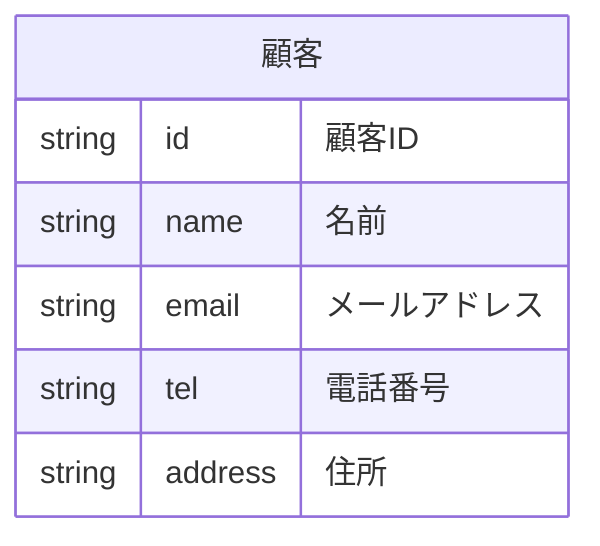
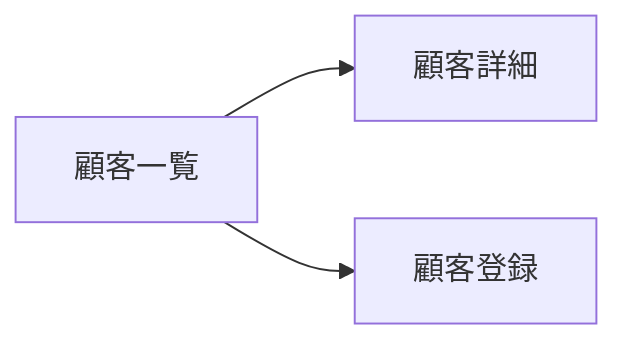

# 顧客を管理する

お客さんから顧客情報を管理したいという要望がありました。
あなたは顧客管理アプリを作ろうと思います。

プロジェクトの先行きも不透明なためある程度の確信を持ってから本格的な開発を行いたいと言われました。

そこでプロトタイプを作ってみることにしました。

# データを考える

顧客の情報には何があるかを整理しました。

営業先のお客さんの連絡先を調べるのに名刺フォルダから探し出すのが大変なのでシステムで一覧したいという要望があったので、顧客の名前、メールアドレス、電話番号、住所を管理したいと思います。



| 論理名 | 物理名 | 型 | 説明 | 例 |
| --- | --- | --- | --- | --- |
| ID | id | string | 顧客を一意に特定するためのID | 1 |
| 名前 | name | string | 顧客の名前 | 山田太郎 |
| メールアドレス | email | string | 顧客のメールアドレス |
| 電話番号 | tel | string | 顧客の電話番号 |
| 住所 | address | string | 顧客の住所 |

# 画面を考える



| 画面名 | 説明 |
| --- | --- |
| 顧客一覧 | 顧客の一覧を表示する |
| 顧客詳細 | 顧客の詳細を表示し、編集と削除を行う |
| 顧客登録 | 顧客を登録する |

# 機能を考える

| 機能名 | 説明 |
| --- | --- |
| 顧客一覧表示 | 顧客の一覧を表示する |
| 顧客詳細表示 | 顧客の詳細を表示する |
| 顧客登録 | 顧客を登録する |
| 顧客編集 | 顧客を編集する |
| 顧客削除 | 顧客を削除する |

# プロジェクトの作成

Vite を使ってプロジェクトを作成しましょう。

```powershell
> npm create vite@latest my-crm -- --template react
```

CRM は Customer Relationship Management の略です。

プロジェクトの名前は好きなものをつけてください。

## 依存パッケージのインストール

画面遷移のライブラリをインストールします。

```powershell
> cd my-crm
> npm install react-router-dom
```

# 各画面の作成

## ディレクトリ構造

`src` の中を次のようにします。

今後各画面に対応するものは `src/routes` に配置します。

```
./src
├── App.jsx
├── main.jsx
└── routes
    ├── CustomerCollection.jsx
    ├── CustomerCreate.jsx
    └── CustomerSingle.jsx
```

## `main.jsx`

```jsx
import { StrictMode } from 'react'
import { createRoot } from 'react-dom/client'
import App from './App.jsx'

createRoot(document.getElementById('root')).render(
  <StrictMode>
    <App />
  </StrictMode>,
)

```

## `App.jsx`

パスとコンポーネントの対応を設定します。

| パス | コンポーネント | 画面名 |
| --- | --- | --- |
| `/` | `CustomerCollection` | 顧客一覧 |
| `/:id` | `CustomerSingle` | 顧客詳細 |
| `/new` | `CustomerCreate` | 顧客登録 |

```jsx
import { BrowserRouter, Route, Routes } from 'react-router-dom'
import CustomerCollection from './routes/CustomerCollection'
import CustomerCreate from './routes/CustomerCreate'
import CustomerSingle from './routes/CustomerSingle'

function App() {
  return (
    <BrowserRouter>
      <Routes>
        <Route path="/" element={<CustomerCollection />} />
        <Route path="/:id" element={<CustomerSingle />} />
        <Route path="/new" element={<CustomerCreate />} />
      </Routes>
    </BrowserRouter>
  )
}

export default App

```

## `src/routes/CustomerCollection.jsx`

```jsx
function CustomerCollection () {
  return (
    <div>
      <h1>顧客一覧</h1>
    </div>
  );
}

export default CustomerCollection;

```

## `src/routes/CustomerSingle.jsx`

```jsx
function CustomerSingle () {
  return (
    <div>
      <h1>顧客詳細</h1>
    </div>
  );
}

export default CustomerSingle;

```

## `src/routes/CustomerCreate.jsx`

```jsx
function CustomerCreate () {
  return (
    <div>
      <h1>顧客登録</h1>
    </div>
  );
}

export default CustomerCreate;

```

## 動作確認

`npm run dev` で起動して動作確認をします。

ブラウザに次のURLを入力して各画面が表示されるかを確認します。

| URL | 画面 |
| --- | --- |
| `http://localhost:3000/` | 顧客一覧 |
| `http://localhost:3000/1` | 顧客詳細 |
| `http://localhost:3000/new` | 顧客登録 |

# 各画面の遷移

次の通り画面の遷移ができるようにしましょう


## `src/routes/CustomerCollection.jsx`

```jsx
import { Link } from 'react-router-dom'

function CustomerCollection () {
  return (
    <div>
      <h1>顧客一覧</h1>
      <p>
        <Link to="/new">新規登録</Link>
      </p>
      <ul>
        <li>
          <Link to="/1">山田太郎</Link>
        </li>
      </ul>
    </div>
  );
}

export default CustomerCollection;

```

## `src/routes/CustomerSingle.jsx`

```jsx
import { Link } from "react-router-dom";

function CustomerSingle () {
  return (
    <div>
      <h1>顧客詳細</h1>
      <hr />
      <Link to="/">顧客一覧に戻る</Link>
    </div>
  );
}

export default CustomerSingle;

```

## `src/routes/CustomerCreate.jsx`

```jsx
import { Link } from 'react-router-dom'

function CustomerCreate () {
  return (
    <div>
      <h1>顧客登録</h1>
      <hr />
      <Link to="/">顧客一覧に戻る</Link>
    </div>
  );
}

export default CustomerCreate;

```

# 顧客の登録機能

顧客の登録機能を作りましょう。


データに基づいたフォームを作ります。

## フォームの作成

顧客登録画面にフォームを追加します。

`src/routes/CustomerCreate.jsx`

```jsx
import { Link } from 'react-router-dom'

function CustomerCreate () {
  const [values, setValues] = React.useState({
    id: '',
    name: '',
    email: '',
    tel: '',
    address: '',
  })

  const handleSubmit = (event) => {
    event.preventDefault()
    console.log(values)
  }
  return (
    <div>
      <h1>顧客登録</h1>
      <form onSubmit={handleSubmit}>
        <div>
          <label>
            ID:
            <input
              type="text" name="id" value={values.id}
              onChange={event => setValues({
                ...values,
                id: event.target.value,
              })} />
          </label>
        </div>
        <div>
          <label>
            名前:
            <input
              type="text" name="name" value={values.name}
              onChange={event => setValues({
                ...values,
                name: event.target.value,
              })} />
          </label>
        </div>
        <div>
          <label>
            メールアドレス:
            <input
              type="email" name="email" value={values.email}
              onChange={event => setValues({
                ...values,
                email: event.target.value,
              })} />
          </label>
        </div>
        <div>
          <label>
            電話番号:
            <input
              type="tel" name="tel" value={values.tel}
              onChange={event => setValues({
                ...values,
                tel: event.target.value,
              })} />
          </label>
        </div>
        <div>
          <label>
            住所:
            <textarea
              name="address" value={values.address}
              onChange={event => setValues({
                ...values,
                address: event.target.value,
              })} />
          </label>
        </div>
        <button type="submit">登録</button>
      </form>
      <hr />
      <Link to="/">顧客一覧に戻る</Link>
    </div>
  );
}

export default CustomerCreate;

```

## 顧客の登録

### `src/storage.js`

`src/storage.js` を作ります。

`addCustomer` は非同期処理として書きます。これはWebAPIへのアクセスを想定しています。

```js
const customers = {}

export async function addCustomer (customer) {
  customers[customer.id] = customer
  console.log(customers)
}

```

### `src/routes/CustomerCreate.jsx`

`src/storage.js` を使ってデータを登録します。

```jsx
import { Link } from 'react-router-dom'
import { addCustomer } from '../storage'
```

`addCustomer()`にデータを渡します。

`await` を使って非同期処理を待ちます。

```js
const handleSubmit = async (event) => {
  event.preventDefault()
  await addCustomer(values)
  setValues({
    id: '',
    name: '',
    email: '',
    tel: '',
    address: '',
  })
  alert('登録しました')
}
```

- `setValues({ ... })` でフォームをリセットします。
- `alert('登録しました')` で登録完了を知らせます。

# 顧客の一覧

登録したデータを一覧で見る機能を作ります。

### 顧客一覧の取得

`getCustomers` を追加します。

```jsx
const customers = {}

export async function addCustomer (customer) {
  customers[customer.id] = customer
}

export async function getCustomers () {
  return Object.values(customers)
}

```

### 顧客一覧の表示

`src/routes/CustomerCollection.jsx`

`getCustomers` を使ってデータを取得します。

```jsx
import { useEffect } from 'react'
import { Link } from 'react-router-dom'
import { getCustomers } from '../storage';

function CustomerCollection () {
  const [customers, setCustomers] = useState([])
  const [error, setError] = useState(null)
  const [loading, setLoading] = useState(false)

  async function load () {
    setLoading(true)
    try {
      const customers = await getCustomers()
      setCustomers(customers)
    } catch (error) {
      setError(error)
    } finally {
      setLoading(false)
    }
  }

  useEffect(() => {
    load()
  }, [])

  const customers = getCustomers()
  return (
    <div>
      <h1>顧客一覧</h1>
      <p>
        <Link to="/new">新規登録</Link>
      </p>
      {loading && <p>読み込み中...</p>}
      {error && <p>エラーが発生しました: {error.message}</p>}
      {customers.length < 1 && <p>顧客が登録されていません</p>}
      <ul>
        {customers.map((customer) => (
          <li key={customer.id}>
            <Link to={`/${customer.id}`}>
              {customer.name}
            </Link>
          </li>
        ))}
      </ul>
    </div>
  );
}

export default CustomerCollection;

```

#### 状態管理

取得するデータとエラー、読み込み中かどうかを管理します。

```jsx
const [customers, setCustomers] = useState([])
const [error, setError] = useState(null)
const [loading, setLoading] = useState(false)
```

### 取得処理

読込中とエラーが発生した場合の処理を追加します。

```js
async function load () {
  setLoading(true)
  try {
    const customers = await getCustomers()
    setCustomers(customers)
  } catch (error) {
    setError(error)
  } finally {
    setLoading(false)
  }
}
```

### 取得処理の実行

画面が読み込まれた時に実行されることを期待して `useEffect` を使います。

```js
useEffect(() => {
  load()
}, [])
```

# 顧客の閲覧

登録したデータを詳細で見る機能を作ります。

## 顧客の取得

`getCustomer` を追加します。

IDを指定したらそのIDのデータを取得します。

```jsx
export async function getCustomer (id) {
  return customer[id];
}

```

## 顧客詳細の表示

顧客を取得して表示することができます。

```jsx
import { Link, useParams } from "react-router-dom";
import { getCustomer } from "../storage";

function CustomerSingle () {
  const param = useParams();
  const [customer, setCustomer] = useState(null)
  const [error, setError] = useState(null)
  const [loading, setLoading] = useState(false)

  async function load (id) {
    setLoading(true)
    try {
      const customer = await getCustomer(id)
      setCustomer(customer)
    } catch (error) {
      setError(error)
    } finally {
      setLoading(false)
    }
  }

  useEffect(() => {
    load(param.id)
  }, [param.id])

  return (
    <div>
      <h1>顧客詳細</h1>
      {error && <p>エラーが発生しました: {error.message}</p>}
      {loading && <p>読み込み中...</p>}
      {customer && (
        <div>
          <p>ID: {customer.id}</p>
          <p>名前: {customer.name}</p>
          <p>メールアドレス: {customer.email}</p>
          <p>電話番号: {customer.tel}</p>
          <p>住所: {customer.address}</p>
        </div>
      )}
      <hr />
      <Link to="/">顧客一覧に戻る</Link>
    </div>
  );
}

export default CustomerSingle;

```


### 取得処理の実行

今までは第2引数はからの配列になっていました。それは結果的にコンポーネントが表示されたタイミングで表示する動作を実現していました。

今回はパスに指定されているパラメータが変更された時に実行されることを期待しているので `param.id` を指定します。

```js
useEffect(() => {
  load(param.id)
}, [param.id])
```

## 顧客がないとき

現段階では永続化していないので画面を再読込するとデータが見つからなくなります。

顧客がない場合はエラーを投げるようにしましょう。

```js
export async function getCustomer (id) {
  const customer = customers[id]
  if (!customer) throw new Error('顧客が見つかりません')
  return customer[id];
}
```

WebAPIを利用する場合はWebAPIがエラーを返すことが一般的です。

# 顧客の編集

登録したデータを編集する機能を作ります。

ここでは画面を増やさずにこの画面で編集できるようにします。

## フォームの作成

まずはフォームだけを表示します。
まだ保存処理は書いていません。

ID は変更できないようにします。

```jsx
import { Link, useParams } from "react-router-dom";
import { getCustomer } from "../storage";

function CustomerSingle () {
  const param = useParams();

  const [customer, setCustomer] = useState(null)
  const [error, setError] = useState(null)
  const [loading, setLoading] = useState(false)

  async function load (id) {
    setLoading(true)
    try {
      const customer = await getCustomer(id)
      setCustomer(customer)
    } catch (error) {
      setError(error)
    } finally {
      setLoading(false)
    }
  }

  useEffect(() => {
    load(param.id)
  }, [param.id])

  const handleSubmit = (event) => {
    event.preventDefault();
    console.log(customer);
    alert("保存しました");
  }

  return (
    <div>
      <h1>顧客詳細</h1>
      {error && <p>エラーが発生しました: {error.message}</p>}
      {loading && <p>読み込み中...</p>}
      {customer && (
        <form onSubmit={handleSubmit}>
          <div>
            <label>
              ID: {customer.id}
            </label>
          </div>
          <div>
            <label>
              名前:
              <input
                type="text" name="name" value={customer.name}
                onChange={event => setCustomer({ ...customer, name: event.target.value })} />
            </label>
          </div>
          <div>
            <label>
              メールアドレス:
              <input
                type="email" name="email" value={customer.email}
                onChange={event => setCustomer({ ...customer, email: event.target.value })} />
            </label>
          </div>
          <div>
            <label>
              電話番号:
              <input
                type="tel" name="tel" value={customer.tel}
                onChange={event => setCustomer({ ...customer, tel: event.target.value })} />
            </label>
          </div>
          <div>
            <label>
              住所:
              <textarea name="address" value={customer.address}
                onChange={event => setCustomer({ ...customer, address: event.target.value })} />
            </label>
          </div>
          <button type="submit">保存</button>
        </form>
      )}
      <hr />
      <Link to="/">顧客一覧に戻る</Link>
    </div>
  );
}

export default CustomerSingle;

```

## 顧客の更新

`updateCustomer` を追加します。

ここでも存在しない場合はエラーを投げるようにします。

```js
export async function updateCustomer (customer) {
  if (!customers[customer.id]) throw new Error('顧客が見つかりません')
  customers[customer.id] = customer
}

```

## フォームの処理から更新処理を呼び出す

`updateCustomer` を呼び出します。

```jsx
import { Link, useParams } from "react-router-dom";
import { getCustomer, updateCustomer } from "../storage";
```

```js
  const [customer, setCustomer] = useState(null)
  const [error, setError] = useState(null)
  const [loading, setLoading] = useState(false)
  const handleSubmit = async (event) => {
    event.preventDefault();
    setLoading(true)
    try {
      await updateCustomer(customer);
      alert("保存しました");
    } catch (error) {
      setError(error)
    } finally {
      setLoading(false)
    }
  }
```

## 動作確認

一度編集して、保存してください。

一覧に戻って再度詳細画面に戻って内容が変更されていることを確認してください。

# 顧客の削除

登録したデータを削除する機能を作ります。

## 顧客の削除

`deleteCustomer` を追加します。

次の２つの処理の結果は同じです。

```js
export async function deleteCustomer (id) {
  if (!customers[id]) throw new Error('顧客が見つかりません')
  delete customers[id]
}

```

## 削除ボタンの追加

`src/routes/CustomerSingle.jsx`

```jsx
import { Link, useParams } from "react-router-dom";
import { deleteCustomer, getCustomer, updateCustomer } from "../storage";

function CustomerSingle () {
  const [customer, setCustomer] = useState(null)
  const [error, setError] = useState(null)
  const [loading, setLoading] = useState(false)

  const handleDelete = async () => {
    setLoading(true)
    try {
      alert("削除しました");
      await deleteCustomer(param.id);
    } catch (error) {
      setError(error)
    } finally {
      setLoading(false)
    }
  }

  return (
    <div>
      <h1>顧客詳細</h1>
      {error && <p>エラーが発生しました: {error.message}</p>}
      {loading && <p>読み込み中...</p>}
      {customer && (
        <form onSubmit={handleSubmit}>
          {/* 省略 */}
          <button type="submit">保存</button>
          <button type="button" onClick={handleDelete}>削除</button>
        </form>
      )}
      <hr />
      <Link to="/">顧客一覧に戻る</Link>
    </div>
  );
}

export default CustomerSingle;

```

## 動作確認

顧客登録後に削除して一覧表示に戻ってください。
一覧から削除されています。

## 削除時に画面遷移

削除後に表示されるのは混乱を招くので一覧画面に戻るようにします。

`useNavigate` をインポートします。

```js
import { Link, useNavigate, useParams } from "react-router-dom";
```

```js
function CustomerSingle () {
  const param = useParams();
  const navigate = useNavigate();
```

削除時に遷移します。

```js
const handleDelete = async () => {
  await deleteCustomer(param.id);
  alert("削除しました");
  navigate("/");
}
```

# データの永続化

データを永続化するために localStorage に書き込みます。

`src/storage.js`

次の処理で localStorage に書き込みます。

```js
function save () {
  localStorage.setItem(STORAGE_KEY, JSON.stringify(customers))
}
```

次の処理で localStorage から読み込みます。

```js
export function load() {
  const data = localStorage.getItem(STORAGE_KEY)
  if (data) {
    Object.assign(customers, JSON.parse(data))
  }
}
```

## データの書き込み時に保存

`addCustomer`, `updateCustomer`, `deleteCustomer` で保存処理を呼び出します。

```js
export function addCustomer (customer) {
  customers[customer.id] = customer
  save()
}
```

```js
export function updateCustomer (customer) {
  customers[customer.id] = customer
  save()
}
```

```js
export function deleteCustomer (id) {
  delete customers[id]
  save()
}
```

## 画面起動時に読み込み

`src/main.js`

`load` を呼び出します。

```jsx
import { StrictMode } from 'react'
import { createRoot } from 'react-dom/client'
import App from './App.jsx'
import { load } from './storage'

load()

createRoot(document.getElementById('root')).render(
  <StrictMode>
    <App />
  </StrictMode>,
)
```

## 動作確認

ブラウザをリロードしてもデータが残っていることを確認してください。

# まとめ

これでお客さんにプロトタイプを見せることができます。

ここまでで顧客の情報の作成、表示、編集、削除を行いました。

この４つのデータの操作は CRUD と呼ばれて基本的な操作です。今後のこの組み合わせで様々な機能追加を進めていきます。

- Create: 作成
- Read: 読み込み
- Update: 更新
- Delete: 削除

次の章ではここに機能追加をします。
ｓ
[次の機能追加](./02-team.md)
