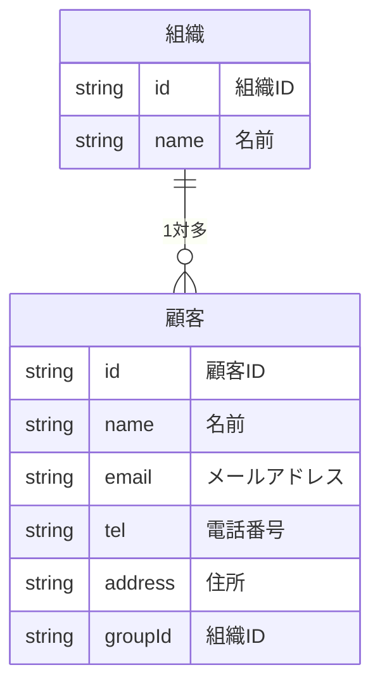
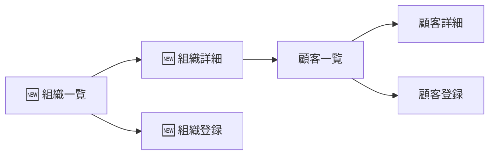

# 機能追加

お客さんに見せた後にお客さんがこんなことを言いました。

> 顧客は会社とかの組織に属しているからそれでグループを分けたい。グループごとに顧客を一覧したい。

この要望に対応するために、グループを追加する機能を追加してましょう。

# データを考える



# 機能を考える

| 機能名 | 説明 |
| --- | --- |
| 顧客一覧表示 | 顧客の一覧を表示する |
| 顧客詳細表示 | 顧客の詳細を表示する |
| 顧客登録 | 顧客を登録する |
| 顧客編集 | 顧客を編集する |
| 顧客削除 | 顧客を削除する |
| 🆕 組織一覧表示 | 組織の一覧を表示する |
| 🆕 組織詳細表示 | 組織の詳細を表示する |
| 🆕 組織登録 | 組織を登録する |
| 🆕 組織編集 | 組織を編集する |
| 🆕 組織削除 | 組織を削除する |


# 画面を考える

先程の画面から最初の画面を変える必要があります。



# 画面を作る

次のように画面を作成してください。

| 画面名 | 説明 | コンポーネント |
| --- | --- |
| 🆕 組織一覧 | 組織の一覧を表示する | `TeamCollection` |
| 🆕 組織登録 | 組織を登録する | `TeamCreate` |
| 🆕 組織詳細 | 組織の詳細とそれに属する | `TeamSingle` |
| 顧客一覧 | 組織に属する顧客の一覧を表示する | `CustomerCollection` |
| 顧客詳細 | 顧客の詳細を表示し、編集と削除を行う | `CustomerSingle` |
| 顧客登録 | 指定された組織に顧客を登録する | `CustomerCreate` |

次のファイルを作成してください。

```
./src/routes
├── CustomerCollection.jsx
├── CustomerCreate.jsx
├── CustomerSingle.jsx
├── TeamCollection.jsx
├── TeamCreate.jsx
└── TeamSingle.jsx

```

それぞれの中身は次のとおりです。

## TeamCollection.jsx

```jsx
function TeamCollection () {
  return (
    <div>
      <h1>組織の一覧</h1>
    </div>
  )
}

export default TeamCollection;

```

## TeamSingle.jsx

```jsx
function TeamSingle () {
  return (
    <div>
      <h1>組織の詳細</h1>
    </div>
  )
}

export default TeamSingle;

```

## TeamCreate.jsx

```jsx
function TeamCreate () {
  return (
    <div>
      <h1>組織の登録</h1>
    </div>
  )
}

export default TeamCreate;

```

#　パスの設定

次のようにパスを設定してください。

| パス | コンポーネント | 画面名 |
| --- | --- | --- |
| `/` | `TeamCollection` | 組織一覧 |
| `/:teamId` | `TeamSingle` | 組織詳細 |
| `/new` | `TeamCreate` | 組織登録 |
| `/:teamId/customers` | `CustomerCollection` | 顧客一覧 |
| `/:teamId/customers/new` | `CustomerCreate` | 顧客登録 |
| `/:teamId/customers/:customerId` | `CustomerSingle` | 顧客詳細 |

## `App.jsx`

```jsx
import { BrowserRouter, Route, Routes } from 'react-router-dom'
import CustomerCollection from './routes/CustomerCollection'
import CustomerCreate from './routes/CustomerCreate'
import CustomerSingle from './routes/CustomerSingle'
import TeamCollection from './routes/TeamCollection'
import TeamCreate from './routes/TeamCreate'
import TeamSingle from './routes/TeamSingle'

function App() {
  return (
    <BrowserRouter>
      <Routes>
        <Route path="/" element={<TeamCollection />} />
        <Route path="/new" element={<TeamCreate />} />
        <Route path="/:teamId" element={<TeamSingle />} />
        <Route path="/:teamId/customers" element={<CustomerCollection />} />
        <Route path="/:teamId/customers/new" element={<CustomerCreate />} />
        <Route path="/:teamId/customers/:customerId" element={<CustomerSingle />} />
      </Routes>
    </BrowserRouter>
  )
}

export default App

```

## 動作確認

それぞれの画面がどのように動作しているのかを確認します。


- 組織の一覧:[`http://localhost:5173/`](http://localhost:5173/)
- 組織の詳細:[`http://localhost:5173/1`](http://localhost:5173/1)
- 組織の登録:[`http://localhost:5173/new`](http://localhost:5173/new)
- 顧客の一覧:[`http://localhost:5173/1/customers`](http://localhost:5173/1/customers)
- 顧客の登録:[`http://localhost:5173/1/customers/new`](http://localhost:5173/1/customers/new)
- 顧客の詳細:[`http://localhost:5173/1/customers/1`](http://localhost:5173/1/customers/1)

顧客の詳細ではエラーが出ていると思います。

# 新規追加画面の作成

## 組織の一覧

```jsx
function TeamCollection () {
  return (
    <div>
      <h1>組織の一覧</h1>
    </div>
  )
}

export default TeamCollection;

```
