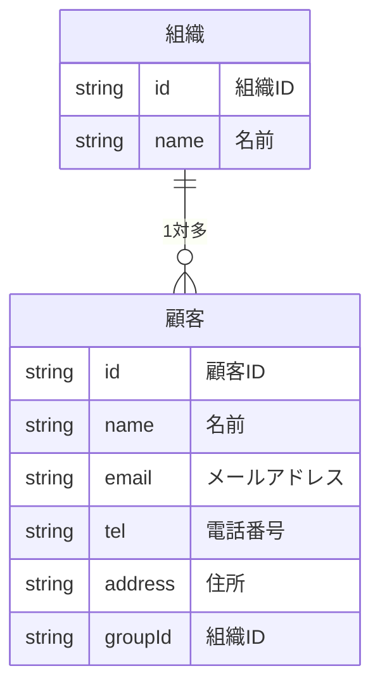
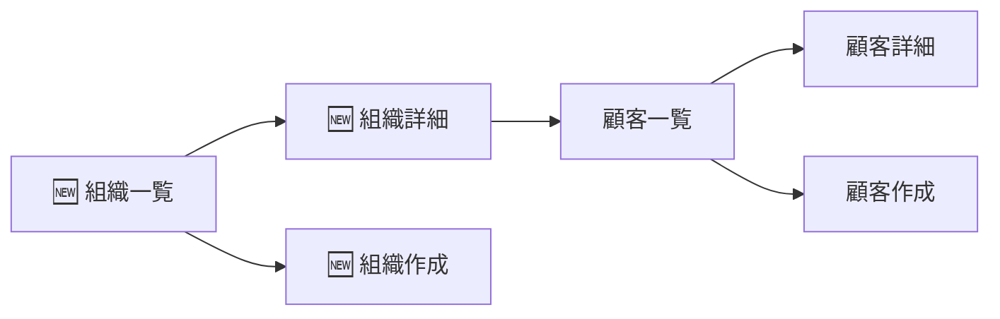

# 機能追加

友人にプロトタイプを見せたところ次のような意見をもらいました。

> 顧客は会社とかの組織に属しているからそれで組織を分けたい。組織ごとに顧客を一覧したい。

この要望に対応するために、組織を追加する機能を追加してましょう。

# データを考える



# 機能を考える

| 機能名 | 説明 |
| --- | --- |
| 顧客一覧表示 | 顧客の一覧を表示する |
| 顧客詳細表示 | 顧客の詳細を表示する |
| 顧客作成 | 顧客を作成する |
| 顧客編集 | 顧客を編集する |
| 顧客削除 | 顧客を削除する |
| 🆕 組織一覧表示 | 組織の一覧を表示する |
| 🆕 組織詳細表示 | 組織の詳細を表示する |
| 🆕 組織作成 | 組織を作成する |
| 🆕 組織編集 | 組織を編集する |
| 🆕 組織削除 | 組織を削除する |


# 画面を考える

先程の画面から最初の画面を変える必要があります。



# 画面を作る

次のように画面を作成してください。

| 画面名 | 説明 | コンポーネント |
| --- | --- | --- |
| 🆕 組織一覧 | 組織の一覧を表示する | `TeamCollection` |
| 🆕 組織作成 | 組織を作成する | `TeamCreate` |
| 🆕 組織詳細 | 組織の詳細とそれに属する | `TeamSingle` |
| 顧客一覧 | 組織に属する顧客の一覧を表示する | `CustomerCollection` |
| 顧客詳細 | 顧客の詳細を表示し、編集と削除を行う | `CustomerSingle` |
| 顧客作成 | 指定された組織に顧客を作成する | `CustomerCreate` |

次のファイルを作成してください。

```
./src/routes
├── CustomerCollection.jsx
├── CustomerCreate.jsx
├── CustomerSingle.jsx
├── TeamCollection.jsx
├── TeamCreate.jsx
└── TeamSingle.jsx

```

それぞれの中身は次のとおりです。

## TeamCollection.jsx

```jsx
function TeamCollection () {
  return (
    <div>
      <h1>組織の一覧</h1>
    </div>
  )
}

export default TeamCollection;

```

## TeamSingle.jsx

```jsx
function TeamSingle () {
  return (
    <div>
      <h1>組織の詳細</h1>
    </div>
  )
}

export default TeamSingle;

```

## TeamCreate.jsx

```jsx
function TeamCreate () {
  return (
    <div>
      <h1>組織の作成</h1>
    </div>
  )
}

export default TeamCreate;

```

# パスの設定

次のようにパスを設定してください。

| パス | コンポーネント | 画面名 |
| --- | --- | --- |
| `/` | `TeamCollection` | 組織一覧 |
| `/:teamId` | `TeamSingle` | 組織詳細 |
| `/new` | `TeamCreate` | 組織作成 |
| `/:teamId/customers` | `CustomerCollection` | 顧客一覧 |
| `/:teamId/customers/new` | `CustomerCreate` | 顧客作成 |
| `/:teamId/customers/:customerId` | `CustomerSingle` | 顧客詳細 |

## `App.jsx`

```jsx
import { BrowserRouter, Route, Routes } from 'react-router-dom'
import CustomerCollection from './routes/CustomerCollection'
import CustomerCreate from './routes/CustomerCreate'
import CustomerSingle from './routes/CustomerSingle'
import TeamCollection from './routes/TeamCollection'
import TeamCreate from './routes/TeamCreate'
import TeamSingle from './routes/TeamSingle'

function App() {
  return (
    <BrowserRouter>
      <Routes>
        <Route path="/" element={<TeamCollection />} />
        <Route path="/new" element={<TeamCreate />} />
        <Route path="/:teamId" element={<TeamSingle />} />
        <Route path="/:teamId/customers" element={<CustomerCollection />} />
        <Route path="/:teamId/customers/new" element={<CustomerCreate />} />
        <Route path="/:teamId/customers/:customerId" element={<CustomerSingle />} />
      </Routes>
    </BrowserRouter>
  )
}

export default App

```

## 動作確認

それぞれの画面がどのように動作しているのかを確認します。

- 組織の一覧:[`http://localhost:5173/`](http://localhost:5173/)
- 組織の詳細:[`http://localhost:5173/1`](http://localhost:5173/1)
- 組織の作成:[`http://localhost:5173/new`](http://localhost:5173/new)
- 顧客の一覧:[`http://localhost:5173/1/customers`](http://localhost:5173/1/customers)
- 顧客の作成:[`http://localhost:5173/1/customers/new`](http://localhost:5173/1/customers/new)
- 顧客の詳細:[`http://localhost:5173/1/customers/1`](http://localhost:5173/1/customers/1)

顧客の詳細ではエラーが出ていると思います。

# localStorage の準備

`src/storage.js` を修正する

永続化の処理を整理します。今までは customers しかないと考えていたけど teams も必要になりました。

それぞれを変更しましょう。

```js
const STORAGE_KEY_CUSTOMERS = 'customers'
const STORAGE_KEY_TEAMS = 'teams'
const customers = {}
const teams = {}

function save () {
  localStorage.setItem(STORAGE_KEY_TEAMS, JSON.stringify(teams))
  localStorage.setItem(STORAGE_KEY_CUSTOMERS, JSON.stringify(customers))
}

export function load() {
  const customersJson = localStorage.getItem(STORAGE_KEY_CUSTOMERS)
  if (customersJson) {
    Object.assign(customers, JSON.parse(customersJson))
  }
  const teamsJson = localStorage.getItem(STORAGE_KEY_TEAMS)
  if (teamsJson) {
    Object.assign(teams, JSON.parse(teamsJson))
  }
}
```

# 組織の作成

- `src/storage.js` に `createTeam` を追加する
- `src/routes/TeamCreate.jsx` に `createTeam` を使って組織を作成する処理を追加する

## `src/storage.js`

`createTeamId()` は組織IDを生成する

```js

function createTeamId () {
  const now = new Date()
  const time = now.getTime()
  return `team-${time}`
}

export async function createTeam (team) {
  team.id = createTeamId()
  teams[team.id] = team
  save()
}
```

## `src/routes/TeamCreate.jsx`

```jsx
import { useState } from "react";
import { Link } from "react-router-dom";
import { createTeam } from "../storage";

function TeamCreate () {
  const [values, setValues] = useState({
    name: ''
  })
  const [error, setError] = useState(null)
  const [loading, setLoading] = useState(false)

  const handleChange = async (event) => {
    event.preventDefault()
    setLoading(true)
    try {
      await createTeam(values)
      setValues({
        name: ''
      })
      setLoading(false)
    } catch (error) {
      setError(error)
    } finally {
      setLoading(false)
    }
  }

  return (
    <div>
      <h1>組織の作成</h1>
      {loading && <p>ロード中...</p>}
      {error && <p>エラー: {error.message}</p>}
      <form onSubmit={handleChange}>
        <div>
          <label>名前</label>
          <input
            type="text"
            name="name"
            value={values.name}
            onChange={e => setValues({ ...values, name: e.target.value })} />
        </div>
        <button type="submit">作成</button>
      </form>
      <hr />
      <Link to="/">組織一覧に戻る</Link>
    </div>
  )
}

export default TeamCreate;

```

# 組織の一覧

## `src/storage.js`

- 組織一覧の取得

```js
export async function getTeams () {
  return Object.values(teams)
}
```

## `src/routes/TeamCollection.jsx`

- 組織の一覧の表示
- 各組織詳細画面へのリンクの表示
- 組織作成画面へのリンクの表示

```jsx
import { useEffect, useState } from "react";
import { getTeams } from "../storage";

function TeamCollection () {
  const [teams, setTeams] = useState([])
  const [error, setError] = useState(null)
  const [loading, setLoading] = useState(false)

  const load = async () => {
    setLoading(false)
    try {
      const teams = await getTeams()
      setTeams(teams)
    } catch (error) {
      setError(error)
    } finally {
      setLoading(false)
    }
  }

  useEffect(() => {
    load()
  }, [])

  return (
    <div>
      <h1>組織の一覧</h1>
      <p>
        <Link to="/new">新規作成</Link>
      </p>
      {loading && <p>ロード中...</p>}
      {error && <p>エラー: {error.message}</p>}
      <ul>
        {teams.map(team => (
          <li key={team.id}>
            <Link to={`/${team.id}`}>{team.name}</Link>
          </li>
        ))}
      </ul>
    </div>
  )
}

export default TeamCollection;

```

# 組織の詳細

## `src/storage.js`

- 組織の取得
- 組織の更新
- 組織の削除

```js
export async function getTeam (id) {
  if (!teams[id]) throw new Error('組織が見つかりません')
  return teams[id]
}

export async function updateTeam (team) {
  if (!teams[team.id]) throw new Error('組織が見つかりません')
  teams[team.id] = team
  save()
}

export async function deleteTeam (id) {
  if (!teams[id]) throw new Error('組織が見つかりません')
  delete teams[id]
  save()
}

```

## `src/routes/TeamSingle.jsx`

- 組織を取得して表示する
- 組織を変更する
- 組織を削除する
- 顧客一覧へのリンクを表示する

```jsx
import { useState, useEffect } from "react";
import { Link, useNavigate, useParams } from "react-router-dom";
import { deleteTeam, getTeam, updateTeam } from "../storage";

function TeamSingle () {
  const param = useParams();
  const navigate = useNavigate();

  const [team, setTeam] = useState(null);
  const [loading, setLoading] = useState(false);
  const [error, setError] = useState(null);

  const handleSubmit = async (event) => {
    event.preventDefault();
    setLoading(true);
    try {
      await updateTeam(team);
      alert("保存しました");
    } catch (error) {
      setError(error);
    } finally {
      setLoading(false);
    }
  }

  const handleDelete = () => {
    alert("削除しました");
    deleteTeam(param.id);
    navigate("/");
  }

  const load = async (teamId) => {
    setLoading(true);
    try {
      const team = await getTeam(teamId);
      setTeam(team);
    } catch (error) {
      setError(error);
    } finally {
      setLoading(false);
    }
  }

  useEffect(() => {
    load(param.teamId);
  }, [param.teamId])

  return (
    <div>
      <h1>組織詳細</h1>
      <p>
        <Link to="./customers">顧客一覧</Link>
      </p>
      {loading && <p>読み込み中...</p>}
      {error && <p>エラー: {error.message}</p>}
      {team && (
        <form onSubmit={handleSubmit}>
          <div>
            <label>
              名前:
              <input
                type="text" name="name" value={team.name}
                onChange={event => setTeam({ ...team, name: event.target.value })} />
            </label>
          </div>
          <button type="submit">保存</button>
          <button type="button" onClick={handleDelete}>削除</button>
        </form>
      )}
      <hr />
      <Link to="/">顧客一覧に戻る</Link>
    </div>
  );
}

export default TeamSingle;

```

# 顧客一覧の修正

現在の顧客一覧の表示ではすべての顧客を表示している状態です。

組織ごとの顧客一覧を取得するようにしましょう。

## `src/storage.js`

組織ごとの顧客一覧の取得

```js
export const getCustomersByTeamId (teamId) {
  const customers = Object.values(customers)
  const teamCustomers = customers.filter(customer => customer.teamId === teamId)
  return teamCustomers
}

```

- `const customers = Object.values(customers)` では `customers` オブジェクトの値を配列に変換しています。
- `const teamCustomers = customers.filter(customer => customer.teamId === teamId)` では `teamId` が一致する顧客をフィルタリングしています。
- `return teamCustomers` でフィルタリングした顧客の配列を返しています。

## `src/routes/CustomerCollection.jsx`

顧客一覧の修正として次の変更をします。

- パスパラメータから組織IDの取得
- 組織ごとの顧客一覧の取得
- 顧客作成画面のパスの変更
- 顧客詳細画面のパスの変更

### 顧客一覧の取得

```js
import { getCustomersByTeamId } from '../storage';
import { Link, useParams } from 'react-router-dom'
```

```js
const params = useParams()

async function load (teamId) {
  setLoading(true);
  try {
    const customers = await getCustomersByTeamId(teamId);
    setCustomers(customers);
  } catch (error) {
    setError(error);
  } finally {
    setLoading(false);
  }
}

useEffect(() => {
  load(params.teamId)
}, [params.teamId])

```

### 顧客作成画面へのリンク

顧客作成画面へのリンクを追加します。

```jsx
<p>
  <Link to={`/${params.teamId}/new`}>新規作成</Link>
</p>
```

### 顧客詳細画面へのリンク

パスの指定に注意して顧客詳細画面へのリンクを設定してください。

```jsx
<ul>
  {customers.map((customer) => (
    <li key={customer.id}>
      <Link to={`/${params.teamId}/customers/${customer.id}`}>{customer.name}</Link>
    </li>
  ))}
</ul>
```

# 顧客の作成

顧客の作成時に組織を指定する必要があります。

- パスパラメータから組織IDの取得
- 顧客作成時に組織IDを指定する

## `src/routes/CustomerCreate.jsx`

### 組織IDの指定

```js
import { useState } from 'react'
import { Link, useParams } from 'react-router-dom'

```

```js
const params = useParams()
const [loading, setLoading] = useState(false)
const [error, setError] = useState(null)
const [values, setValues] = useState({
  name: '',
  email: '',
  tel: '',
  address: '',
  teamId: params.teamId
})

const handleSubmit = async (event) => {
  event.preventDefault()
  try {
    await createCustomer(values)
    alert('作成しました')
    setValues({
      name: '',
      email: '',
      tel: '',
      address: '',
      teamId: params.teamId,
    })
  } catch (error) {
    setError(error)
  } finally {
    setLoading(false)
  }
}

```

`teamId: params.teamId` で組織IDを指定しています。
`createCustomer` の引数に `teamId` を指定することで、顧客を作成する際に組織IDを指定しています。

### リンクの修正

```jsx
<Link to={`/${params.teamId}/customers`}>顧客一覧に戻る</Link>
```

# 顧客詳細画面の修正

- パスパラメータの変更への対応
- リンクの修正

## `src/routes/CustomerSingle.jsx`

```jsx
import { useParams, Link } from 'react-router-dom'
```

```js
const params = useParams()
```

```js
  useEffect(() => {
    load(params.customerId);
  }, [params.customerId])
```

```jsx
<Link to={`/${params.teamId}/customers`}>顧客一覧に戻る</Link>
```

# 動作確認

ここまでですべての画面に対しての修正をしました。

次の動作を確認しましょう。

- 組織の作成
- 組織の一覧の表示
- 組織の単一の表示
- 組織の更新
- 組織の削除
- 組織ごとの顧客の一覧の表示
- 組織を指定した顧客の作成
- 顧客の表示
- 顧客の更新
- 顧客の削除

動作確認ができればプロトタイプの作成の完了です。

また、友人に見せに行けるようになりました。

[次の機能追加](./03-note.md)
