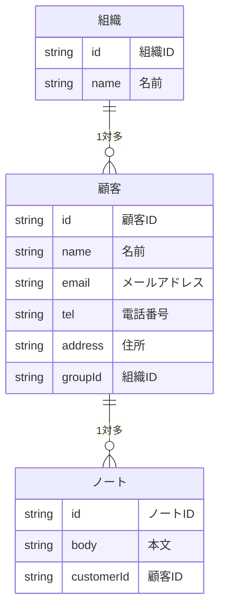
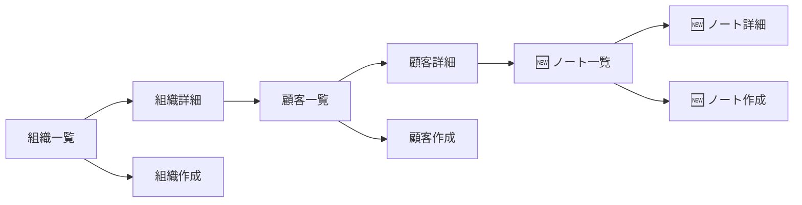

# 機能追加

お客さんに見せた後にお客さんがこんなことを言いました。

> 顧客ごとにメモを残したい

この要望に対応するために、グループを追加する機能を追加してましょう。

# データを考える

# 機能を考える

| 機能名 | 説明 |
| --- | --- |
| 顧客一覧表示 | 顧客の一覧を表示する |
| 顧客詳細表示 | 顧客の詳細を表示する |
| 顧客作成 | 顧客を作成する |
| 顧客編集 | 顧客を編集する |
| 顧客削除 | 顧客を削除する |
| 組織一覧表示 | 組織の一覧を表示する |
| 組織詳細表示 | 組織の詳細を表示する |
| 組織作成 | 組織を作成する |
| 組織編集 | 組織を編集する |
| 組織削除 | 組織を削除する |
| 🆕 ノート一覧表示 | ノートの一覧を表示する |
| 🆕 ノート詳細表示 | ノートの詳細を表示する |
| 🆕 ノート作成 | ノートを作成する |
| 🆕 ノート編集 | ノートを編集する |
| 🆕 ノート削除 | ノートを削除する |

# 画面を考える

先程の画面から最初の画面を変える必要があります。

# 自分で機能追加

ここまでの内容を踏まえて残りの実装を考えて進めてみましょう。

# 追加課題

## CSSを書く

機能追加が終わったら、CSSをしっかり書いてみましょう

## 共通処理をまとめる

何度もコピペをしながら作ってきたと思います。[DRY原則](https://xn--97-273ae6a4irb6e2hsoiozc2g4b8082p.com/%E3%82%A8%E3%83%83%E3%82%BB%E3%82%A4/DRY%E5%8E%9F%E5%89%87/) に従って同じ処理がある場合はまとめてみましょう。
