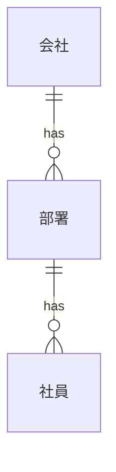
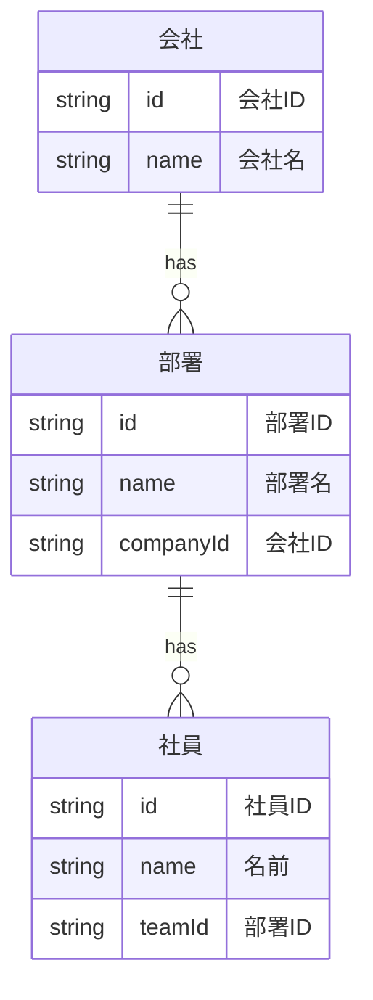
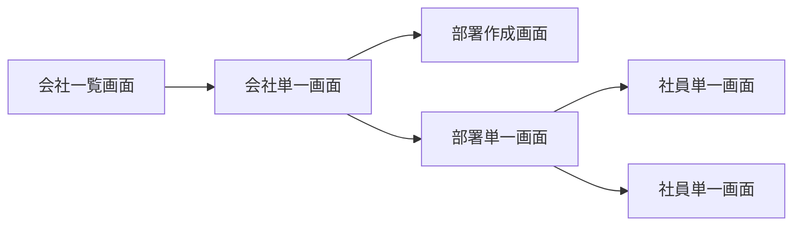

# 顧客管理システム

この章ではブラウザで完結する顧客管理システムを作る演習をします。

データの永続化に関しては localStorage を使用します。そのため、実際に利用できるものではありません。
後に localStorageに書き込んでいる処理をWebAPIなどに置き換えることにより、実際に利用できるものになります。

この章では [Reactの基本](../01-react-basic/README.md) の知識を前提としています。

# 演習の流れ

段階を追って機能追加をしていきます。発注者が新しい要望を足してきたり、自分で開発している時に新しい要望を思いついたりすることがあると思います。

そのような場合を想定しています。

# 演習の方針

開発全体の流れに集中するために次の方針で進めます。

- TypeScript を使わない
- CSS は書かない
- 利用するライブラリは最低限

余力のある人は TypeScript や CSS を追加してみてください。

# UMLの利用

一部UMLを使って設計を説明します。ただし、厳密な使い方はしていません。

作るシステムの内容が理解できるように説明のために使っています。

## UMLの例

次のものはデータの関係を表す図です。

厳密に値を表すときもあります。

次のような画面遷移を説明する図も使います。

