# ORM を介して取得した値を API から返す

このセクションでは、**Sequelize を使ってデータベースからデータを取得し、API を通じてクライアントに返す** 仕組みを実装します。

---

## 1. 全体の構成の確認

### 1-1. ORM の目的とメリット

#### ORM (Object-Relational Mapping) とは？
ORM は、データベースのテーブルをプログラムのオブジェクトとして扱えるようにする技術です。SQL を直接記述せずに、オブジェクト指向のコードでデータベースを操作できます。

#### ORM を使うメリット
- **可読性の向上**: SQL を直接書く必要がなく、コードがシンプルになる。
- **データの整合性を保ちやすい**: モデル定義を使うことで、データの一貫性を確保できる。
- **SQL インジェクション対策**: プレースホルダを使用するため、セキュリティリスクが減る。

#### 今回はマイグレーションを使わないが…
マイグレーションを使用すると、スキーマの変更をバージョン管理し、データベースを一貫して更新できる。

- **メリット**
  - 手動で SQL を実行しなくてもスキーマ変更ができる
  - チーム開発時にデータベースの状態を統一しやすい
  - バージョンを管理できるので、過去の状態に戻すことが可能

今回は **基本操作に集中するため、マイグレーションは使わず** に進める。

---

### 1-2. コントローラー・ユースケース・モデルの役割

以下のような構成で API を設計する。

```mermaid
graph LR;

  Client["クライアント (React)"]
  API["API (Express)"]
  Controller["コントローラー"]
  UseCase["ユースケース"]
  Model["モデル (Sequelize)"]
  Database["データベース (SQLite)"]

  Client -->|リクエスト| API
  API -->|ルーティング| Controller
  Controller -->|処理を依頼| UseCase
  UseCase -->|データ取得| Model
  Model -->|SQL実行| Database
  Database -->|結果を返す| Model
  Model -->|データオブジェクトを返す| UseCase
  UseCase -->|レスポンスを作成| Controller
  Controller -->|レスポンスを返す| API
  API -->|データを送信| Client
```



---

## 2. Sequelize の導入

まず、Sequelize をインストールします。

```sh
cd my-express-api
npm install sequelize sqlite3
npm install --save-dev sequelize-cli
```

Sequelize の設定を行うために `models/index.js` を作成します。

### `models/index.js`
```js
import { Sequelize } from "sequelize";

const sequelize = new Sequelize({
  dialect: "sqlite",
  storage: "./database.sqlite",
});

export { sequelize };
```

---

## 3. User モデルの作成

次に `User` モデルを定義します。

### `models/user.js`
```js
import { DataTypes } from "sequelize";
import { sequelize } from "./index.js";

const User = sequelize.define("User", {
  name: {
    type: DataTypes.STRING,
    allowNull: false,
  },
  email: {
    type: DataTypes.STRING,
    allowNull: false,
    unique: true,
  },
});

export { User };
```

モデルの同期を行い、テーブルを作成します。

### `models/index.js` の修正
```js
import { User } from "./user.js";

async function initDatabase() {
  await sequelize.sync({ force: true }); // テーブルをリセットして作成
  console.log("Database synchronized.");

  await User.create({ name: "Alice", email: "alice@example.com" });
  await User.create({ name: "Bob", email: "bob@example.com" });
}

initDatabase();

export { User };
```

---

## 4. ユースケース層の作成（User の取得処理）

ユースケース層では、モデルを操作してデータを取得するロジックを実装します。

### `usecases/userUseCase.js`
```js
import { User } from "../models/user.js";

async function getAllUsers() {
  return await User.findAll();
}

export { getAllUsers };
```

---

## 5. コントローラー層の作成（API のエンドポイント）

コントローラーは、ルーティングを定義し、ユースケースを呼び出します。

### `controllers/userController.js`
```js
import { getAllUsers } from "../usecases/userUseCase.js";

async function getUsers(req, res) {
  try {
    const users = await getAllUsers();
    res.json(users);
  } catch (error) {
    res.status(500).json({ error: "Internal Server Error" });
  }
}

export { getUsers };
```

### `routes/userRoutes.js`
```js
import express from "express";
import { getUsers } from "../controllers/userController.js";

const router = express.Router();

router.get("/users", getUsers);

export { router };
```

### `server.js` の修正
```js
import express from "express";
import { router as userRoutes } from "./routes/userRoutes.js";

const app = express();
const PORT = 3000;

app.use("/api", userRoutes);

app.listen(PORT, () => {
  console.log(`Server is running on http://localhost:${PORT}`);
});
```

---

## 6. クライアントから取得データを表示する

### `src/api.js`
```js
export async function fetchUsers() {
  const response = await fetch("http://localhost:3000/api/users");
  return await response.json();
}
```

### `src/App.jsx`
```jsx
import { useState, useEffect } from "react";
import { fetchUsers } from "./api";

function App() {
  const [users, setUsers] = useState([]);

  useEffect(() => {
    fetchUsers().then(setUsers);
  }, []);

  return (
    <div>
      <h1>ユーザー一覧</h1>
      <ul>
        {users.map(user => (
          <li key={user.id}>{user.name} ({user.email})</li>
        ))}
      </ul>
    </div>
  );
}

export default App;
```

---

## 7. プロジェクト構造の確認

```
my-project/
├── backend/
│   ├── server.js
│   ├── models/
│   │   ├── index.js
│   │   ├── user.js
│   ├── usecases/
│   │   ├── userUseCase.js
│   ├── controllers/
│   │   ├── userController.js
│   ├── routes/
│   │   ├── userRoutes.js
├── frontend/
│   ├── src/
│   │   ├── App.jsx
│   │   ├── api.js
```

---

## 8. まとめと機能拡張のイメージ

このセクションでは、以下を実装しました：
- Sequelize の導入
- モデル (`User`) の作成
- ユースケース (`getAllUsers`) の作成
- コントローラー (`getUsers`) の作成
- API (`/api/users`) の実装
- クライアント側でデータを取得し、画面に表示

次のステップでは、**顧客管理アプリの開発** に進みます。
