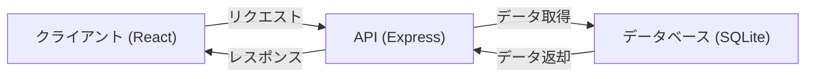
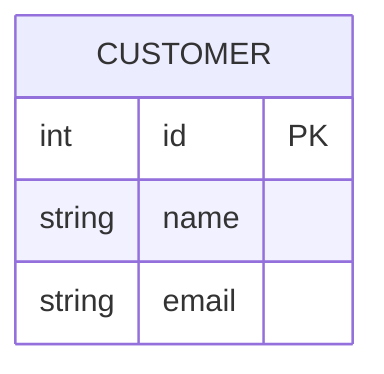
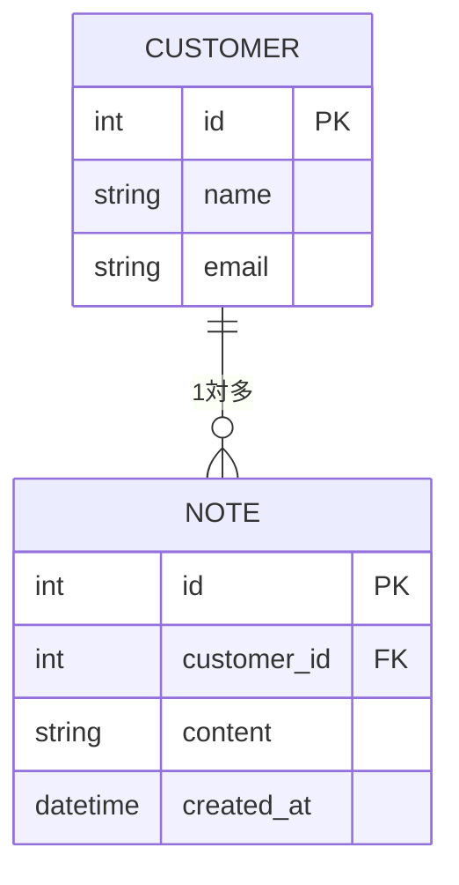
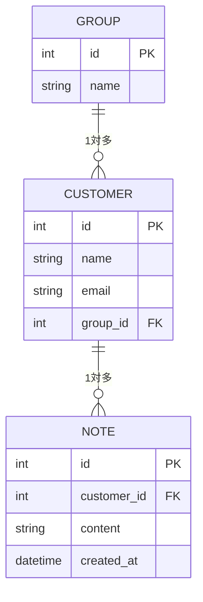

# 顧客管理システムの概要と構成

このセクションでは、**顧客管理システムの全体構成を整理し、開発の進め方を説明** します。
最初に基本的な機能を実装し、段階的に拡張していくことで、スムーズに開発を進めます。

---

## 1. 顧客管理システムの目的

顧客管理システムの目的は、**顧客情報を適切に管理し、業務を効率化する** ことです。
このシステムでは、次のような基本機能を実装します。

### **基本機能**
- **顧客の一覧を表示**（データベースから情報を取得）
- **顧客を追加**（フォームで入力し、データベースに登録）
- **顧客の詳細ページ**（個別の情報を表示）
- **顧客の編集・削除**（情報の更新・削除）
- **ノート機能**（顧客ごとにメモを追加・管理）
- **グループ管理**（顧客をグループごとに分類）

---

## 2. システムの構成

このシステムは、**フロントエンド (React)・バックエンド (Express)・データベース (SQLite)** で構成されます。

---

## 3. 開発の進め方（段階的に機能を追加）

### **ステップ1: 基本機能の実装（一覧・追加）**
1. **顧客の一覧を表示** (`GET /api/customers`) → [詳細はこちら](07-customer-list.md)
2. **顧客を追加** (`POST /api/customers`) → [詳細はこちら](08-customer-add.md)

---

### **ステップ2: 顧客の詳細・編集・削除**
3. **顧客の詳細ページ** (`GET /api/customers/:id`) → [詳細はこちら](09-customer-detail.md)
4. **顧客の編集・削除** (`PUT /api/customers/:id`, `DELETE /api/customers/:id`) → [詳細はこちら](10-customer-edit-delete.md)

---

### **ステップ3: ノート機能の追加**
5. **顧客ごとにノートを追加・表示** (`POST /api/customers/:id/notes`, `GET /api/customers/:id/notes`) → [詳細はこちら](11-customer-notes.md)

---

### **ステップ4: グループ管理の追加**
6. **グループごとに顧客を管理** (`POST /api/groups`, `GET /api/groups/:id/customers`) → [詳細はこちら](12-customer-groups.md)

---

## 4. まとめと今後の機能拡張

### 4-1. まとめ
このセクションでは、顧客管理システムの構成と開発ステップを整理しました。
- **基本機能（一覧・追加）**
- **詳細ページ・編集・削除**
- **ノート機能**
- **グループ管理**

### 4-2. 今後の機能拡張
- **検索機能の追加** (顧客を検索できるようにする) → [詳細はこちら](13-customer-advanced-features.md)
- **ページネーション** (一覧を見やすくする)
- **エクスポート機能** (CSV などでデータを出力)

次のステップでは、これらの機能を **実際に実装** していきます！
