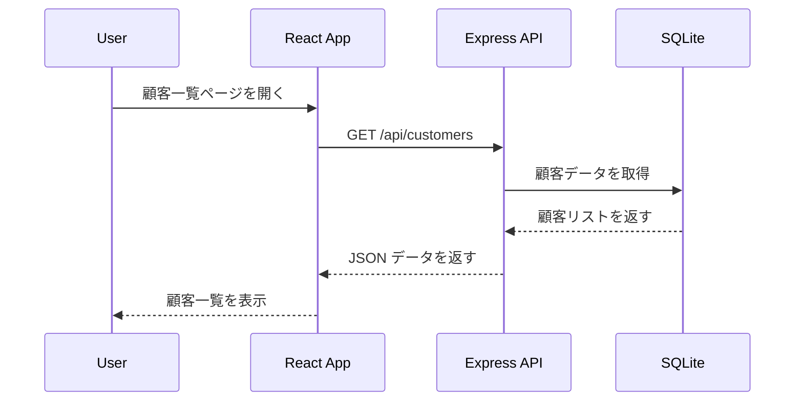

# 顧客一覧の表示

このセクションでは、**データベースをセットアップし、API を作成し、React で顧客の一覧を表示** するまでを実装します。  

---

## 1. 顧客一覧機能の概要  

### 1-1. 目的  
この機能では、以下を実装します：
- SQLite に **新しく顧客データベースを作成**
- API (`GET /api/customers`) を作成し、データを取得
- React で一覧を表示

### 1-2. データの流れ  
顧客一覧のデータの流れは次のようになります。



---

## 2. データベースの準備  

### 2-1. SQLite の新しいデータベースを作成  
顧客情報を管理するデータベースを作成します。

#### **データベースの作成**
ターミナルで以下を実行し、新しいデータベース `customers.db` を作成します。

```sh
sqlite3 customers.db
```

#### **テーブルの作成**
SQLite のコンソールで以下を実行し、`Customer` テーブルを作成します。

```sql
CREATE TABLE Customer (
    id INTEGER PRIMARY KEY AUTOINCREMENT,
    name TEXT NOT NULL,
    email TEXT UNIQUE NOT NULL
);
```

### 2-2. サンプルデータの挿入  
テストデータを追加します。

```sql
INSERT INTO Customer (name, email) VALUES ("Alice", "alice@example.com");
INSERT INTO Customer (name, email) VALUES ("Bob", "bob@example.com");
```

#### **データ確認**
データが正しく追加されたか確認します。

```sql
SELECT * FROM Customer;
```

**出力:**
```
1|Alice|alice@example.com
2|Bob|bob@example.com
```

---

## 3. API の実装  

### 3-1. `GET /api/customers` のエンドポイント作成  

#### **`models/customer.js`**
```js
import { DataTypes } from "sequelize";
import { sequelize } from "./index.js";

const Customer = sequelize.define("Customer", {
  name: { type: DataTypes.STRING, allowNull: false },
  email: { type: DataTypes.STRING, allowNull: false, unique: true },
});

export { Customer };
```

#### **`usecases/customerUseCase.js`**
```js
import { Customer } from "../models/customer.js";

async function getAllCustomers() {
  return await Customer.findAll();
}

export { getAllCustomers };
```

#### **`controllers/customerController.js`**
```js
import { getAllCustomers } from "../usecases/customerUseCase.js";

async function getCustomers(req, res) {
  try {
    const customers = await getAllCustomers();
    res.json(customers);
  } catch (error) {
    res.status(500).json({ error: "Internal Server Error" });
  }
}

export { getCustomers };
```

#### **`routes/customerRoutes.js`**
```js
import express from "express";
import { getCustomers } from "../controllers/customerController.js";

const router = express.Router();
router.get("/customers", getCustomers);

export { router };
```

#### **`server.js`**
```js
import express from "express";
import { router as customerRoutes } from "./routes/customerRoutes.js";

const app = express();
const PORT = 3000;

app.use("/api", customerRoutes);

app.listen(PORT, () => {
  console.log(`Server is running on http://localhost:${PORT}`);
});
```

---

## 4. クライアント側の実装  

### 4-1. React でデータを取得する  

#### **`src/api.js`**
```js
export async function fetchCustomers() {
  const response = await fetch("http://localhost:3000/api/customers");
  return await response.json();
}
```

### 4-2. API から取得したデータの表示  

#### **`src/App.jsx`**
```jsx
import { useState, useEffect } from "react";
import { fetchCustomers } from "./api";

function App() {
  const [customers, setCustomers] = useState([]);

  useEffect(() => {
    fetchCustomers().then(setCustomers);
  }, []);

  return (
    <div>
      <h1>顧客一覧</h1>
      <ul>
        {customers.map((customer) => (
          <li key={customer.id}>{customer.name} ({customer.email})</li>
        ))}
      </ul>
    </div>
  );
}

export default App;
```

---

## 5. エラーハンドリングと開発ツールの確認  

### 5-1. ネットワークエラーへの対応  
API が動いていない場合にエラーメッセージを表示する。

#### **`src/App.jsx` にエラーハンドリングを追加**
```jsx
import { useState, useEffect } from "react";
import { fetchCustomers } from "./api";

function App() {
  const [customers, setCustomers] = useState([]);
  const [error, setError] = useState(null);

  useEffect(() => {
    fetchCustomers()
      .then(setCustomers)
      .catch(() => setError("データを取得できませんでした"));
  }, []);

  return (
    <div>
      <h1>顧客一覧</h1>
      {error && <p style={{ color: "red" }}>{error}</p>}
      <ul>
        {customers.map((customer) => (
          <li key={customer.id}>{customer.name} ({customer.email})</li>
        ))}
      </ul>
    </div>
  );
}

export default App;
```

### 5-2. 開発者ツールでの API レスポンス確認  
1. **開発者ツール (DevTools) を開く** (`F12` または `Ctrl + Shift + I`)
2. **Network タブを開く**
3. `customers` のリクエストを選択し、API のレスポンスを確認

---

## 6. まとめ  

このセクションでは、**顧客一覧を表示するための一連の処理** を実装しました。  
- **SQLite に顧客データを作成**
- **API (`GET /api/customers`) の実装**
- **React でデータを取得し、一覧を表示**
- **エラーハンドリングの実装**
- **開発者ツールで API をデバッグ**

次のセクションでは、**顧客を追加する機能** を実装していきます！
