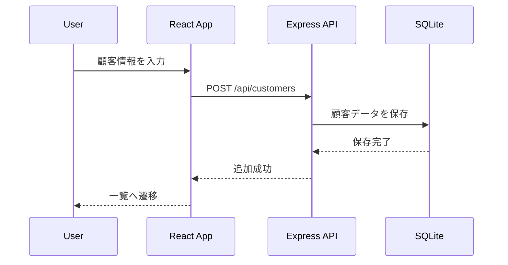
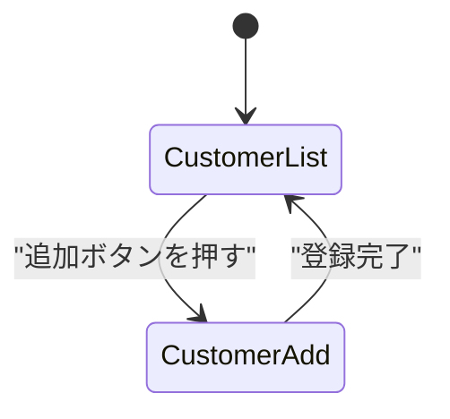

# 顧客の追加機能の実装

このセクションでは、**顧客を新規登録する機能を実装** します。  
React Router DOM を使ってルーティングを追加し、顧客追加フォームを作成します。

---

## 1. 機能の概要

### 1-1. 目的
- ユーザーが新規顧客を追加できるようにする。
- フォームを作成し、入力データを API に送信する。
- 成功時には一覧ページへ遷移する。

### 1-2. データの流れ



---

## 2. ルーティングの設定 (React Router DOM)

### 2-1. React Router DOM のインストール

```sh
npm install react-router-dom
```

### 2-2. 画面遷移の設計



### 2-3. ルーティングの実装

#### **`src/App.jsx`**
```jsx
import { BrowserRouter as Router, Routes, Route, Link } from "react-router-dom";
import CustomerList from "./CustomerList";
import CustomerAdd from "./CustomerAdd";

function App() {
  return (
    <Router>
      <nav>
        <Link to="/">顧客一覧</Link> | <Link to="/add">顧客追加</Link>
      </nav>
      <Routes>
        <Route path="/" element={<CustomerList />} />
        <Route path="/add" element={<CustomerAdd />} />
      </Routes>
    </Router>
  );
}

export default App;
```

---

## 3. API の実装 (顧客の追加)

### 3-1. `POST /api/customers` のエンドポイント作成

#### **`usecases/customerUseCase.js`**
```js
import { Customer } from "../models/customer.js";

async function createCustomer(name, email) {
  return await Customer.create({ name, email });
}

export { createCustomer };
```

#### **`controllers/customerController.js`**
```js
import { createCustomer } from "../usecases/customerUseCase.js";

async function addCustomer(req, res) {
  try {
    const { name, email } = req.body;
    if (!name || !email) {
      return res.status(400).json({ error: "名前とメールは必須です" });
    }
    const newCustomer = await createCustomer(name, email);
    res.status(201).json(newCustomer);
  } catch (error) {
    res.status(500).json({ error: "サーバーエラー" });
  }
}

export { addCustomer };
```

#### **`routes/customerRoutes.js`**
```js
import express from "express";
import { addCustomer } from "../controllers/customerController.js";

const router = express.Router();
router.use(express.json());
router.post("/customers", addCustomer);

export { router };
```

---

## 4. フォームの実装

### 4-1. 顧客追加フォームの作成

#### **`src/CustomerAdd.jsx`**
```jsx
import { useState } from "react";
import { useNavigate } from "react-router-dom";

function CustomerAdd() {
  const [name, setName] = useState("");
  const [email, setEmail] = useState("");
  const [error, setError] = useState(null);
  const navigate = useNavigate();

  const handleSubmit = async (e) => {
    e.preventDefault();
    setError(null);

    if (!name.trim() || !email.trim()) {
      setError("名前とメールは必須です");
      return;
    }
    
    const emailRegex = /^[^\s@]+@[^\s@]+\.[^\s@]+$/;
    if (!emailRegex.test(email)) {
      setError("メールアドレスの形式が正しくありません");
      return;
    }

    try {
      const response = await fetch("http://localhost:3000/api/customers", {
        method: "POST",
        headers: { "Content-Type": "application/json" },
        body: JSON.stringify({ name, email }),
      });

      if (!response.ok) {
        throw new Error("サーバーエラーが発生しました");
      }

      navigate("/");
    } catch (error) {
      setError("データ送信に失敗しました");
    }
  };

  return (
    <div>
      <h1>顧客追加</h1>
      {error && <p style={{ color: "red" }}>{error}</p>}
      <form onSubmit={handleSubmit}>
        <input value={name} onChange={(e) => setName(e.target.value)} placeholder="名前" />
        <input value={email} onChange={(e) => setEmail(e.target.value)} placeholder="メール" />
        <button type="submit">追加</button>
      </form>
    </div>
  );
}

export default CustomerAdd;
```

---

## 5. フォーム送信処理とデータ登録

### 5-1. API へのデータ送信
- `fetch()` を使って API にデータを送信
- `POST /api/customers` でデータ登録

### 5-2. 成功時の画面遷移
- データが正常に登録されたら `/` (顧客一覧) にリダイレクト

```jsx
navigate("/");
```

---

## 6. エラーハンドリングとデバッグ

### 6-1. API リクエストのエラーハンドリング
- 必須フィールドのバリデーション (`name` と `email` は必須)
- メールのフォーマットチェック (`emailRegex`)

### 6-2. 開発者ツールでのリクエスト確認
1. **開発者ツール (DevTools) を開く** (`F12` または `Ctrl + Shift + I`)
2. **Network タブを開く**
3. `POST /api/customers` のリクエストを選択
4. **Request Payload (送信データ) を確認**
5. **Response (API のレスポンス) を確認**

---

## 7. まとめ

このセクションでは、顧客追加機能を実装しました。
- **React Router DOM を導入し、ページ遷移を実装**
- **API (`POST /api/customers`) の実装**
- **フォームを作成し、バリデーションを追加**
- **エラーハンドリングを実装し、リクエスト失敗時の処理を実装**

次のステップでは、**顧客の詳細ページの実装** を行います！
