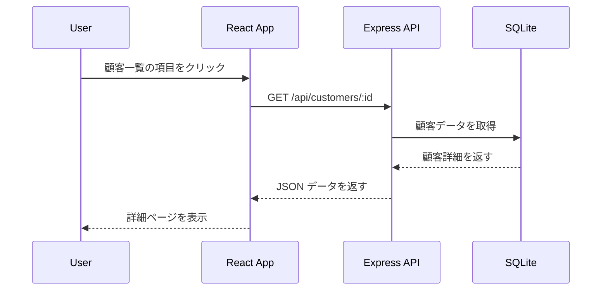
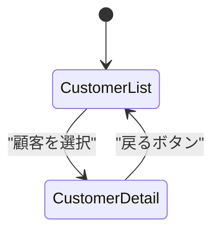

# 顧客の詳細ページの実装

このセクションでは、**顧客の詳細情報を取得し、表示する機能を実装** します。
React Router DOM を使用してページ遷移を行い、`GET /api/customers/:id` を使って API からデータを取得します。

---

## 1. 機能の概要

### 1-1. 目的
- ユーザーが顧客の詳細情報を確認できるようにする。
- 顧客一覧の各項目をクリックすると詳細ページへ遷移する。
- `GET /api/customers/:id` の API を作成し、データを取得する。

### 1-2. データの流れ



---

## 2. ルーティングの設定 (React Router DOM)

### 2-1. 画面遷移の設計



### 2-2. ルーティングの実装

#### **`src/App.jsx`**
```jsx
import { BrowserRouter as Router, Routes, Route, Link } from "react-router-dom";
import CustomerList from "./CustomerList";
import CustomerDetail from "./CustomerDetail";

function App() {
  return (
    <Router>
      <nav>
        <Link to="/">顧客一覧</Link>
      </nav>
      <Routes>
        <Route path="/" element={<CustomerList />} />
        <Route path="/customers/:id" element={<CustomerDetail />} />
      </Routes>
    </Router>
  );
}

export default App;
```

---

## 3. API の実装 (顧客の詳細取得)

### 3-1. `GET /api/customers/:id` のエンドポイント作成

#### **`usecases/customerUseCase.js`**
```js
import { Customer } from "../models/customer.js";

async function getCustomerById(id) {
  return await Customer.findByPk(id);
}

export { getCustomerById };
```

#### **`controllers/customerController.js`**
```js
import { getCustomerById } from "../usecases/customerUseCase.js";

async function getCustomer(req, res) {
  try {
    const { id } = req.params;
    const customer = await getCustomerById(id);

    if (!customer) {
      return res.status(404).json({ error: "顧客が見つかりません" });
    }

    res.json(customer);
  } catch (error) {
    res.status(500).json({ error: "サーバーエラー" });
  }
}

export { getCustomer };
```

#### **`routes/customerRoutes.js`**
```js
import express from "express";
import { getCustomer } from "../controllers/customerController.js";

const router = express.Router();
router.get("/customers/:id", getCustomer);

export { router };
```

---

## 4. 詳細ページの UI 実装

### 4-1. 顧客の情報を表示

#### **`src/api.js`**
```js
export async function fetchCustomerById(id) {
  const response = await fetch(`http://localhost:3000/api/customers/${id}`);
  return await response.json();
}
```

#### **`src/CustomerDetail.jsx`**
```jsx
import { useState, useEffect } from "react";
import { useParams, useNavigate } from "react-router-dom";
import { fetchCustomerById } from "./api";

function CustomerDetail() {
  const { id } = useParams();
  const navigate = useNavigate();
  const [customer, setCustomer] = useState(null);
  const [loading, setLoading] = useState(true);
  const [error, setError] = useState(null);

  useEffect(() => {
    fetchCustomerById(id)
      .then((data) => {
        if (data.error) {
          setError(data.error);
        } else {
          setCustomer(data);
        }
        setLoading(false);
      })
      .catch(() => {
        setError("データ取得に失敗しました");
        setLoading(false);
      });
  }, [id]);

  if (loading) return <p>読み込み中...</p>;
  if (error) return <p style={{ color: "red" }}>{error}</p>;

  return (
    <div>
      <h1>顧客詳細</h1>
      <p><strong>名前:</strong> {customer.name}</p>
      <p><strong>メール:</strong> {customer.email}</p>
      <button onClick={() => navigate("/")}>戻る</button>
    </div>
  );
}

export default CustomerDetail;
```

---

## 5. エラーハンドリングとデバッグ

### 5-1. ID が存在しない場合の対応
- `GET /api/customers/:id` で存在しない ID を指定すると、**404 エラー** を返す。
- フロントエンドでは「顧客が見つかりません」と表示。

```js
if (!customer) {
  return res.status(404).json({ error: "顧客が見つかりません" });
}
```

### 5-2. ネットワークエラー時の処理
- API がダウンしている場合、「データ取得に失敗しました」と表示。
- フロントエンド側で `catch()` を使ってエラーを処理。

```js
fetchCustomerById(id)
  .catch(() => {
    setError("データ取得に失敗しました");
    setLoading(false);
  });
```

---

## 6. まとめ

このセクションでは、顧客の詳細ページを実装しました。
- **React Router DOM を使用してページ遷移を実装**
- **API (`GET /api/customers/:id`) の実装**
- **詳細ページで顧客情報を取得して表示**
- **エラーハンドリングを追加し、存在しない ID や通信エラーに対応**

次のステップでは、**顧客の編集・削除機能** を実装していきます！
