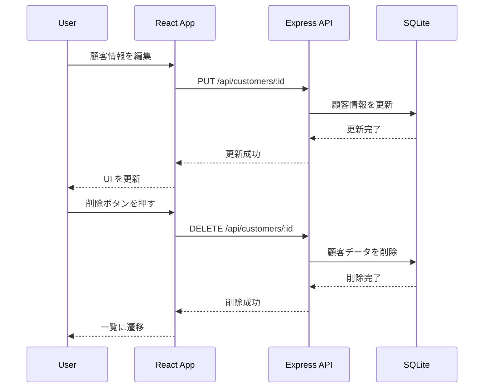
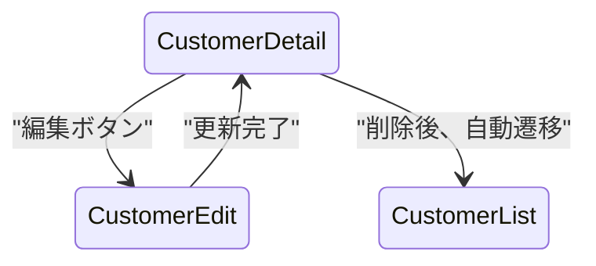

# 顧客の編集・削除機能の実装

このセクションでは、**顧客の情報を編集・削除できる機能を実装** します。
React Router DOM を使用して編集ページを作成し、`PUT /api/customers/:id` および `DELETE /api/customers/:id` の API を実装します。

---

## 1. 機能の概要

### 1-1. 目的
- ユーザーが顧客情報を変更できるようにする。
- 不要な顧客を削除できるようにする。
- `PUT /api/customers/:id` でデータを更新、`DELETE /api/customers/:id` でデータを削除する。

### 1-2. データの流れ



---

## 2. ルーティングの設定 (React Router DOM)

### 2-1. 画面遷移の設計



### 2-2. ルーティングの実装

#### **`src/App.jsx`**
```jsx
import { BrowserRouter as Router, Routes, Route, Link } from "react-router-dom";
import CustomerList from "./CustomerList";
import CustomerDetail from "./CustomerDetail";
import CustomerEdit from "./CustomerEdit";

function App() {
  return (
    <Router>
      <nav>
        <Link to="/">顧客一覧</Link>
      </nav>
      <Routes>
        <Route path="/" element={<CustomerList />} />
        <Route path="/customers/:id" element={<CustomerDetail />} />
        <Route path="/customers/:id/edit" element={<CustomerEdit />} />
      </Routes>
    </Router>
  );
}

export default App;
```

---

## 3. API の実装 (編集・削除)

### 3-1. `PUT /api/customers/:id` のエンドポイント作成

#### **`usecases/customerUseCase.js`**
```js
async function updateCustomer(id, name, email) {
  const customer = await Customer.findByPk(id);
  if (!customer) return null;
  return await customer.update({ name, email });
}

export { updateCustomer };
```

#### **`controllers/customerController.js`**
```js
import { updateCustomer } from "../usecases/customerUseCase.js";

async function editCustomer(req, res) {
  try {
    const { id } = req.params;
    const { name, email } = req.body;

    if (!name || !email) {
      return res.status(400).json({ error: "名前とメールは必須です" });
    }

    const updatedCustomer = await updateCustomer(id, name, email);
    if (!updatedCustomer) {
      return res.status(404).json({ error: "顧客が見つかりません" });
    }

    res.json(updatedCustomer);
  } catch (error) {
    res.status(500).json({ error: "サーバーエラー" });
  }
}

export { editCustomer };
```

---

### 3-2. `DELETE /api/customers/:id` のエンドポイント作成

#### **`usecases/customerUseCase.js`**
```js
async function deleteCustomer(id) {
  const customer = await Customer.findByPk(id);
  if (!customer) return null;
  await customer.destroy();
  return true;
}

export { deleteCustomer };
```

#### **`controllers/customerController.js`**
```js
import { deleteCustomer } from "../usecases/customerUseCase.js";

async function removeCustomer(req, res) {
  try {
    const { id } = req.params;
    const success = await deleteCustomer(id);
    if (!success) {
      return res.status(404).json({ error: "顧客が見つかりません" });
    }

    res.json({ message: "削除成功" });
  } catch (error) {
    res.status(500).json({ error: "サーバーエラー" });
  }
}

export { removeCustomer };
```

#### **`routes/customerRoutes.js`**
```js
router.put("/customers/:id", editCustomer);
router.delete("/customers/:id", removeCustomer);
```

---

## 4. 編集ページの UI 実装

### 4-1. フォームの作成

#### **`src/CustomerEdit.jsx`**
```jsx
import { useState, useEffect } from "react";
import { useParams, useNavigate } from "react-router-dom";
import { fetchCustomerById, updateCustomer } from "./api";

function CustomerEdit() {
  const { id } = useParams();
  const navigate = useNavigate();
  const [customer, setCustomer] = useState({ name: "", email: "" });
  const [error, setError] = useState(null);

  useEffect(() => {
    fetchCustomerById(id)
      .then(setCustomer)
      .catch(() => setError("データ取得に失敗しました"));
  }, [id]);

  const handleSubmit = async (e) => {
    e.preventDefault();
    if (!customer.name.trim() || !customer.email.trim()) {
      setError("名前とメールは必須です");
      return;
    }

    try {
      await updateCustomer(id, customer);
      navigate(`/customers/${id}`);
    } catch {
      setError("更新に失敗しました");
    }
  };

  return (
    <div>
      <h1>顧客編集</h1>
      {error && <p style={{ color: "red" }}>{error}</p>}
      <form onSubmit={handleSubmit}>
        <input value={customer.name} onChange={(e) => setCustomer({ ...customer, name: e.target.value })} />
        <input value={customer.email} onChange={(e) => setCustomer({ ...customer, email: e.target.value })} />
        <button type="submit">更新</button>
      </form>
    </div>
  );
}

export default CustomerEdit;
```

---

## 5. 削除機能の追加

#### **`src/CustomerDetail.jsx` に削除ボタンを追加**
```jsx
const handleDelete = async () => {
  if (window.confirm("本当に削除しますか？")) {
    await fetch(`http://localhost:3000/api/customers/${id}`, { method: "DELETE" });
    navigate("/");
  }
};
```

---

## 6. まとめ

このセクションでは、顧客の編集・削除機能を実装しました。
- **React Router DOM を使用して編集ページを作成**
- **API (`PUT /api/customers/:id`, `DELETE /api/customers/:id`) を実装**
- **エラーハンドリングを追加し、バリデーションを実装**

次のステップでは、**顧客ごとにメモを追加できる機能** を実装していきます！
