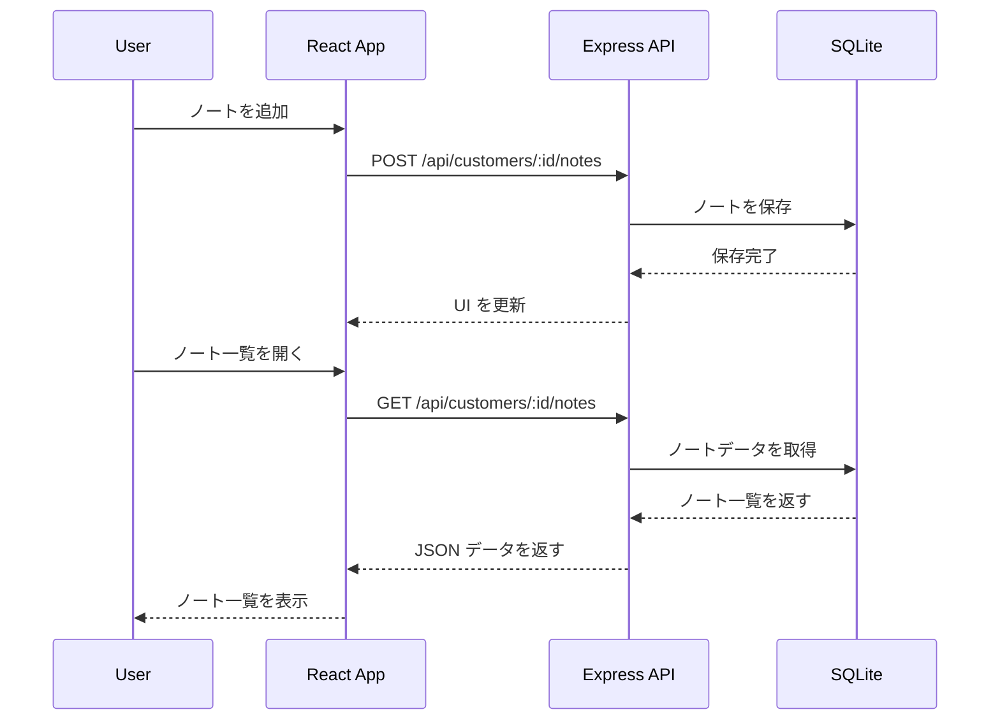
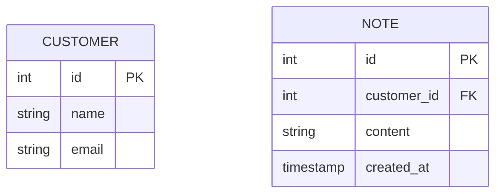

# 顧客に紐づくノート機能の実装

このセクションでは、**顧客ごとにノートを追加・表示できる機能を実装** します。
`POST /api/customers/:id/notes` でノートを追加し、`GET /api/customers/:id/notes` でノート一覧を取得できるようにします。

---

## 1. 機能の概要

### 1-1. 目的
- 顧客ごとに自由にメモ（ノート）を追加できるようにする。
- `POST /api/customers/:id/notes` でノートを追加。
- `GET /api/customers/:id/notes` でノートを取得。

### 1-2. データの流れ



---

## 2. データベースの準備

### 2-1. `Note` テーブルの作成

```sql
CREATE TABLE Note (
    id INTEGER PRIMARY KEY AUTOINCREMENT,
    customer_id INTEGER NOT NULL,
    content TEXT NOT NULL,
    created_at TIMESTAMP DEFAULT CURRENT_TIMESTAMP,
    FOREIGN KEY (customer_id) REFERENCES Customer(id) ON DELETE CASCADE
);
```

### 2-2. ER 図



---

## 3. API の実装

### 3-1. `GET /api/customers/:id/notes` のエンドポイント作成

#### **`models/note.js`**
```js
import { DataTypes } from "sequelize";
import { sequelize } from "./index.js";
import { Customer } from "./customer.js";

const Note = sequelize.define("Note", {
  content: { type: DataTypes.TEXT, allowNull: false },
  created_at: { type: DataTypes.DATE, defaultValue: DataTypes.NOW },
});

Note.belongsTo(Customer, { foreignKey: "customer_id", onDelete: "CASCADE" });

export { Note };
```

#### **`usecases/noteUseCase.js`**
```js
import { Note } from "../models/note.js";

async function getNotesByCustomerId(customerId) {
  return await Note.findAll({ where: { customer_id: customerId }, order: [["created_at", "DESC"]] });
}

export { getNotesByCustomerId };
```

#### **`controllers/noteController.js`**
```js
import { getNotesByCustomerId } from "../usecases/noteUseCase.js";

async function getNotes(req, res) {
  try {
    const { id } = req.params;
    const notes = await getNotesByCustomerId(id);
    res.json(notes);
  } catch (error) {
    res.status(500).json({ error: "サーバーエラー" });
  }
}

export { getNotes };
```

#### **`routes/noteRoutes.js`**
```js
import express from "express";
import { getNotes } from "../controllers/noteController.js";

const router = express.Router();
router.get("/customers/:id/notes", getNotes);

export { router };
```

---

### 3-2. `POST /api/customers/:id/notes` のエンドポイント作成

#### **`usecases/noteUseCase.js`**
```js
async function createNote(customerId, content) {
  return await Note.create({ customer_id: customerId, content });
}

export { createNote };
```

#### **`controllers/noteController.js`**
```js
import { createNote } from "../usecases/noteUseCase.js";

async function addNote(req, res) {
  try {
    const { id } = req.params;
    const { content } = req.body;

    if (!content.trim()) {
      return res.status(400).json({ error: "ノートの内容は必須です" });
    }

    const newNote = await createNote(id, content);
    res.status(201).json(newNote);
  } catch (error) {
    res.status(500).json({ error: "サーバーエラー" });
  }
}

export { addNote };
```

#### **`routes/noteRoutes.js`**
```js
router.post("/customers/:id/notes", addNote);
```

---

## 4. クライアントの実装

### 4-1. ノート一覧の取得

#### **`src/api.js`**
```js
export async function fetchNotes(customerId) {
  const response = await fetch(`http://localhost:3000/api/customers/${customerId}/notes`);
  return await response.json();
}
```

#### **`src/NoteList.jsx`**
```jsx
import { useState, useEffect } from "react";
import { fetchNotes } from "./api";

function NoteList({ customerId }) {
  const [notes, setNotes] = useState([]);

  useEffect(() => {
    fetchNotes(customerId).then(setNotes);
  }, [customerId]);

  return (
    <div>
      <h2>ノート一覧</h2>
      <ul>
        {notes.map(note => (
          <li key={note.id}>{note.content} - {new Date(note.created_at).toLocaleString()}</li>
        ))}
      </ul>
    </div>
  );
}

export default NoteList;
```

---

### 4-2. ノート追加フォーム

#### **`src/api.js`**
```js
export async function addNote(customerId, content) {
  const response = await fetch(`http://localhost:3000/api/customers/${customerId}/notes`, {
    method: "POST",
    headers: { "Content-Type": "application/json" },
    body: JSON.stringify({ content }),
  });
  return await response.json();
}
```

#### **`src/NoteForm.jsx`**
```jsx
import { useState } from "react";
import { addNote } from "./api";

function NoteForm({ customerId, onNoteAdded }) {
  const [content, setContent] = useState("");

  const handleSubmit = async (e) => {
    e.preventDefault();
    if (!content.trim()) return;

    await addNote(customerId, content);
    setContent("");
    onNoteAdded();
  };

  return (
    <form onSubmit={handleSubmit}>
      <textarea value={content} onChange={(e) => setContent(e.target.value)} />
      <button type="submit">ノートを追加</button>
    </form>
  );
}

export default NoteForm;
```

---

## 5. まとめ

このセクションでは、顧客ごとにノートを追加・表示する機能を実装しました。
- **ノート用のテーブル `Note` を作成**
- **API (`GET /api/customers/:id/notes`, `POST /api/customers/:id/notes`) を実装**
- **React でノート一覧を表示・追加できる UI を作成**

次のステップでは、**顧客をグループごとに管理する機能** を実装していきます！
