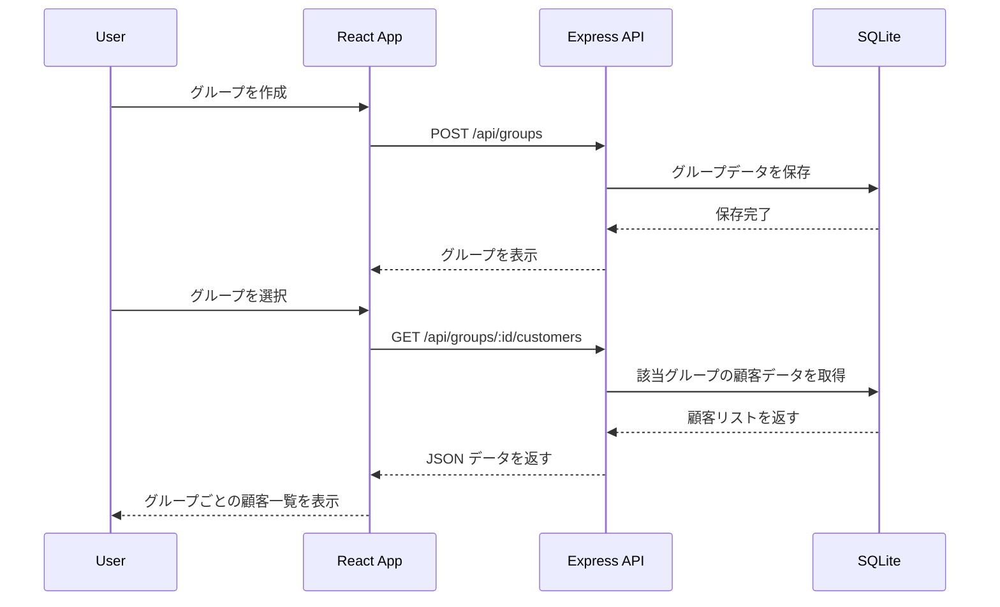
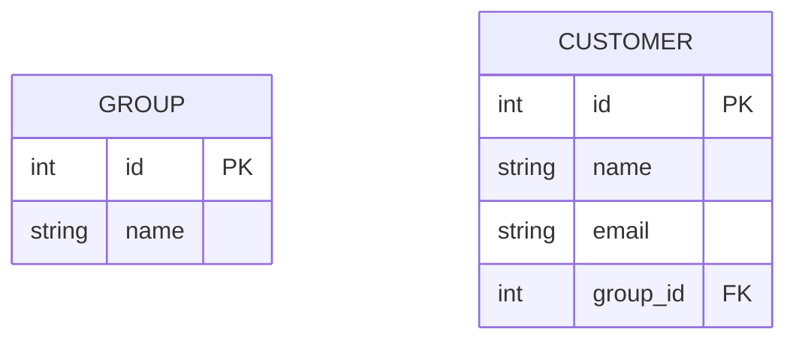

# グループ単位で顧客を管理する機能の実装

このセクションでは、**顧客をグループごとに管理できる機能を実装** します。
`POST /api/groups` でグループを作成し、`GET /api/groups/:id/customers` でグループごとの顧客一覧を取得します。

---

## 1. 機能の概要

### 1-1. 目的
- ユーザーが **顧客をグループに分類** できるようにする。
- `POST /api/groups` で **グループを作成** できるようにする。
- `GET /api/groups/:id/customers` で **グループごとの顧客一覧を取得** できるようにする。

### 1-2. データの流れ



---

## 2. データベースの準備

### 2-1. `Group` テーブルの作成

```sql
CREATE TABLE `Group` (
    id INTEGER PRIMARY KEY AUTOINCREMENT,
    name TEXT NOT NULL
);
```

### 2-2. `Customer` テーブルにグループ ID を追加

```sql
ALTER TABLE Customer ADD COLUMN group_id INTEGER REFERENCES `Group`(id);
```

### 2-3. ER 図



---

## 3. API の実装

### 3-1. `POST /api/groups` のエンドポイント作成

#### **`models/group.js`**
```js
import { DataTypes } from "sequelize";
import { sequelize } from "./index.js";

const Group = sequelize.define("Group", {
  name: { type: DataTypes.STRING, allowNull: false },
});

export { Group };
```

#### **`usecases/groupUseCase.js`**
```js
import { Group } from "../models/group.js";

async function createGroup(name) {
  return await Group.create({ name });
}

export { createGroup };
```

#### **`controllers/groupController.js`**
```js
import { createGroup } from "../usecases/groupUseCase.js";

async function addGroup(req, res) {
  try {
    const { name } = req.body;

    if (!name.trim()) {
      return res.status(400).json({ error: "グループ名は必須です" });
    }

    const newGroup = await createGroup(name);
    res.status(201).json(newGroup);
  } catch (error) {
    res.status(500).json({ error: "サーバーエラー" });
  }
}

export { addGroup };
```

#### **`routes/groupRoutes.js`**
```js
import express from "express";
import { addGroup } from "../controllers/groupController.js";

const router = express.Router();
router.post("/groups", addGroup);

export { router };
```

---

### 3-2. `GET /api/groups/:id/customers` のエンドポイント作成

#### **`usecases/customerUseCase.js`**
```js
import { Customer } from "../models/customer.js";

async function getCustomersByGroupId(groupId) {
  return await Customer.findAll({ where: { group_id: groupId } });
}

export { getCustomersByGroupId };
```

#### **`controllers/customerController.js`**
```js
import { getCustomersByGroupId } from "../usecases/customerUseCase.js";

async function getCustomersByGroup(req, res) {
  try {
    const { id } = req.params;
    const customers = await getCustomersByGroupId(id);
    res.json(customers);
  } catch (error) {
    res.status(500).json({ error: "サーバーエラー" });
  }
}

export { getCustomersByGroup };
```

#### **`routes/customerRoutes.js`**
```js
router.get("/groups/:id/customers", getCustomersByGroup);
```

---

## 4. クライアントの実装

### 4-1. グループ一覧の取得

#### **`src/api.js`**
```js
export async function fetchGroups() {
  const response = await fetch("http://localhost:3000/api/groups");
  return await response.json();
}
```

#### **`src/GroupList.jsx`**
```jsx
import { useState, useEffect } from "react";
import { fetchGroups } from "./api";
import { Link } from "react-router-dom";

function GroupList() {
  const [groups, setGroups] = useState([]);

  useEffect(() => {
    fetchGroups().then(setGroups);
  }, []);

  return (
    <div>
      <h2>グループ一覧</h2>
      <ul>
        {groups.map(group => (
          <li key={group.id}>
            <Link to={`/groups/${group.id}/customers`}>{group.name}</Link>
          </li>
        ))}
      </ul>
    </div>
  );
}

export default GroupList;
```

---

### 4-2. グループごとの顧客一覧表示

#### **`src/api.js`**
```js
export async function fetchCustomersByGroup(groupId) {
  const response = await fetch(`http://localhost:3000/api/groups/${groupId}/customers`);
  return await response.json();
}
```

#### **`src/GroupCustomers.jsx`**
```jsx
import { useState, useEffect } from "react";
import { useParams } from "react-router-dom";
import { fetchCustomersByGroup } from "./api";

function GroupCustomers() {
  const { id } = useParams();
  const [customers, setCustomers] = useState([]);

  useEffect(() => {
    fetchCustomersByGroup(id).then(setCustomers);
  }, [id]);

  return (
    <div>
      <h2>グループの顧客一覧</h2>
      <ul>
        {customers.map(customer => (
          <li key={customer.id}>{customer.name} ({customer.email})</li>
        ))}
      </ul>
    </div>
  );
}

export default GroupCustomers;
```

---

## 5. まとめ

このセクションでは、顧客をグループごとに管理する機能を実装しました。
- **グループ用のテーブル `Group` を作成**
- **API (`POST /api/groups`, `GET /api/groups/:id/customers`) を実装**
- **React でグループ一覧・グループごとの顧客一覧を表示する UI を作成**

次のステップでは、**検索機能・ページネーション・エクスポートなどの機能拡張** を実装していきます！
