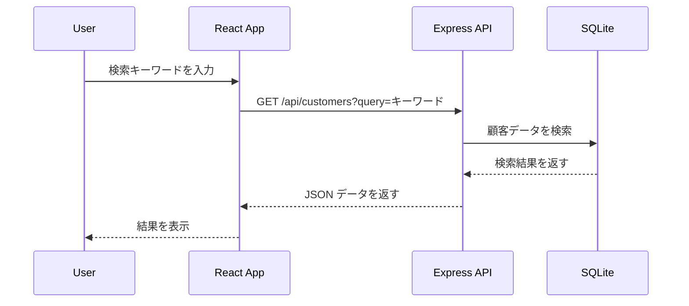

# 機能拡張と今後の展開

このセクションでは、**検索機能・ページネーション・エクスポート** などの拡張機能を追加します。
これにより、顧客管理アプリをより実用的にします。

---

## 1. 機能拡張の概要

### 1-1. 追加する機能
- **検索機能** (`GET /api/customers?query=...`)
- **ページネーション** (`GET /api/customers?page=1&limit=10`)
- **CSV エクスポート** (`GET /api/customers/export`)

### 1-2. データの流れ



---

## 2. 検索機能の実装

### 2-1. `GET /api/customers?query=` のエンドポイント作成

#### **`usecases/customerUseCase.js`**
```js
import { Customer } from "../models/customer.js";
import { Op } from "sequelize";

async function searchCustomers(query) {
  return await Customer.findAll({
    where: {
      [Op.or]: [
        { name: { [Op.like]: `%${query}%` } },
        { email: { [Op.like]: `%${query}%` } }
      ]
    }
  });
}

export { searchCustomers };
```

#### **`controllers/customerController.js`**
```js
import { searchCustomers } from "../usecases/customerUseCase.js";

async function getCustomers(req, res) {
  try {
    const { query } = req.query;
    const customers = query ? await searchCustomers(query) : await getAllCustomers();
    res.json(customers);
  } catch (error) {
    res.status(500).json({ error: "サーバーエラー" });
  }
}

export { getCustomers };
```

#### **`routes/customerRoutes.js`**
```js
router.get("/customers", getCustomers);
```

#### **`src/api.js`**
```js
export async function searchCustomers(query) {
  const response = await fetch(`http://localhost:3000/api/customers?query=${query}`);
  return await response.json();
}
```

#### **`src/SearchBar.jsx`**
```jsx
import { useState } from "react";
import { searchCustomers } from "./api";

function SearchBar({ onSearch }) {
  const [query, setQuery] = useState("");

  const handleSearch = async () => {
    const results = await searchCustomers(query);
    onSearch(results);
  };

  return (
    <div>
      <input value={query} onChange={(e) => setQuery(e.target.value)} placeholder="検索..." />
      <button onClick={handleSearch}>検索</button>
    </div>
  );
}

export default SearchBar;
```

---

## 3. ページネーションの実装

### 3-1. `GET /api/customers?page=1&limit=10` のエンドポイント作成

#### **`usecases/customerUseCase.js`**
```js
async function getPaginatedCustomers(page, limit) {
  const offset = (page - 1) * limit;
  return await Customer.findAll({ offset, limit });
}

export { getPaginatedCustomers };
```

#### **`controllers/customerController.js`**
```js
import { getPaginatedCustomers } from "../usecases/customerUseCase.js";

async function getCustomers(req, res) {
  try {
    const { page = 1, limit = 10 } = req.query;
    const customers = await getPaginatedCustomers(Number(page), Number(limit));
    res.json(customers);
  } catch (error) {
    res.status(500).json({ error: "サーバーエラー" });
  }
}

export { getCustomers };
```

#### **`src/api.js`**
```js
export async function fetchCustomersPaginated(page, limit) {
  const response = await fetch(`http://localhost:3000/api/customers?page=${page}&limit=${limit}`);
  return await response.json();
}
```

#### **`src/Pagination.jsx`**
```jsx
function Pagination({ page, setPage }) {
  return (
    <div>
      <button onClick={() => setPage(page - 1)} disabled={page === 1}>前へ</button>
      <span> {page} </span>
      <button onClick={() => setPage(page + 1)}>次へ</button>
    </div>
  );
}

export default Pagination;
```

---

## 4. CSV エクスポート機能

### 4-1. `GET /api/customers/export` のエンドポイント作成

#### **`controllers/customerController.js`**
```js
import { getAllCustomers } from "../usecases/customerUseCase.js";
import { Parser } from "json2csv";

async function exportCustomers(req, res) {
  try {
    const customers = await getAllCustomers();
    const parser = new Parser({ fields: ["id", "name", "email"] });
    const csv = parser.parse(customers);

    res.header("Content-Type", "text/csv");
    res.attachment("customers.csv");
    return res.send(csv);
  } catch (error) {
    res.status(500).json({ error: "サーバーエラー" });
  }
}

export { exportCustomers };
```

#### **`routes/customerRoutes.js`**
```js
router.get("/customers/export", exportCustomers);
```

#### **`src/ExportButton.jsx`**
```jsx
function ExportButton() {
  const handleExport = () => {
    window.location.href = "http://localhost:3000/api/customers/export";
  };

  return <button onClick={handleExport}>CSV エクスポート</button>;
}

export default ExportButton;
```

---

## 5. まとめ

このセクションでは、顧客管理システムを強化する拡張機能を実装しました。
- **検索機能 (`GET /api/customers?query=`)**
- **ページネーション (`GET /api/customers?page=1&limit=10`)**
- **CSV エクスポート (`GET /api/customers/export`)**

これで、顧客管理アプリは実用的な形になりました！
次のステップでは、さらなる改善点やカスタマイズについて検討できます。
